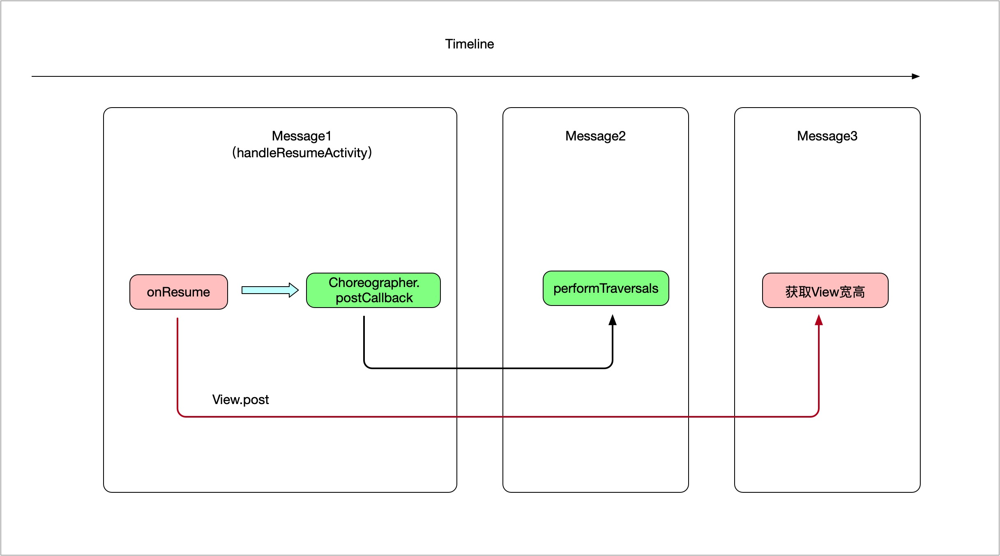

# 使用 View.post 获取 View 宽高

<!-- TOC -->

  - [前言](#前言)
  - [使用 Handler().postDelayed 获取 View 宽高](#使用-handlerpostdelayed-获取-view-宽高)
  - [Handler().postDelayed 方案缺点](#handlerpostdelayed-方案缺点)
  - [使用 View.post 获取 View 宽高](#使用-viewpost-获取-view-宽高-1)
  - [为什么 View.post 可以获取到 View 宽高？](#为什么-viewpost-可以获取到-view-宽高)

<!-- /TOC -->

## 前言

我们平常如果想获取 View 的宽高，第一反应是在 onResume 生命周期回调中去获取，但是 onResume 中真的可以获取到 View 宽高吗？

在 [onResume 中可以获取 View 宽高吗？]() 这篇文章中我已经分析了，在 onResume 方法中，View 的绘制流程还没有开始，所以我们是拿不到 View 宽高的。

那有没有其它的方法可以获取到 View 的宽高呢？

## 使用 Handler().postDelayed 获取 View 宽高

聪明的童鞋肯定已经想到了，既然在 onResume 方法中，View 的绘制流程还没开始，那我们延迟一段时间再去获取不就可以了嘛。比如这样：

```kotlin
// 延迟 1 秒再获取 View 的宽高
Handler().postDelayed(object : Runnable {
    override fun run() {
        // 获取 View 宽高
    }
}, 1000)
```

## Handler().postDelayed 方案缺点

这样虽然可以获取宽高，但是明显有缺点。

- 一是不够优雅，加了一个 1 秒的延迟去获取
- 二是不能满足业务需求，如果我们只需要执行一段业务逻辑去更新 UI，而这段业务逻辑又依赖于 View 的宽高，那我们每次打开页面都要等 1 秒钟才能去获取 View 宽高，然后才能去执行业务逻辑更新 UI，这样 App 就会有明显的卡顿。

那有没有更优雅的方法呢？或者说有没有更准确的一个时机，在这个时机里，View 刚好绘制完成，因此我们可以放心的获取到 View 宽高。

有，而且还不止一个。

## 使用 View.post 获取 View 宽高

我们先说第一个，也就是这篇文章的主题，`View.post`。

我们先上代码：

```kotlin
view.post {
    // 获取 View 宽高
}
```

在 onResume 里执行这段代码，就可以获取到 View 宽高。

## 为什么 View.post 可以获取到 View 宽高？

我们跟一下 `View.post` 源码：

```java
View # post

public boolean post(Runnable action) {
    final AttachInfo attachInfo = mAttachInfo;
    if (attachInfo != null) {
        return attachInfo.mHandler.post(action);
    }

    getRunQueue().post(action);
    return true;
}

View # getRunQueue

private HandlerActionQueue getRunQueue() {
    if (mRunQueue == null) {
        mRunQueue = new HandlerActionQueue();
    }
    return mRunQueue;
}
```

在 post 方法中，对 attachInfo 进行了判空处理，如果 attachInfo 不为空，就使用 `attachInfo.mHandler` 来 post runnable，如果 attachInfo 为空，就使用 `HandlerActionQueue` 来 post runnable。

我们获取 View 宽高的操作会被封装为一个 Runnable，然后 post 到 Handler 或者 HandlerActionQueue 中去执行。

那我们现在需要确定一个事情了，attachInfo 是不是 null，毕竟这个确定了我们的 Runnable 是被 post 到 Handler 还是被 post 到 HandlerActionQueue。

先找一下 mAttachInfo 是在哪里被赋值，mAttachInfo 会在两个方法中会赋值，一个是 View.dispatchAttachedToWindow，一个是 View.dispatchDetachedFromWindow。

从名字来看，dispatchAttachedToWindow 应该是在 View 被添加到 Window 的时候被调用，dispatchDetachedFromWindow 应该是在 View 从 Window 中移除的时候被调用。

而我们这里用到的是 onResume 方法，是要显示 View 的，那我们这里应该关注 dispatchAttachedToWindow 这个方法。

我们再看下 dispatchAttachedToWindow 方法会在什么地方调用，经过查找，dispatchAttachedToWindow 会在 ViewRootImpl.performTraversals 中被调用：

```java
ViewRootImpl # performTraversals

private void performTraversals() {
    final View host = mView;

    ......
    if (mFirst) {
        ......
        host.dispatchAttachedToWindow(mAttachInfo, 0);
        ......
    } else {
        ......
    }

    ......
}
```

这里牵扯到一个新的类，ViewRootImpl，我们先大概了解一下这个类的作用。

我们都知道 View 有 mesaure、layout、draw 的流程，这个流程并不是 View 自己触发的，而是通过 ViewRootImpl.performTraversals 被动触发的。在 performTraversals 方法中，ViewRootImpl 会依次触发 View 的 mesaure、layout、draw 流程。

我们再看下 ViewRootImpl 里的 mAttachInfo 是什么被赋值的：

```java
ViewRootImpl # ViewRootImpl

public ViewRootImpl(Context context, Display display, IWindowSession session,
            boolean useSfChoreographer) {
    ......
    mAttachInfo = new View.AttachInfo(mWindowSession, mWindow, display, this, mHandler, this,
            context);
    ......
}
```

可以看到，ViewRootImpl.mAttachInfo 是在 ViewRootImpl 的构造方法中被赋值的。

我们继续跟一下，看 ViewRootImpl 是在哪里被创建的：

```java
WindowManagerGlobal # addView

public void addView(View view, ViewGroup.LayoutParams params,
            Display display, Window parentWindow, int userId) {
    ......
    ViewRootImpl root;

    synchronized (mLock) {
        ......
        // 创建 ViewRootImpl 对象
        root = new ViewRootImpl(view.getContext(), display);
        ......
        try {
            // setView 会触发 performTraversals 流程
            root.setView(view, wparams, panelParentView, userId);
        } catch (RuntimeException e) {
            ......
        }
    }
}
```

可以看到，ViewRootImpl 是在 WindowManagerGlobal.addView 方法中被创建的。

那判断 attachInfo 是否为 null，就看这个时候有没有执行过 WindowManagerGlobal.addView 方法。

这里就不细跟代码流程了，先给出结论，attachInfo 一开始是 null。

代码调用链：

```
ActivityThread.handleResumeActivity
    ActivityThread.performResumeActivity // 1
        Activity.performResume
            Instrumentation.callActivityOnResume
                Activity.onResume
                    View.post()
                        判断 mAttachInfo 是否为 null // 2

ActivityThread.handleResumeActivity
    ViewManager.addView // 3
        WindowManagerImpl.addView
            WindowManagerGlobal.addView
                创建 ViewRootImpl
                    mAttachInfo 被赋值 // 4
```

大概的执行流程：

由于在 handleResumeActivity 方法中，会先执行 performResumeActivity 方法，再执行 ViewManager.addView 方法，mAttachInfo 是在 ViewManager.addView 方法的调用链中被赋值的，而在 performResumeActivity 方法的调用链中，就已经对 mAttachInfo 判空了。

我们接着分析：

```java
View # post

public boolean post(Runnable action) {
    final AttachInfo attachInfo = mAttachInfo;
    if (attachInfo != null) {
        return attachInfo.mHandler.post(action);
    }

    getRunQueue().post(action);
    return true;
}
```

既然 attachInfo 一开始是 null，所以就不会进入 if 语句了，而是执行 `getRunQueue().post(action)`，而 `getRunQueue()` 会返回 HandlerActionQueue 类型的对象，所以我们看 HandlerActionQueue 的 post 方法：

```java
HandlerActionQueue # post

public void post(Runnable action) {
    postDelayed(action, 0);
}

HandlerActionQueue # postDelayed

public void postDelayed(Runnable action, long delayMillis) {
    final HandlerAction handlerAction = new HandlerAction(action, delayMillis);

    synchronized (this) {
        if (mActions == null) {
            mActions = new HandlerAction[4];
        }
        mActions = GrowingArrayUtils.append(mActions, mCount, handlerAction);
        mCount++;
    }
}

HandlerActionQueue # HandlerAction

private static class HandlerAction {
    final Runnable action;
    final long delay;

    public HandlerAction(Runnable action, long delay) {
        this.action = action;
        this.delay = delay;
    }

    public boolean matches(Runnable otherAction) {
        return otherAction == null && action == null
                || action != null && action.equals(otherAction);
    }
}
```

我们 post 的 action，会被封装为 HandlerAction，这个 HandlerAction 会被缓存起来，HandlerAction 有两个字段，action 表示我们要执行的操作，这里是获取 View 宽高，delay 表示延时，如果我们用的是 View.postDelay 方法，delay 字段会被赋值。

注意，这里只是把获取 View 宽高的操作的 Runnable 缓存了起来，并没有执行。

那么这个 Runnable 什么时候会被执行呢？

我们先找一下这个 Runnable 是在哪里被调用，先看刚刚的 HandlerActionQueue 类，这个类里有一个 executeActions 方法里，是用来执行 HandlerAction：

```java
public void executeActions(Handler handler) {
    synchronized (this) {
        final HandlerAction[] actions = mActions;
        for (int i = 0, count = mCount; i < count; i++) {
            final HandlerAction handlerAction = actions[i];
            // 执行 handlerAction
            handler.postDelayed(handlerAction.action, handlerAction.delay);
        }

        mActions = null;
        mCount = 0;
    }
}
```

之前我们分析了，我们 post 的 Runnable 会被封装为 HandlerAction 的 action，在 executeActions 方法中，用 handler 把 handlerAction.action 给 post 了出去，那也就说，一旦调用了 executeActions 方法，我们获取 View 宽高的操作，就会在 MessageQuque 的下一个 Message 里被执行。

executeActions 方法会在 ViewRootImpl.performTraversals 被调用：

```java
ViewRootImpl # performTraversals

private void performTraversals() {
    final View host = mView;

    getRunQueue().executeActions(mAttachInfo.mHandler);
    // View 绘制流程的测量阶段
    performMeasure();
    // View 绘制流程的布局阶段
    performLayout();
    // View 绘制流程的绘制阶段
    performDraw();

    mFirst = false;

    ......
}
```

这里有一个问题，executeActions 方法明明是在 View 绘制流程之前调用的，为什么可以获取到 View 的宽高呢？

这里涉及到了 Android 的消息机制，Anrdoid 是通过消息驱动的，Android 中有一个 MessageQueue，里面会存储外部 post 的消息，Looper 会不停的从 MessageQueue 中取出消息去执行。

这里 executeActions 中只是 post 了一个 message，这个 message 需要被取出执行才可以获取到 View 宽高，等这个 message 被取出的时候，View 已经绘制完毕了，所以这个时候可以获取到 View 宽高。

大概就是这样：

