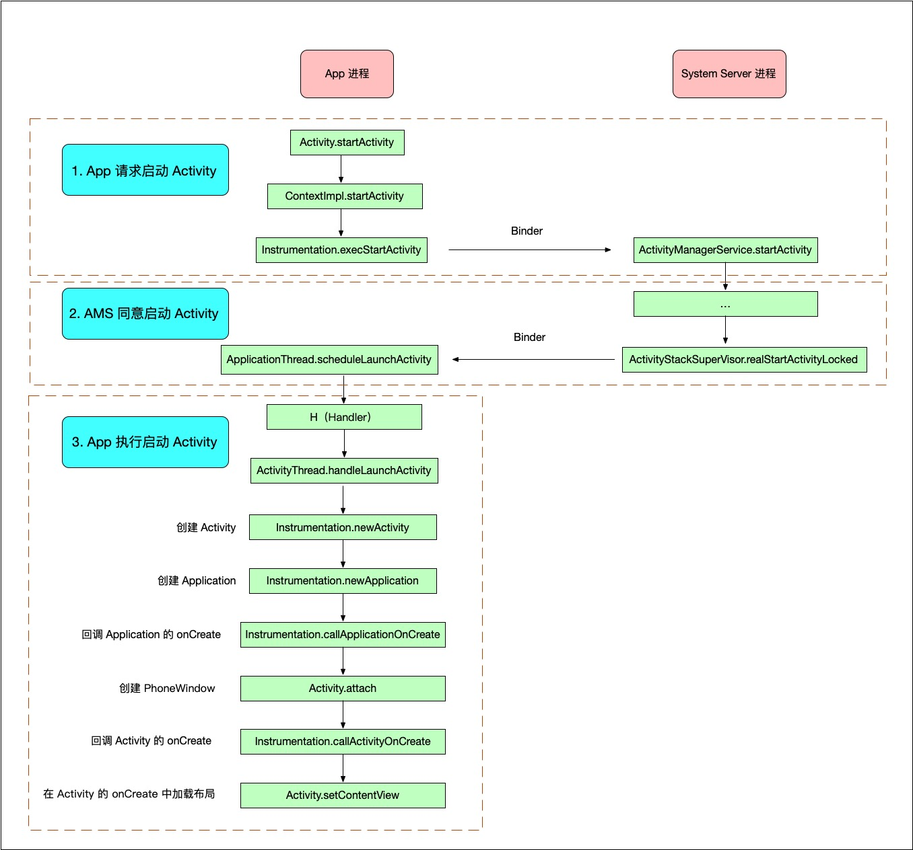

<!-- TOC -->

- [Activity 启动流程的定义](#activity-启动流程的定义)
- [联系生活，方便理解](#联系生活方便理解)
- [Activity 启动流程 3 步走](#activity-启动流程-3-步走)
- [总体流程图](#总体流程图)
- [总结](#总结)

<!-- /TOC -->

### Activity 启动流程的定义

什么是 Activity 的启动过程，具体来说，就是从点击按钮启动 Activity 开始，到 Activity 显示出来，这个过程就叫 Activity 的启动过程。

OK，那我们就来分析一下这个过程，只分析大体流程，不看源码。

### 联系生活，方便理解

在分析之前，我们先来回忆一下我们平常是怎么请假的，我们请假一般是先找直接上级，我们的直接上级同意后，再由老板审批，老板同意后我们就算请假成功了。

因为老板平常日理万机，要是随便一个员工请假都直接找到老板，老板不得烦死。所以请假这种事情，先由上级审批，上级审批没问题了，再让老板审批下就可以了，这样可以减轻老板的负担。

那这个和我们要分析的 Activity 的启动过程有什么关系呢？

刚才说的请假，属于员工的请求，Activity 的启动，也属于 App 的请求。
App 想启动一个 Activity，得先找自己的上级 Instrumentation，上级同意后，再由老板 ActivityManagerService（简称 AMS）审批，老板同意后，App 就可以启动 Activity 啦。

### Activity 启动流程 3 步走

整体来说，Activity 的启动过程可以分为 3 步：

1. App 询问 AMS 能否启动 Activity
2. AMS 同意 App 启动 Activity
3. App 启动 Activity

等等，好像缺少个东西，看这 3 个步骤的描述，似乎 App 就是我们普通员工，AMS 是老板，那上级呢？

上级是 Instrumentation，我们等会就可以看到他了。

### 总体流程图

先贴一张总体流程图，这个总体流程图包含了上面说的 3 个步骤：

大概解释一下这张图：

- App 请求启动 Activity

当我们在代码中调用 startActivity 的时候，就开始了请求启动 Activity 的流程，这个请求由我们的上级 Instrumentation 审批通过后，再交给老板 AMS 审批。

- AMS 同意启动 Activity

老板 AMS 觉得我们的请求很合理，于是大手一挥，审批通过。

- App 执行启动 Activity

既然老板都已经同意了，那我们还等啥呢，Application，Activity，这些该创建的对象就创建，还有 onCreate 这些该回调的方法也别忘了回调。

关于这张图，还需要解释一下。可以看到这张图中标注了 App 进程和 SystemServer 进程，还有 Binder 跨进程操作。

- App 进程，可以理解为在公司里
- SystemServer 进程，可以理解为在外出差
- Binder 跨进程操作，可以理解为打电话

### 总结

所以整个流程大概是这样的：

我们想请求启动 Activity，于是在公司里找到了我们的上级 Instrumentation，Instrumentation 审批通过后，要再找老板审批，但是老板 AMS 天天出差在外，所以上级就打电话联系老板（Binder 跨进程通信）说这个事，老板同意后，我们就开始在公司里（App 进程）启动 Activity 了。