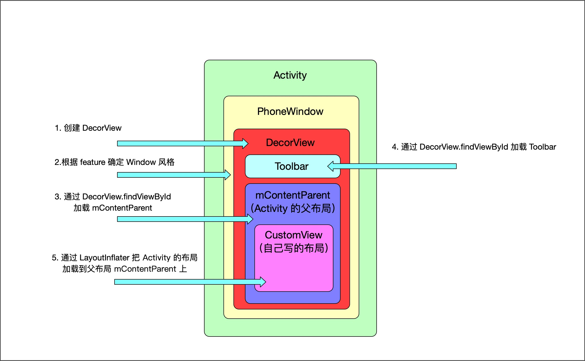
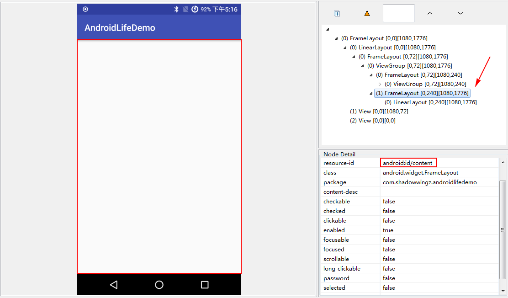
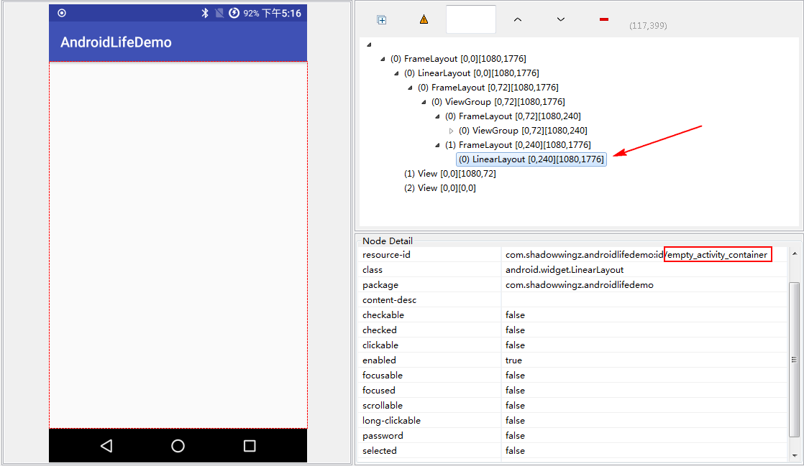
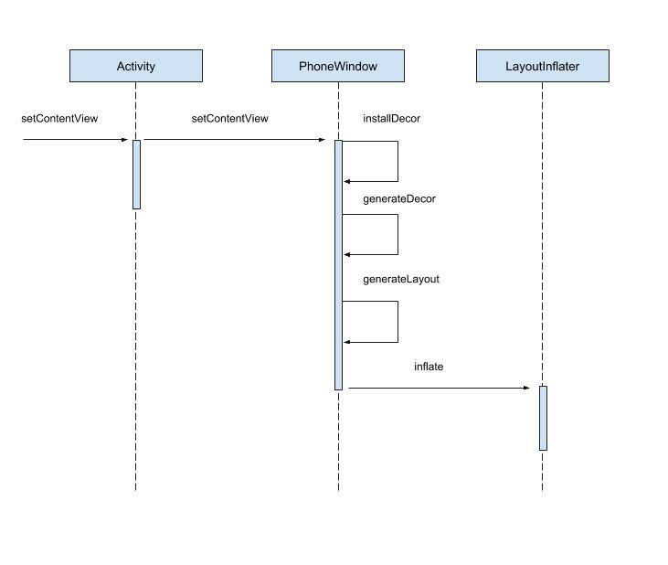

## 前言

对于安卓开发者用来，见的最多的应该就是 `setContentView` 了。这句代码我们也知道它意思了，就是把布局文件设置给 Activity，让 Activity 的界面显示出来。那么，它的内部是怎么实现的呢？

## Activity 结构图

在研究它的内部实现之前，我们先看一张 Activity 结构图。


</p>

我们平常写的布局，也就是 `activity_main.xml`，就是图中的 CustomView。它和 Activity 之间还隔着 PhoneWindow、DecorView、mContentParent。

从图中的包含关系可以看出：
- mContentParent 是 CustomView 的父布局
- DecorView 是 mContentParent 的父布局
- PhoneWindow 是 DecorView 的父布局

了解了这些，我们发现，加载 Activity 的布局貌似并不是那么简单...我们只是想加载一个简简单单的布局而已，但是看这架势貌似还要和 PhoneWindow、DecorView、mContentParent 打交道。

## setContentView 总体流程图

我们先看一下  `setContentView` 的总体流程图，有个大概印象。



## setContentView 大概流程

这张图在之前的图片上新增了 `setContentView` 的内部流程，流程也不算很复杂，一共有 5 步：

### 1. 创建 DecorView

这个比较好理解，从关系层级来讲，DecorView 算的上是我们自己布局的爷爷了，我们自己的布局想要创建出来，那自然得先创建个爷爷出来~

### 2. 根据 feature 确定 PhoneWindow 风格

平常我们如果想隐藏 Activity 的标题栏，一般会使用如下代码：

```java
requestWindowFeature(Window.FEATURE_NO_TITLE);
```

`FEATURE_NO_TITLE` 就是 feature，当我们使用了这个 feature，PhoneWindow 的风格就是没有标题栏。

### 3. 通过 DecorView.findViewById 加载 mContentParent

这个也好理解，DecorView 已经创建出来了，就可以通过 findViewById 来实例化它的孩子 & 我们自己布局的爸爸，也就是 mContentParent。这个名字也是很有意思，名字里有个 Content，mContentParent 布局对应的 id 是 `android:id/content`，id 里也有一个 content，所以这就是加载 Activity 布局的方法叫 setContentView 的原因？故名思义，这个方法的作用是给 Content 设置一个 View。

### 4. 通过 DecorView.findViewById 加载 Toolbar

Toolbar 相信大家都知道是什么东西，我这里就不多解释了，由于 Activity 布局中也包含 Toolbar，所以自然也要把 Toolbar 加载出来。

### 5. 通过 LayoutInflater 把 Activity 的布局加载到父布局 mContentParent 中

这一步就是关键中的关键了，之所以说 mContentParent 是 Activity 布局的父布局，就是因为我们的布局文件被加载到了 mContentParent 上。

相关代码：

```java
mLayoutInflater.inflate(layoutResID, mContentParent);
```

在这句代码里，`layoutResID` 就是我们的布局 id，比如 MainActivity 的话就是 `activity_main.xml`，mContentParent 就是 Activity 的父布局。

## setContentView 源码分析

好了，`setContentView` 的大概流程我们已经心里有数了，接着，我们来分析下 `setContentView` 的源码。

```java
Activity # setContentView

public void setContentView(int layoutResID) {
    getWindow().setContentView(layoutResID);
    initWindowDecorActionBar();
}
```

从方法命名上可以看出，`initWindowDecorActionBar()` 是初始化 ActionBar 的，这里我们就不分析 ActionBar 了，所以我们看 `getWindow().setContentView(layoutResID)` 代码：

```java
PhoneWindow # setContentView

@Override
public void setContentView(int layoutResID) {
    if (mContentParent == null) {
        installDecor();
    } else if (!hasFeature(FEATURE_CONTENT_TRANSITIONS)) {
        mContentParent.removeAllViews();
    }

    if (hasFeature(FEATURE_CONTENT_TRANSITIONS)) {
        ......
    } else {
        mLayoutInflater.inflate(layoutResID, mContentParent);
    }
    ......
}
```

首先判断 mContentParent 是否为 `null`（第一次调用），如果是 `null`，就调用 `installDecor`，从名字来看，这个方法应该是和 DecorView 有关。

如果 `mContentParent` 不为 null，就调用 `mContentParent.removeAllViews()` 把 `mContentParent` 内的所有子 View 全部移除掉。这个比较好理解，因为我们自己的布局，也就是图中的 CustomView，要想加载到 `mContentParent` 中，如果 `mContentParent` 已经有子 View 了，那 `mContentParent` 肯定是要把子 View 移除掉，再添加我们自己的布局。

接着，判断是否设置了 `FEATURE_CONTENT_TRANSITIONS`（默认为 false），所以会进入 else 语句，执行 `mLayoutInflater.inflate(layoutResID, mContentParent)`，这句代码就是关键了，它会把我们的布局文件转换为 View 树，然后把 View 树添加到 `mContentParent` 上。

我们先分析下 `installDecor` 方法。

```java
PhoneWindow # installDecor

private void installDecor() {
    if (mDecor == null) {
        mDecor = generateDecor();
        ......
    }
    if (mContentParent == null) {
        mContentParent = generateLayout(mDecor);

        ......
    }
}
```

`installDecor` 的代码很多，这里只截取了最重要的一部分，首先，判断 `mDecor` （DecorView）是否为 `null`，如果为 `null`，就调用 `generateDecor` 方法创建 DecorView。

```
PhoneWindow # generateDecor

protected DecorView generateDecor() {
    return new DecorView(getContext(), -1);
}
```

接着判断 `mContentParent` 是否为 `null`，如果为 `null`，就调用 `generateLayout(mDecor)` 来创建 `mContentParent`。

```java
PhoneWindow # generateLayout

protected ViewGroup generateLayout(DecorView decor) {
    ......

    // 窗口根布局
    int layoutResource;
    int features = getLocalFeatures();
    // 根据 features 值确定不同的窗口修饰布局文件，也就是 layoutResource 的值
    if ((features & (1 << FEATURE_SWIPE_TO_DISMISS)) != 0) {
        layoutResource = R.layout.screen_swipe_dismiss;
    } else if ((features & (1 << FEATURE_NO_TITLE)) == 0) { // 经常用到的 FEATURE_NO_TITLE
        // If no other features and not embedded, only need a title.
        // If the window is floating, we need a dialog layout
        if (mIsFloating) {
            TypedValue res = new TypedValue();
            getContext().getTheme().resolveAttribute(
                    R.attr.dialogTitleDecorLayout, res, true);
            layoutResource = res.resourceId;
        } else if ((features & (1 << FEATURE_ACTION_BAR)) != 0) {
            layoutResource = a.getResourceId(
                    R.styleable.Window_windowActionBarFullscreenDecorLayout,
                    R.layout.screen_action_bar);
        } else {
            layoutResource = R.layout.screen_title;
        }
        // System.out.println("Title!");
    }
    ......

    // 加载窗口根布局
    View in = mLayoutInflater.inflate(layoutResource, null);
    // 将窗口根布局添加到 DecorView 中
    decor.addView(in, new ViewGroup.LayoutParams(MATCH_PARENT, MATCH_PARENT));
    mContentRoot = (ViewGroup) in;

    // 实例化 DecorView 中 id 为 content 的 ViewGroup，这个 ViewGroup 就是 Activity 布局的父布局
    ViewGroup contentParent = (ViewGroup)findViewById(ID_ANDROID_CONTENT);

    ......

    return contentParent;
}
```

首先，根据窗口的修饰类型 features 来确定窗口的根布局文件。features 有很多种，其中一种就是我们经常用到的 `FEATURE_NO_TITLE`，作用是让 Activity 隐藏标题栏。

```java
requestWindowFeature(Window.FEATURE_NO_TITLE);
```

看到这里，我们也可以明白，为什么我们隐藏标题栏时，需要让这句代码在 `setContentView` 之前调用。因为在 `setContentView` 的源码里，会判断 feature 类型，所以我们要在 `setContentView` 之前就把 feature 设置好。

确定了 features 之后，就把对应的窗口根布局文件加载出来，然后添加到 DecorView 中。也就是下面这部分代码。

```java
// 加载窗口根布局
View in = mLayoutInflater.inflate(layoutResource, null);
// 将窗口根布局添加到 DecorView 中
decor.addView(in, new ViewGroup.LayoutParams(MATCH_PARENT, MATCH_PARENT));
```

然后，通过 findViewById 找到 id 为 `ID_ANDROID_CONTENT`（`android:id/content`） 的 ViewGroup，这个 id 为 `ID_ANDROID_CONTENT` 的 ViewGroup 就是 Activity 布局的父容器。

我们可以用 Android Studio 的 `Android Device Monitor` 更直观的看一下。

我们新建一个 Activity，然后把 Activity 的布局改成只有一个 LinearLayout 的布局。并把 LinearLayout 的 id 设置为 `empty_activity_container`，代码如下：

```xml
<?xml version="1.0" encoding="utf-8"?>
<LinearLayout
    xmlns:android="http://schemas.android.com/apk/res/android"
    android:id="@+id/empty_activity_container"
    android:layout_width="match_parent"
    android:layout_height="match_parent"
    android:orientation="vertical">

</LinearLayout>
```

运行一下，然后在 `Android Device Monitor` 中，选中我们要查看的进程，使用 `Dump View Hierarchy for UI Automator` 查看界面的视图层次。


分析结果如下：



先看左边的红色的框，它就是右边箭头指向的 FrameLayout，也就是 Activity 的布局的父布局。它的资源 id 是 `android:id/content`，也就是我们刚刚提到的 `ID_ANDROID_CONTENT`。最终我们的 Activity 是被添加到这个 FrameLayout 厘米。这个 FrameLayout 是 DecorView 的一部分。

现在就好理解一些了，我们想要把 Activity 添加到这个 FrameLayout 中，首先应该把这个 FrameLayout 实例化出来。

```java
ViewGroup contentParent = (ViewGroup)findViewById(ID_ANDROID_CONTENT);
```

既然 FrameLayout 是 Activity 的布局的父布局。刚刚我们又只在布局文件里放了一个 LinearLayout，那么 FrameLayout 下面的那个 LinearLayout 应该就是我们定义的 LinearLayout 了。



可以看到，这个 LinearLayout 的资源 id 就是我们刚刚定义的 `empty_activity_container`。

到这里，我们可以总结一下 `generateLayout` 的作用了，首先会根据 feature 来确定窗口样式，比如隐藏状态栏。然后返回 `mContentParent`，也就是 Activity 布局的父布局。

`generateLayout` 方法我们看完了，再看下面，DecorView 会通过 findViewById 来加载一个 `decor_content_parent` 的 ViewGroup，这个 ViewGroup中 有 Toolbar。

```java
PhoneWindow # installDecor

final DecorContentParent decorContentParent = (DecorContentParent) mDecor.findViewById(
                    R.id.decor_content_parent);
```

我们接着往下看，在 PhoneWindow 的 `setContentView` 方法中，`mContentParent` 被返回，接着调用 `mLayoutInflater.inflate(layoutResID, mContentParent)` 这句代码，这句代码就是加载 Activity 布局的关键了，这句代码会把 Activity 的布局文件解析成 View 树，然后把 View 树添加到 mContentParent 中。至于这句代码内部是怎么执行的，因为已经写过一篇文章来分析了，[LayoutInflater 源码解析](https://github.com/shadowwingz/AndroidLife/blob/master/article/LayoutInflater%20%E6%BA%90%E7%A0%81%E8%A7%A3%E6%9E%90.md)，这里我就不详细解释了。

到这里，一个大致的 `setContentView` 流程我们就分析清楚了。我们再总结一下：

1. 创建 DecorView，作为整个应用窗口的根视图
2. 根据 feature 类型来确定窗口风格，比如隐藏标题栏
3. 创建 mContentParent，也就是 Activity 布局的父布局
4. 加载 Toolbar
5. 加载 Activity 布局，并把 Activity 布局添加到 mContentParent 中。

