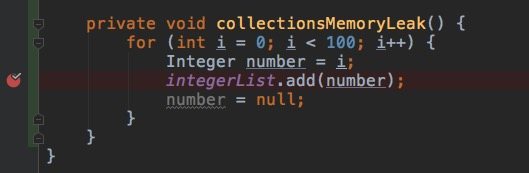
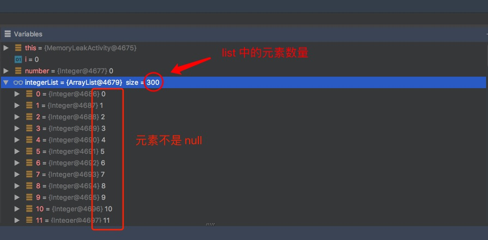

在开发程序时，集合类想必每个人都用过，别告诉我你没用过 ArrayList，在用 ArrayList 的过程中，一不注意，就有可能引起内存泄漏。

如果 ArrayList 中只能添加元素，而不能删除元素，就会导致创建的元素占用的内存一直被元素占用，无法被释放，而如果这个 ArrayList 是静态的，那恭喜你，这个 ArrayList 中的元素在 App 的整个生命周期里都会占用内存，而且内存只增不减。

那有的童鞋可能会说了，没事，我用 ArrayList 后，会把 ArrayList 中的元素赋值为 null，这样就不会内存泄漏了。

比如这样：

```java
private static List<Integer> integerList = new ArrayList<>();

private void collectionsMemoryLeak() {
    for (int i = 0; i < 100; i++) {
        Integer number = i;
        integerList.add(number);
        number = null;
    }
}
```

在把 number 添加到 integerList 中之后，我们就把 number 赋值为 null 了，这样看起来好像没毛病，

对于这样的同学，我只能说 Too Young。

用张图来解释一下：

可以看到，当我们把 number 置为 null 之后，integerList 依然指向 number 引用之前指向的对象 i。所以 number 置为 null，并不影响 integerList。

我们再打下断点实验，看一下 integerList 有多少元素，元素是不是 null，先进入 Activity，再退出这个 Activity，反复操作几次，然后



我们每进入 Activity 一次，就会给 integerList 增加 100 个元素，这样反复操作几次后，list 中的元素就会超过一百个。



可以看到，integerList 中已经有了 300 个元素，而且这 300 个元素都不为 null，也就是说，虽然我们把 number 置为了 null，但是并不影响 integerList 里面的元素。

#### 避免集合引发内存泄漏

在集合使用完后要把集合清空并设置为 null，这里作为演示，在 Activity 的  onDestroy 方法中清空：

```java
@Override
protected void onDestroy() {
    super.onDestroy();
    if (integerList != null) {
        integerList.clear();
        integerList = null;
    }
}
```