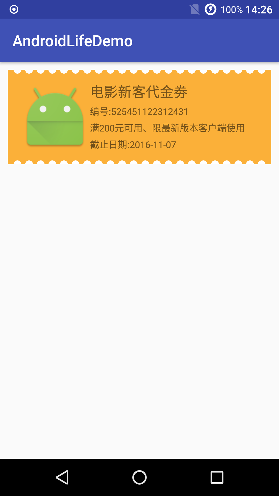
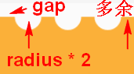
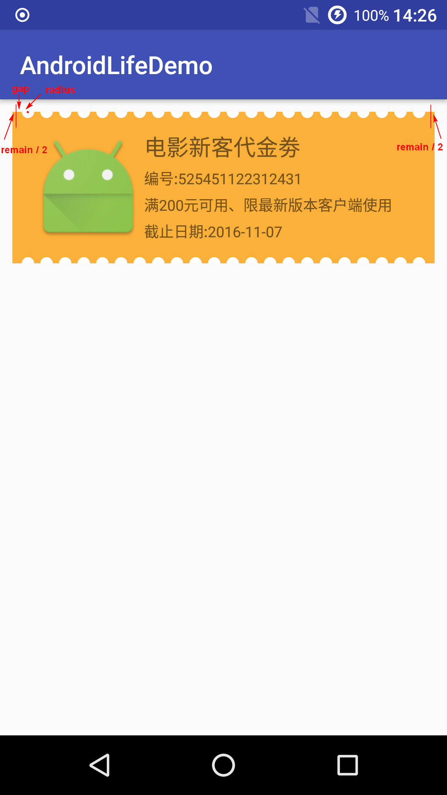

[Demo 地址](https://github.com/shadowwingz/AndroidLifeDemo/tree/master/app/src/main/java/com/shadowwingz/androidlifedemo/customviewdemo)



先看一下我们要做到效果，是一个常见的优惠卷。我们来分析下要怎么自定义这种 View。

#### 继承 View 还是继承 ViewGroup ####

我们观察下布局，优惠卷内部布局没有什么特殊的，就是一个图片和几个文字。优惠卷，更像是一个容器，承载了一个 ImageView 和几个 TextView，那我们就用 ViewGroup，ViewGroup 的话，可以选择 LinearLayout，也可以选择 RelativeLayout。这里我们选用 LinearLayout。

#### 思路 ####

#### 画圆 ####

我们再观察下，这个优惠卷布局和普通的 LinearLayout 有什么不同，很容易发现，就是上下两边的边缘有凹凸效果，这个凹凸效果其实就是一个半圆，等等，半圆要怎么画，Android 提供的 api 好像没有画半圆的啊，Canvas 只有一个 drawCircle 方法画圆，事实时，我们直接画圆就可以了，超出 LinearLayout 边缘范围的半圆是不会显示出来的，这样就达到了半圆的效果。

#### 画多少个圆 ####



我把关键部分截取了一下，首先，圆和圆之间都有个间距，这个间距我们叫它 `gap`，然后，每个圆都有半径 `radius`，直径就是 `radius * 2`，我们可以把一个 `gap` 和整个圆看作一个整体，在图片中，这种整体有多少个，圆就有多少个。也就是说，圆的个数等于

```
(控件宽度 - 多余的一个 gap) / (radius * 2 + gap)
```

本来 `gap` 和圆是配对的，但是最右边的 `gap` 是多余的，所以我们要把它减去，才能计算出圆的个数。

但是还有一个小问题，我们计算出的圆的个数，应该是一个整数，但是实际计算出的，很可能不是整数，因为最后一个 gap 很可能不是标准的 gap，比如，gap 是 10 dp，但是最后一个 gap 可能是 13dp。

有的童鞋可能会说，这个简单，直接转换成 int 就可以了，的确，这样就可以得到一个正确的圆的个数了，但是会有一个小小的隐患，绘制出来的优惠卷，最后一个 gap 会比较长。

怎么解决呢？

我们可以计算出最后一个 gap 和标准 gap 的差值，然后除以 2，把得到的结果分配给左右两边的 gap（绘制圆的时候，让每一个圆的圆心的 x 坐标加上这个结果的值）。这样，即使左边两边的 gap 不是标准的 gap，但是它们是对称的。

```
// 取余，得到最后一个 gap 和标准 gap 的差值
remain = (int) (w - gap) % (2 * radius + gap);
```

