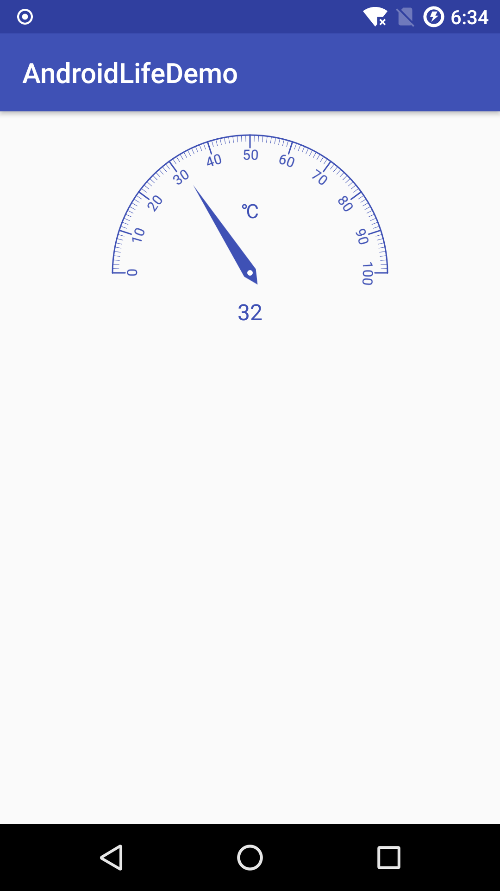
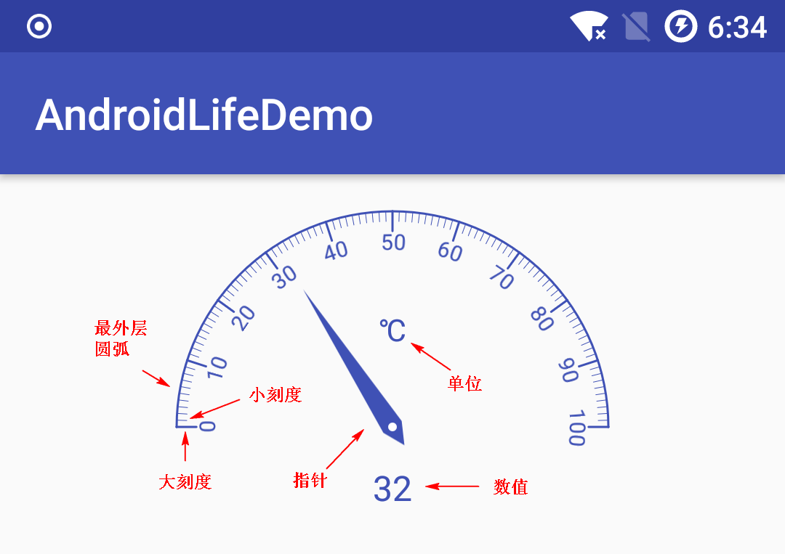

[Demo 地址](https://github.com/shadowwingz/AndroidLifeDemo/blob/master/app/src/main/java/com/shadowwingz/androidlifedemo/customviewdemo/dashboard/DashboardView.java)



这次我们要自定义的 View 是一个仪表盘 View。我们来分析下要怎么自定义这种 View。

#### 继承 View 还是继承 ViewGroup ####

我们观察下布局，这个仪表盘 View 大致上由几个部分组成：

1. 最外层的圆弧
2. 刻度，包括大刻度和小刻度，大刻度是 0、10、20，小刻度是类似于 0 到 10 之间的 10 个刻度。
3. 度数单位 ℃
4. 指针，指向某一个刻度
5. 最下面的度数数值



像圆弧，还有刻度，肯定是没法用现成的控件了，只能用 Canvas 画。所以我们选择继承 View。

### 思路 ###

其实思路还是挺简单的，就是用 Canvas 一个个画，主要是角度的计算有点复杂，需要点耐心来计算。

- #### 圆弧 ####

画圆弧的 api 是

```java
public void drawArc(
    @NonNull RectF oval, 
    float startAngle, 
    float sweepAngle, 
    boolean useCenter,
    @NonNull Paint paint) {
```

drawArc 方法需要 5 个参数：

1. 第一个参数 `RectF oval` 是弧形所在矩形，由于最外层的弧形是一个半圆，那么这个圆弧所在矩形就是一个正方形了，正方形的边长是控件的宽度。
2. 第二个参数 `float startAngle` 是弧形的开始角度，这里我们的开始角度是 180 度。
3. 第三个参数 `float sweepAngle` 是弧形扫过的角度，由于我们的弧形是一个半圆，所以扫过的角度是 180 度。
4. 第四个参数 `boolean useCenter`，是 false。
5. 第五个参数 `Paint paint`，画笔，这个就不多说了。

- #### 刻度 ####

刻度是通过 drawLine 方法画线实现的，我们这里只说长刻度，短刻度和长刻度的实现原理是一样的。我们只画起始角度的那一条刻度，也就是左下角的那个刻度，其余的刻度我们通过 canvas 的 rotate（旋转）来实现。

- #### 刻度读数 ####

刻度读数，0、10、20...这种，由于它们不是水平方向，而是沿着圆弧的方向，所以我们用 `drawTextOnPath` 来画：

```java
public void drawTextOnPath(
    @NonNull String text, 
    @NonNull Path path, 
    float hOffset,
    float vOffset, 
    @NonNull Paint paint) {
}
```

drawTextOnPath 方法需要 5 个参数

1. 第一个参数 `String text`，要绘制的文字，也就是 0、10、20...
2. 第二个参数 `Path path`，Path 路径，这个是重点
3. 第三个参数 `float hOffset`，水平偏移，这里是 0
4. 第三个参数 `vOffset`，竖直偏移，这里是 0

drawTextOnPath 方法中，最重要的就是 Path，我们知道，我们的目的是要沿着圆弧的方向绘制文字，这个圆弧就是 Path，而圆弧的生成又需要一个矩形 RectF，所以我们只要计算出矩形的四个顶点坐标，就能得出 Path。