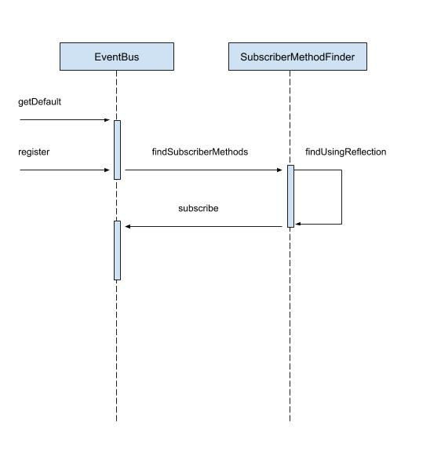

这篇文章，我们来分析 `EventBus.getDefault().register(this)` 的执行流程，也就是 EventBus 是怎么实现注册订阅者的。

我们先看 `EventBus.getDefault()` 方法：

```java
public static EventBus getDefault() {
    if (defaultInstance == null) {
        synchronized (EventBus.class) {
            if (defaultInstance == null) {
                defaultInstance = new EventBus();
            }
        }
    }
    return defaultInstance;
}
```

getDefault 很简单，使用了双重检验锁获取了 EventBus 的单例。

```java
private static final EventBusBuilder DEFAULT_BUILDER = new EventBusBuilder();

public EventBus() {
    this(DEFAULT_BUILDER);
}

EventBus(EventBusBuilder builder) {
    subscriptionsByEventType = new HashMap<>();
    typesBySubscriber = new HashMap<>();
    stickyEvents = new ConcurrentHashMap<>();
    mainThreadPoster = new HandlerPoster(this, Looper.getMainLooper(), 10);
    backgroundPoster = new BackgroundPoster(this);
    asyncPoster = new AsyncPoster(this);
    indexCount = builder.subscriberInfoIndexes != null ? builder.subscriberInfoIndexes.size() : 0;
    subscriberMethodFinder = new SubscriberMethodFinder(builder.subscriberInfoIndexes,
            builder.strictMethodVerification, builder.ignoreGeneratedIndex);
    logSubscriberExceptions = builder.logSubscriberExceptions;
    logNoSubscriberMessages = builder.logNoSubscriberMessages;
    sendSubscriberExceptionEvent = builder.sendSubscriberExceptionEvent;
    sendNoSubscriberEvent = builder.sendNoSubscriberEvent;
    throwSubscriberException = builder.throwSubscriberException;
    eventInheritance = builder.eventInheritance;
    executorService = builder.executorService;
}

public class EventBusBuilder {
    boolean logSubscriberExceptions = true;
    boolean logNoSubscriberMessages = true;
    boolean sendSubscriberExceptionEvent = true;
    boolean sendNoSubscriberEvent = true;
}
```

EventBus 使用默认的 EventBusBuilder 来创建 EventBus 的实例，我们可以看到，EventBusBuilder 中有很多配置选项，像这样把配置单独放到一个类里，方便自定义配置，代码也更加清晰。

到这里，我们清楚了，`EventBus.getDefault()` 就是获取了 EventBus 的一个实例。

我们接着看 register 方法：

```java
public void register(Object subscriber) {
    // 获取订阅者的 Class 对象
    Class<?> subscriberClass = subscriber.getClass();
    // 获取订阅者所有的订阅方法
    List<SubscriberMethod> subscriberMethods = subscriberMethodFinder.findSubscriberMethods(subscriberClass);
    synchronized (this) {
        for (SubscriberMethod subscriberMethod : subscriberMethods) {
            // 订阅
            subscribe(subscriber, subscriberMethod);
        }
    }
}
```

首先，获取订阅者的 Class 对象，假设我们是在 MainActivity 里注册的 EventBus，那么这里就是获取 MainActivity.class，接着获取 MainActivity 所有的订阅方法，我们回忆一下，为了接收 EventBus 发送的事件，我们是不是要写一个方法来接收，这个方法要用注解来修饰，这里就是获取 MainActivity 所有被 EventBus 的注解修饰的方法。接着我们看下 findSubscriberMethods 是怎么获取订阅方法的：

```java
// METHOD_CACHE 中缓存订阅类和对应的订阅方法列表，之所以是列表，是因为有可能不止一个订阅方法
private static final Map<Class<?>, List<SubscriberMethod>> METHOD_CACHE = new ConcurrentHashMap<>();

List<SubscriberMethod> findSubscriberMethods(Class<?> subscriberClass) {
    List<SubscriberMethod> subscriberMethods = METHOD_CACHE.get(subscriberClass);
    if (subscriberMethods != null) {
        return subscriberMethods;
    }

    // EventBusAnnotationProcessor 会生成一个 MyEventBusIndex 类
    // 是否忽略这个类
    if (ignoreGeneratedIndex) {
        // 如果忽略，就利用反射来读取订阅类中的订阅方法信息
        subscriberMethods = findUsingReflection(subscriberClass);
    } else {
        // 否则直接从 MyEventBusIndex 类中获取订阅类的订阅方法信息
        subscriberMethods = findUsingInfo(subscriberClass);
    }
    // 如果一个订阅方法都没有，就抛异常
    if (subscriberMethods.isEmpty()) {
        throw new EventBusException("Subscriber " + subscriberClass
                + " and its super classes have no public methods with the @Subscribe annotation");
    } else {
        // 将订阅方法缓存起来，key 是订阅类，value 是所有的订阅方法
        METHOD_CACHE.put(subscriberClass, subscriberMethods);
        return subscriberMethods;
    }
}
```

首先，看 METHOD_CACHE 有没有缓存订阅类对应的订阅方法，如果有缓存，就直接返回订阅方法列表，如果没有缓存，那就只能解析了。解析分两种，一个是用 EventBus 中的 EventBusAnnotationProcessor 模块来解析，这个模块会在编译期通过读取 `@Subscribe()` 注解并解析，然后生成 Java 类来保存所有订阅者关于订阅的信息，因为是在编译期读取，不是在运行时读取，所以速度会更快。读取完之后，通过 findUsingInfo 方法来获取订阅方法列表。另一种解析的方法就是利用反射来读取，也就是 findUsingReflection 方法，我们看下这个方法：

```java
private List<SubscriberMethod> findUsingReflection(Class<?> subscriberClass) {
    // FindState 用来做订阅方法的校验和保存
    FindState findState = prepareFindState();
    findState.initForSubscriber(subscriberClass);
    while (findState.clazz != null) {
        findUsingReflectionInSingleClass(findState);
        findState.moveToSuperclass();
    }
    return getMethodsAndRelease(findState);
}

private FindState prepareFindState() {
    synchronized (FIND_STATE_POOL) {
        for (int i = 0; i < POOL_SIZE; i++) {
            FindState state = FIND_STATE_POOL[i];
            if (state != null) {
                FIND_STATE_POOL[i] = null;
                return state;
            }
        }
    }
    return new FindState();
}
```

首先，调用 prepareFindState 来获取一个 FindState 对象，如果 FIND_STATE_POOL 里面已经缓存了 FindState 对象，就直接取出来，否则 new 一个出来。FindState 是干什么？FindState 负责校验和保存校验后的订阅方法，为什么要校验？因为订阅方法要满足一定的要求才能被 EventBus 回调，比如订阅方法要被 public 修饰，方法的形参只能有一个。

获取到 findState 对象之后，就要调用 findUsingReflectionInSingleClass 来获取订阅类中的订阅方法了。

```java
private void findUsingReflectionInSingleClass(FindState findState) {
    Method[] methods;
    try {
        // This is faster than getMethods, especially when subscribers are fat classes like Activities
        // 通过反射得到方法数组
        methods = findState.clazz.getDeclaredMethods();
    } catch (Throwable th) {
        // Workaround for java.lang.NoClassDefFoundError, see https://github.com/greenrobot/EventBus/issues/149
        methods = findState.clazz.getMethods();
        findState.skipSuperClasses = true;
    }
    // 遍历 method，检查 method 的合法性
    for (Method method : methods) {
        int modifiers = method.getModifiers();
        // 如果订阅方法是 public
        if ((modifiers & Modifier.PUBLIC) != 0 && (modifiers & MODIFIERS_IGNORE) == 0) {
            Class<?>[] parameterTypes = method.getParameterTypes();
            // 订阅方法只有一个参数，比如 void onReceive(Event event)
            if (parameterTypes.length == 1) {
                // 获取方法的注解
                Subscribe subscribeAnnotation = method.getAnnotation(Subscribe.class);
                if (subscribeAnnotation != null) {
                    // eventType 是参数类型，就像上面的 Event
                    Class<?> eventType = parameterTypes[0];
                    // 如果订阅方法已经被成功添加（缓存）
                    if (findState.checkAdd(method, eventType)) {
                        // 获取订阅方法要在哪个线程被回调
                        ThreadMode threadMode = subscribeAnnotation.threadMode();
                        /**
                         * 将 method 封装为 SubscriberMethod，然后保存起来。
                         * SubscriberMethod 中包含了：
                         * 要调用的方法，
                         * 方法在哪个线程被回调，
                         * 形参的类型，
                         * 优先级，
                         * 是否是粘性
                         */
                        findState.subscriberMethods.add(new SubscriberMethod(method, eventType, threadMode,
                                subscribeAnnotation.priority(), subscribeAnnotation.sticky()));
                    }
                }
            } else if (strictMethodVerification && method.isAnnotationPresent(Subscribe.class)) {
                // 如果订阅方法的形参超过 1 个，就抛异常
                String methodName = method.getDeclaringClass().getName() + "." + method.getName();
                throw new EventBusException("@Subscribe method " + methodName +
                        "must have exactly 1 parameter but has " + parameterTypes.length);
            }
        } else if (strictMethodVerification && method.isAnnotationPresent(Subscribe.class)) {
            // 如果订阅方法不是 public，就抛异常
            String methodName = method.getDeclaringClass().getName() + "." + method.getName();
            throw new EventBusException(methodName +
                    " is a illegal @Subscribe method: must be public, non-static, and non-abstract");
        }
    }
}
```

要获取订阅方法，也就是 `@Subscribe()` 方法，那首先得把类中的方法 methods 全遍历出来，再一个个筛选，看那些才是符合 EventBus 的订阅方法。注释写的很详细，就不多说了。

总结一下，findUsingReflectionInSingleClass 方法就是获取订阅类中所有合法的订阅方法，最终这些订阅方法会被保存到 findState 对象的 subscriberMethods 中。

我们再回到 findUsingReflection 中，在执行完 findUsingReflectionInSingleClass 方法之后，findState 中就保存了订阅类中所有的订阅方法，接着执行 `findState.moveToSuperclass` 方法，让 findState 中的 clazz 对象指向订阅类的父类对象，如果订阅类有父类，会再执行一个 while 循环，再获取父类所有的订阅方法。

获取到订阅类和其父类所有的订阅方法之后，就执行 getMethodsAndRelease 方法把 findState 中的订阅方法转移到新创建的 subscriberMethods 中：

```java
private List<SubscriberMethod> getMethodsAndRelease(FindState findState) {
    // 把 findState 中的 subscriberMethods 转移到新创建的 subscriberMethods 中
    List<SubscriberMethod> subscriberMethods = new ArrayList<>(findState.subscriberMethods);
    // 回收 findState
    findState.recycle();
    // 将回收后的 findState 缓存到 FIND_STATE_POOL 中
    synchronized (FIND_STATE_POOL) {
        for (int i = 0; i < POOL_SIZE; i++) {
            if (FIND_STATE_POOL[i] == null) {
                FIND_STATE_POOL[i] = findState;
                break;
            }
        }
    }
    return subscriberMethods;
}
```

在转移了订阅方法之后，findState 对象就被回收了，然后被缓存到 FIND_STATE_POOL 数组中。

到这里，`findSubscriberMethods` 我们就分析完了，总结一下，EventBus 会通过反射来解析订阅类，从而获取到订阅类所有的订阅方法。

获取到所有订阅方法之后，接下来就是订阅了，EventBus 会遍历所有的订阅方法，然后依次订阅：

```java
EventBus # register

synchronized (this) {
    for (SubscriberMethod subscriberMethod : subscriberMethods) {
        // 订阅
        subscribe(subscriber, subscriberMethod);
    }
}

EventBus # subscribe

private void subscribe(Object subscriber, SubscriberMethod subscriberMethod) {
    Class<?> eventType = subscriberMethod.eventType;
    // 创建 Subscription 对象
    Subscription newSubscription = new Subscription(subscriber, subscriberMethod);
    // 检查 subscriptionsByEventType 里是否添加过该 subscriptions，如果添加过就抛异常
    CopyOnWriteArrayList<Subscription> subscriptions = subscriptionsByEventType.get(eventType);
    // 如果没有添加过，就保存
    if (subscriptions == null) {
        subscriptions = new CopyOnWriteArrayList<>();
        subscriptionsByEventType.put(eventType, subscriptions);
    } else {
        if (subscriptions.contains(newSubscription)) {
            throw new EventBusException("Subscriber " + subscriber.getClass() + " already registered to event "
                    + eventType);
        }
    }

    // 根据优先级 priority 添加 subscriptions 对象
    int size = subscriptions.size();
    for (int i = 0; i <= size; i++) {
        if (i == size || subscriberMethod.priority > subscriptions.get(i).subscriberMethod.priority) {
            subscriptions.add(i, newSubscription);
            break;
        }
    }

    // 将订阅者 subscriber 和所有订阅方法的参数类型 subscribedEvents 保存到 typesBySubscriber 中
    List<Class<?>> subscribedEvents = typesBySubscriber.get(subscriber);
    if (subscribedEvents == null) {
        subscribedEvents = new ArrayList<>();
        typesBySubscriber.put(subscriber, subscribedEvents);
    }
    subscribedEvents.add(eventType);

    // 如果接收 sticky 事件，就分发 sticky 事件
    if (subscriberMethod.sticky) {
        if (eventInheritance) {
            // Existing sticky events of all subclasses of eventType have to be considered.
            // Note: Iterating over all events may be inefficient with lots of sticky events,
            // thus data structure should be changed to allow a more efficient lookup
            // (e.g. an additional map storing sub classes of super classes: Class -> List<Class>).
            Set<Map.Entry<Class<?>, Object>> entries = stickyEvents.entrySet();
            for (Map.Entry<Class<?>, Object> entry : entries) {
                Class<?> candidateEventType = entry.getKey();
                if (eventType.isAssignableFrom(candidateEventType)) {
                    Object stickyEvent = entry.getValue();
                    checkPostStickyEventToSubscription(newSubscription, stickyEvent);
                }
            }
        } else {
            Object stickyEvent = stickyEvents.get(eventType);
            checkPostStickyEventToSubscription(newSubscription, stickyEvent);
        }
    }
}
```

subscribe 方法里其实就只干了一件事，保存订阅类和订阅方法。只不过其中有些细节要注意，比如 EventBus 会根据优先级 priority 来保存，高优先级的会先保存。

到这里，EventBus 的注册流程我们就分析完了，我们最后再总结一下：

> EventBus 会通过反射来解析订阅类，从而获取到订阅类所有的订阅方法，然后把订阅类和订阅方法保存起来。

EventBus 的注册流程我们清楚了，接着我们再来分析 [EventBus 的发送事件流程](https://github.com/shadowwingz/AndroidLife/blob/master/article/eventbus/eventbus_post.md)。