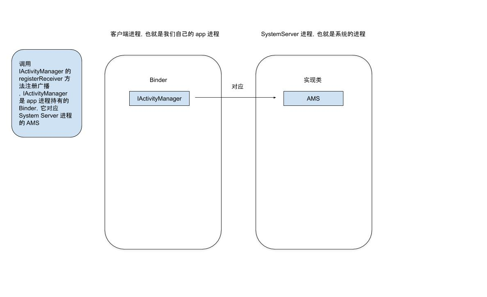

```java
private static class MyBroadcastReceiver extends BroadcastReceiver {
    @Override
    public void onReceive(Context context, Intent intent) {

    }
}

IntentFilter intentFilter = new IntentFilter("com.shadowwingz.test");
registerReceiver(new MyBroadcastReceiver(), intentFilter);
```

动态注册一个广播只需要创建一个 BroadcastReceiver 对象和 IntentFilter 对象，然后调用一下 `registerReceiver` 方法就行了，那么在 `registerReceiver` 方法内部又执行了哪些操作呢？我们来分析一下。

在分析之前，先提前讲下广播注册过程中涉及到的一些对象，以及它们的作用，避免看源码的时候一脸懵逼。

- ContextImpl，Context 实现类，我们平常调用 Context 的方法都是 ContextImpl 实现的，比如获取包名 `getPackageName`、获取资源 `getResources`。
- ActivityManagerService，简称 AMS，服务端对象，负责广播的注册
- mRegisteredReceivers，HashMap，key 是客户端对应的 Binder 对象，value 是泛型为 BroadcastFilter 的 List（广播接收者列表）
- mReceiverResolver，保存 IntentFilter

这边文章，主要分析广播是怎么注册的，也就是 `registerReceiver` 方法的执行流程。

首先，会执行 ContextWrapper 的 `registerReceiver` 方法，ContextWrapper 里并没有做什么实质性工作，而是调用了 ContextImpl 的 `registerReceiver` 方法：

```java
ContextWrapper # registerReceiver

@Override
public Intent registerReceiver(
    BroadcastReceiver receiver, IntentFilter filter,
    String broadcastPermission, Handler scheduler) {
    // 调用了 ContextImpl 的 registerReceiver 方法
    return mBase.registerReceiver(receiver, filter, broadcastPermission,
            scheduler);
}
```

ContextImpl 的 registerReceiver 方法又调用了 registerReceiverInternal 方法：

```java
ContextImpl # registerReceiver

@Override
public Intent registerReceiver(BroadcastReceiver receiver, IntentFilter filter,
        String broadcastPermission, Handler scheduler) {
    return registerReceiverInternal(receiver, getUserId(),
            filter, broadcastPermission, scheduler, getOuterContext());
}

ContextImpl # registerReceiverInternal

private Intent registerReceiverInternal(BroadcastReceiver receiver, int userId,
            IntentFilter filter, String broadcastPermission,
            Handler scheduler, Context context) {
    IIntentReceiver rd = null;
    if (receiver != null) {
        if (mPackageInfo != null && context != null) {
            if (scheduler == null) {
                scheduler = mMainThread.getHandler();
            }
            rd = mPackageInfo.getReceiverDispatcher(
                receiver, context, scheduler,
                mMainThread.getInstrumentation(), true);
        } else {
            if (scheduler == null) {
                scheduler = mMainThread.getHandler();
            }
            rd = new LoadedApk.ReceiverDispatcher(
                    receiver, context, scheduler, null, true).getIIntentReceiver();
        }
    }
    try {
        return ActivityManagerNative.getDefault().registerReceiver(
                mMainThread.getApplicationThread(), mBasePackageName,
                rd, filter, broadcastPermission, userId);
    } catch (RemoteException e) {
        return null;
    }
}
```

到 registerReceiverInternal 方法里，就比较关键了，为什么说比较关键呢？因为在这个方法里，会跨进程调用 AMS 的 `registerReceiver` 方法，四大组件的工作原理都涉及到了跨进程。但是在跨进程之前，还有点准备工作要做，就是先准备一下支持跨进程的组件，因为我们的 BroadcastReceiver 是不支持跨进程的。那 BroadcastReceiver 不支持跨进程，我们要准备个什么东西来跨进程？

答案是 IIntentReceiver，也就是 registerReceiverInternal 方法中那个名字叫 rd 的变量：

```java
IIntentReceiver

oneway interface IIntentReceiver {
    void performReceive(in Intent intent, int resultCode, String data,
            in Bundle extras, boolean ordered, boolean sticky, int sendingUser);
}
```

可以看到，IIntentReceiver 是一个 Binder ，AMS 最终会通过 IIntentReceiver 这个 Binder 来和我们的进程通信。但是这一切和 BroadcastReceiver 有什么关系呢？

要回答这个问题，我们需要看下 IIntentReceiver 的实现类，IIntentReceiver 的实现类是 LoadedApk.ReceiverDispatcher.InnerReceiver

```java
LoadedApk.ReceiverDispatcher

static final class ReceiverDispatcher {
    final IIntentReceiver.Stub mIIntentReceiver;
    final BroadcastReceiver mReceiver;
}
```

我们可以看到，ReceiverDispatcher 的内部封装了 IIntentReceiver 和 BroadcastReceiver，这里和 Service 的绑定过程有些类似。

```
LoadedApk
    ReceiverDispatcher
        InnerReceiver extends IIntentReceiver.Stub

    ServiceDispatcher
        InnerConnection extends IServiceConnection.Stub
```

这样，当接收到广播时，ReceiverDispatcher 可以调用 BroadcastReceiver 的 onReceive 方法。到这里，我们就知道了，IIntentReceiver 来负责完成进程间通信，由于 IIntentReceiver 和 BroadcastReceiver 是配对的，再调用 BroadcastReceiver 的 onReceive 方法，这样，广播就达到跨进程发送的目的了。

我们再回到 `registerReceiverInternal` 方法，它里面调用了 `mPackageInfo.getReceiverDispatcher` 方法，这个方法，看名字，是获取 ReceiverDispatcher 的。

接着，就开始跨进程了，远程调用 AMS 的 registerReceiver 方法：

```java
ActivityManagerService # registerReceiver

public Intent registerReceiver(IApplicationThread caller, String callerPackage,
            IIntentReceiver receiver, IntentFilter filter, String permission, int userId) {
    enforceNotIsolatedCaller("registerReceiver");
    int callingUid;
    int callingPid;
    synchronized(this) {
        ......

        ReceiverList rl
            = (ReceiverList)mRegisteredReceivers.get(receiver.asBinder());
        if (rl == null) {
            // 将 IIntentReceiver 存储到 ReceiverList 中
            rl = new ReceiverList(this, callerApp, callingPid, callingUid,
                    userId, receiver);
            ......
            // 存储 ReceiverList，也就是 IIntentReceiver
            mRegisteredReceivers.put(receiver.asBinder(), rl);
        } ......
        BroadcastFilter bf = new BroadcastFilter(filter, rl, callerPackage,
                permission, callingUid, userId);
        rl.add(bf);
        if (!bf.debugCheck()) {
            Slog.w(TAG, "==> For Dynamic broadast");
        }
        // 保存 IntentFilter
        mReceiverResolver.addFilter(bf);

        ......

        return sticky;
    }
}
```

AMS 的 registerReceiver 中主要做了两件事

- 保存 IIntentReceiver
- 保存 IntentFilter

到这里，整个广播的注册过程就分析完了。

我们总结一下

>因为广播不支持跨进程，所以需要创建一个 IIntentReceiver 来帮忙跨进程，然后调用 AMS 的 registerReceiver 来注册广播，在 AMS 中，将 IIntentReceiver 和 IntentFilter 分别保存起来，这样就完成了广播的注册。

#### ContentProvider 注册过程中涉及到的 Binder ####

