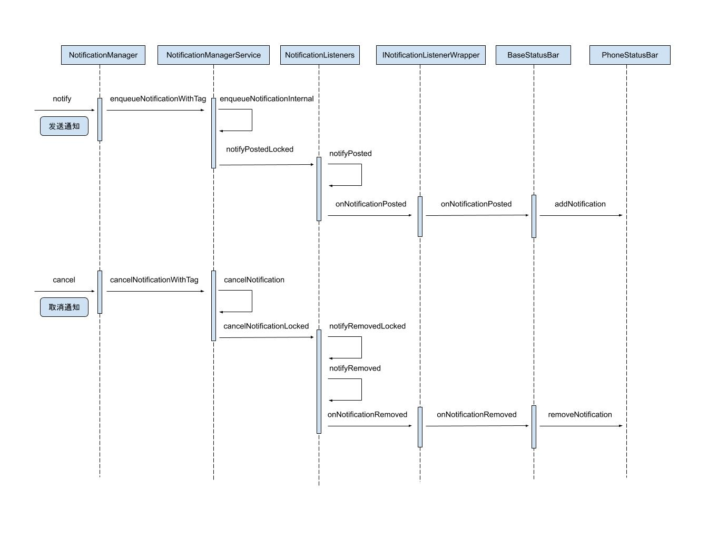

通知是 App 中很常见的一个功能，我们来研究下通知是怎么显示出现的。

通知是调用 `notify` 方法显示出来的，`notify` 方法会调用 NotificationManager 的 `notify` 方法：

```java
NotificationManager # notify

public void notify(int id, Notification notification)
{
    notify(null, id, notification);
}

public void notify(String tag, int id, Notification notification)
{
    ......
    // 获取 NMS 的实例
    INotificationManager service = getService();
    ......
    try {
        // 远程调用 NMS 的 enqueueNotificationWithTag 方法
        service.enqueueNotificationWithTag(pkg, mContext.getOpPackageName(), tag, id,
                stripped, idOut, UserHandle.myUserId());
        ......
    } catch (RemoteException e) {
    }
}
```

在 `notify` 方法中，会远程调用 NMS（NotificationManagerService）的 `enqueueNotificationWithTag` 方法，代码会执行到 system server 进程。

```java
NotificationManagerService # enqueueNotificationWithTag

@Override
public void enqueueNotificationWithTag(String pkg, String opPkg, String tag, int id,
        Notification notification, int[] idOut, int userId) throws RemoteException {
    enqueueNotificationInternal(pkg, opPkg, Binder.getCallingUid(),
            Binder.getCallingPid(), tag, id, notification, idOut, userId);
}

NotificationManagerService # enqueueNotificationInternal

void enqueueNotificationInternal(final String pkg, final String opPkg, final int callingUid,
            final int callingPid, final String tag, final int id, final Notification notification,
            int[] idOut, int incomingUserId) {
    ......

    mHandler.post(new Runnable() {
        @Override
        public void run() {

            synchronized (mNotificationList) {
                ......

                if (notification.icon != 0) {
                    StatusBarNotification oldSbn = (old != null) ? old.sbn : null;
                    mListeners.notifyPostedLocked(n, oldSbn);
                }

                ......
            }
        }
    });

    ......
}
```

在 