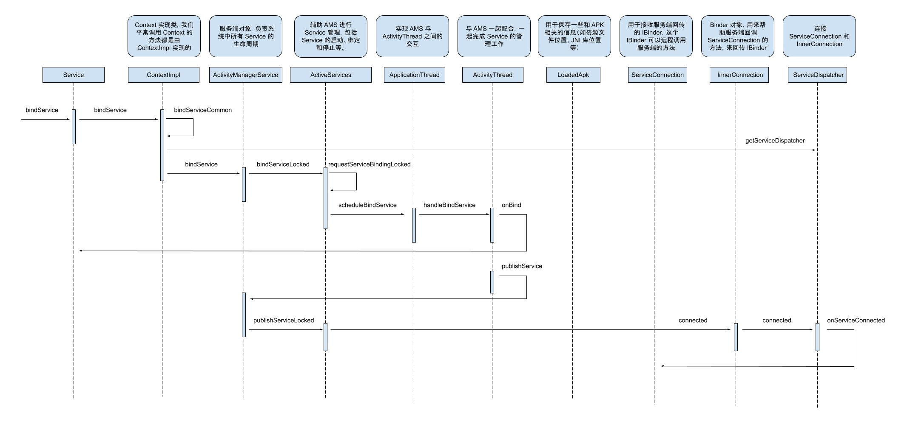

[点击查看大图](https://raw.githubusercontent.com/shadowwingz/AndroidLife/master/article/how_service_bind/art/how_service_bind.jpg)

#### 涉及到的对象以及作用 ####

先大概介绍下 Serivce 绑定过程中涉及到的一些对象，以及它们的作用：

- ContextImpl，Context 实现类，我们平常调用 Context 的方法都是 ContextImpl 实现的，比如获取包名 `getPackageName`、获取资源 `getResources`。
- ActivityManagerService，简称 AMS，服务端对象，负责系统中所有 Service 的生命周期。
- ApplicationThread，用来实现 AMS 与 ActivityThread 之间的交互。在 AMS 需要管理相关应用程序中的 Service 的生命周期时，通过 Application 的代理对象与 ActivityThread 通讯。
- ApplicationThreadProxy，是 ApplicationThread 在服务端的代理，负责和客户端的 ApplicationThread 通讯，AMS 就是通过该代理与 ActivityThread 通信的。
- ActivityThread，App 的真正入口，与 AMS 一起配合，一起完成 Service 的管理工作，比如启动 Service。
- LoaderApk，用于保存一些和 APK 相关的信息（如资源文件位置、JNI 库位置等）。
- ServiceConnection，我们调用 bindService 方法来绑定 Service，会返回一个用来和 Service 交互的 IBinder，这个 IBinder 可以用来远程调用服务端的方法，要接收这个 IBinder，我们客户端要创建一个 ServiceConnection 的实例并传给 bindService，ServiceConnection 包含一个回调方法 onServiceConnected，系统会通过这个方法来把 IBinder 传递给我们。
- InnerConnection，上面我们说了，ServiceConnection 的 onServiceConnected 方法是用来获取 IBinder 的，这个 IBinder 是服务端传递过来的，换句话说，就是服务端远程调用了客户端的 onServiceConnected 方法，把 IBinder 传过来了。但是有个问题，ServiceConnection 并不是个 Binder，它只是个普通的接口，而普通的接口是不能被远程调用的，这就意味着，服务端远程调用的其实是别的对象，这个对象必须是个 Binder 对象，这个对象就是 InnerConnection，InnerConnection 再调用 ServiceConnection 的 onServiceConnected 方法，把 IBinder 传递过来。
- ServiceDispatcher，ServiceDispatcher 起着连接 ServiceConnection 和  InnerConnection 的作用，怎么连接？ServiceDispatcher 内部有两个字段，一个是 `ServiceDispatcher.InnerConnection` 类型，一个是 `ServiceConnection` 类型，可以简单的把 ServiceDispatcher 理解为一个 Bean 对象，里面封装了 `ServiceDispatcher.InnerConnection` 对象和 `ServiceConnection` 对象。

#### 启动过程简述 ####

大致描述一下 Service 的启动过程：

> Service 的启动过程，我们从 ContextWrapper 的 bindService 说起，先是 ContextImpl 的 bindService，然后内部会通过 bindServiceCommon 来尝试启动 Service，在启动 Service 之前，会把客户端的 ServiceConnection 对象转化为 InnerConnection 对象，方便服务端回调 ServiceConnection 的 onServiceConnected 方法，启动 Service 是一个跨进程过程，它会调用 AMS 的 bindService 方法，AMS 校验完 Service 的合法性后，会通过 ApplicationThread 回调到我们的进程，这也是一次跨进程过程，而 ApplicationThread 就是一个 Binder，回调逻辑是在我们进程的 Binder 线程池中完成，所以需要通过 Handler H 将其切回 UI 线程，绑定 Service 对应的消息是 BIND_SERVICE,它对应着 handleBindService，在这个方法里面完成了 Service 的绑定，同时会回调 Service 的 onBind 方法，但是因为 Service 在服务端进程，Service 的 onBind 方法被调用，客户端并不知道，所以还要通过 AMS 的 publishService 来跨进程调用客户端 ServiceConnection 的 onServiceConnected 方法。

#### 目的 ####

这篇文章，主要分析从 bindService 开始，到客户端的 ServiceConnection 的 `onServiceConnected` 方法被回调，中间经历了怎样的流程。可以参考 [Binder 的使用及上层原理](https://github.com/shadowwingz/AndroidLifeDemo/tree/master/AndroidLifeDemo/app/src/main/java/com/shadowwingz/androidlifedemo/binderdemo) 的代码。

- BookManagerActivity，客户端，实现了 ServiceConnection 的 `onServiceConnected` 方法
- BookManagerService，服务端，实现了 aidl 接口的方法，并在 onBind 方法中返回 Binder 对象给客户端 ServiceConnection 的 `onServiceConnected` 方法。

我们先看 ContextWrapper 的 bindService 方法：

```java
ContextWrapper # bindService

@Override
public boolean bindService(Intent service, ServiceConnection conn,
        int flags) {
    return mBase.bindService(service, conn, flags);
}
```

mBase 是 ContextImpl 类型，我们接着看 ContextImpl 的 bindService 方法：

```java
ContextImpl # bindService

@Override
public boolean bindService(Intent service, ServiceConnection conn,
        int flags) {
    warnIfCallingFromSystemProcess();
    return bindServiceCommon(service, conn, flags, Process.myUserHandle());
}

ContextImpl # bindServiceCommon

private boolean bindServiceCommon(Intent service, ServiceConnection conn, int flags,
            UserHandle user) {
    IServiceConnection sd;
    ......
    if (mPackageInfo != null) {
        sd = mPackageInfo.getServiceDispatcher(conn, getOuterContext(),
                mMainThread.getHandler(), flags);
    } else {
        throw new RuntimeException("Not supported in system context");
    }
    validateServiceIntent(service);
    try {
        ......
        int res = ActivityManagerNative.getDefault().bindService(
            mMainThread.getApplicationThread(), getActivityToken(),
            service, service.resolveTypeIfNeeded(getContentResolver()),
            sd, flags, user.getIdentifier());
        ......
    } catch (RemoteException e) {
        return false;
    }
}
```

在 bindService 中，调用了 `bindServiceCommon` 方法，在 `bindServiceCommon` 方法中，会把客户端 BookManagerActivity 实现的 ServiceConnection 对象，转换成 `ServiceDispatcher.InnerConnection` 对象，因为最终服务端是要远程调用客户端 ServiceConnection 的 `onServiceConnected` 方法，而 ServiceConnection 只是普通的接口，并不是 Binder，所以没有办法跨进程，所以服务端也就无法远程调用 `onServiceConnected` 方法，所以要把 ServiceConnection 转换成 ServiceDispatcher 的内部类 `InnerConnection`，InnerConnection 是一个 Binder，这样服务端就可以先调用 InnerConnection，再由 InnerConnection 去调用 ServiceConnection 的 `onServiceConnected`。

ServiceDispatcher 起着连接 ServiceConnection 和 InnerConnection 的作用，怎么连接？ServiceDispatcher 内部有两个字段，一个是 `ServiceDispatcher.InnerConnection` 类型，一个是 `ServiceConnection` 类型，可以简单的把 ServiceDispatcher 理解为一个 Bean 对象，里面封装了 `ServiceDispatcher.InnerConnection` 对象和 `ServiceConnection` 对象。

我们看下 `mPackageInfo.getServiceDispatcher` 方法，mPackageInfo 是 LoadedApk 类型，所以我们看下 LoadedApk 的 `getServiceDispatcher` 方法：

```java
public final IServiceConnection getServiceDispatcher(ServiceConnection c,
            Context context, Handler handler, int flags) {
    synchronized (mServices) {
        LoadedApk.ServiceDispatcher sd = null;
        ArrayMap<ServiceConnection, LoadedApk.ServiceDispatcher> map = mServices.get(context);
        if (map != null) {
            sd = map.get(c);
        }
        if (sd == null) {
            sd = new ServiceDispatcher(c, context, handler, flags);
            if (map == null) {
                map = new ArrayMap<ServiceConnection, LoadedApk.ServiceDispatcher>();
                mServices.put(context, map);
            }
            map.put(c, sd);
        } else {
            sd.validate(context, handler);
        }
        return sd.getIServiceConnection();
    }
}
```

在 `getServiceDispatcher` 方法中，有一个 mService 变量，它是一个 ArrayMap，保存了 ServiceConnnection 和 ServiceDispatcher 的映射关系：

```java
private final ArrayMap<Context, ArrayMap<ServiceConnection, LoadedApk.ServiceDispatcher>> mServices
        = new ArrayMap<Context, ArrayMap<ServiceConnection, LoadedApk.ServiceDispatcher>>();
```

可以看到，它的 key 是 ServiceConnection，value 是 LoadedApk.ServiceDispatcher，我们刚刚说了，ServiceDispatcher 中封装了 ServiceConnection 对象和 InnerConnection 对象。

系统首先会查找是否存在相同的 ServiceConnection，如果不存在就创建一个 ServiceDispatcher，并把当前客户端的 ServiceConnection 传递到这个 ServiceDispatcher 中，并为客户端的 ServiceConnection 创建一个对应的 InnerConnection：

```java
LoadedApk # ServiceDispatcher

// conn 是客户端的 ServiceConnection，被传入 ServiceDispatcher 的构造方法中
ServiceDispatcher(ServiceConnection conn,
                Context context, Handler activityThread, int flags) {
    // 创建对应的 InnerConnection
    mIServiceConnection = new InnerConnection(this);
}
```

可以看出，ServiceConnection 和 InnerConnection 是一一对应的关系。

当 Service 和客户端建立连接后，也就是 Service 的 onBind 被回调，这时系统会通过 InnerConnection 来调用 ServiceConnection 的 `onServiceConnected` 方法，这个过程有可能是跨进程的，是否跨进程取决于有没有设置 Service 的 remote 属性。

总结一下，`getServiceDispatcher` 方法会返回 ServiceConnection 对应的 InnerConnection 对象。

我们继续看 `bindServiceCommon` 方法，在调用了 `getServiceDispatcher` 方法之后，拿到了对应的 InnerConnection，接着调用了 `ActivityManagerNative.getDefault().bindService` 方法，也就是 AMS 的 `bindService` 方法：

```java
ActivityManagerService # bindService

public int bindService(IApplicationThread caller, IBinder token,
            Intent service, String resolvedType,
            IServiceConnection connection, int flags, int userId) {
    ......
    synchronized(this) {
        return mServices.bindServiceLocked(caller, token, service, resolvedType,
                connection, flags, userId);
    }
}

ActiveServices # bindServiceLocked

int bindServiceLocked(IApplicationThread caller, IBinder token,
            Intent service, String resolvedType,
            IServiceConnection connection, int flags, int userId) {
    ......

    try {
        ......

        if (s.app != null && b.intent.received) {
            ......
        } else if (!b.intent.requested) {
            requestServiceBindingLocked(s, b.intent, callerFg, false);
        }

        ......

    } finally {
        ......
    }

    return 1;
}

ActiveServices # requestServiceBindingLocked

private final boolean requestServiceBindingLocked(ServiceRecord r,
            IntentBindRecord i, boolean execInFg, boolean rebind) {
    ......
    if ((!i.requested || rebind) && i.apps.size() > 0) {
        try {
            ......
            r.app.thread.scheduleBindService(r, i.intent.getIntent(), rebind,
                    r.app.repProcState);
            ......
        } catch (RemoteException e) {
            ......
        }
    }
    return true;
}
```

在 AMS 的 `bindService` 方法中，最终调用了 ApplicationThread 的 `scheduleBindService` 方法，这是服务端远程调用客户端，我们继续看 `scheduleBindService` 方法：

```java
ActivityThread.ApplicationThread # scheduleBindService

public final void scheduleBindService(IBinder token, Intent intent,
                boolean rebind, int processState) {
    ......
    sendMessage(H.BIND_SERVICE, s);
}
```

`scheduleBindService` 方法中，发了一个消息给 H Handler，切换线程，对应的消息是 BIND_SERVICE：

```java
ActivityThread.H

case BIND_SERVICE:
    Trace.traceBegin(Trace.TRACE_TAG_ACTIVITY_MANAGER, "serviceBind");
    handleBindService((BindServiceData)msg.obj);
    Trace.traceEnd(Trace.TRACE_TAG_ACTIVITY_MANAGER);
    break;
```

在 BIND_SERVICE 中，调用了 handleBindService 方法：

```java
ActivityThread # handleBindService

private void handleBindService(BindServiceData data) {
    Service s = mServices.get(data.token);
    ......
    if (s != null) {
        try {
            ......
            try {
                if (!data.rebind) {
                    IBinder binder = s.onBind(data.intent);
                    ActivityManagerNative.getDefault().publishService(
                            data.token, data.intent, binder);
                } else {
                    ......
                }
                ensureJitEnabled();
            } catch (RemoteException ex) {
            }
        } catch (Exception e) {
            ......
        }
    }
}
```

在 handleBindService 方法中，根据 Service 的 token 取出 Service 对象，然后调用 Service 的 onBind 方法。

到这里，服务端 BookManagerService 中的 onBind 方法就被回调了，Service 此时也处于绑定状态，但是因为 Service 在服务端，而客户端 BookManagerActivity 并不知道 Service 已经绑定成功了，所以还需要通知下客户端，具体的通知方法就是下面的 `ActivityManagerNative.getDefault().publishService` 方法，也就是 AMS 的 `publishService`，这是从客户端远程调用服务端的方法，我们看下 `publishService` 方法的实现：

```java
AMS # publishService

public void publishService(IBinder token, Intent intent, IBinder service) {
    ......

    synchronized(this) {
        ......
        mServices.publishServiceLocked((ServiceRecord)token, intent, service);
    }
}
```

在 AMS 的 `publishService` 方法中，调用了 `ActiveServices` 的 `publishServiceLocked` 方法：

```java
ActiveServices # publishServiceLocked

void publishServiceLocked(ServiceRecord r, Intent intent, IBinder service) {
    final long origId = Binder.clearCallingIdentity();
    try {
        if (DEBUG_SERVICE) Slog.v(TAG, "PUBLISHING " + r
                + " " + intent + ": " + service);
        if (r != null) {
            ......
            if (b != null && !b.received) {
                ......
                for (int conni=r.connections.size()-1; conni>=0; conni--) {
                    ......
                    for (int i=0; i<clist.size(); i++) {
                        ......
                        try {
                            // 调用 InnerConnection 的 connected 方法
                            c.conn.connected(r.name, service);
                        } catch (Exception e) {
                            ......
                        }
                    }
                }
            }

            serviceDoneExecutingLocked(r, mDestroyingServices.contains(r), false);
        }
    } finally {
        Binder.restoreCallingIdentity(origId);
    }
}

LoadedApk.ServiceDispatcher.InnerConnection # connected

public void connected(ComponentName name, IBinder service) throws RemoteException {
    LoadedApk.ServiceDispatcher sd = mDispatcher.get();
    if (sd != null) {
        sd.connected(name, service);
    }
}

LoadedApk.ServiceDispatcher # connected

public void connected(ComponentName name, IBinder service) {
    if (mActivityThread != null) {
        mActivityThread.post(new RunConnection(name, service, 0));
    } else {
        doConnected(name, service);
    }
}
```

在 `publishServiceLocked` 中，调用了 InnerConnection 的 connected，InnerConnection 我们之前说过，是帮助 AMS 调用客户端 ServiceConnection 的 onServiceConnected 方法的。在 InnerConnection 的 connected 方法中，又调用了 
ServiceDispatcher 的 connected 方法，最终调用了 mActivityThread.post 方法。

mActivityThread 是一个 Handler，其实就是 ActivityThread 的 H，这里调用 post 方法，会把 RunConnection 这个任务投递到主线程去执行，我们看下 RunConnection：

```java
LoadedApk.ServiceDispatcher.RunConnection

private final class RunConnection implements Runnable {
            RunConnection(ComponentName name, IBinder service, int command) {
        mName = name;
        mService = service;
        mCommand = command;
    }

    public void run() {
        if (mCommand == 0) {
            doConnected(mName, mService);
        } else if (mCommand == 1) {
            doDeath(mName, mService);
        }
    }

    final ComponentName mName;
    final IBinder mService;
    final int mCommand;
}

LoadedApk.ServiceDispatcher # doConnected

public void doConnected(ComponentName name, IBinder service) {
    ......
    // If there is a new service, it is now connected.
    if (service != null) {
        mConnection.onServiceConnected(name, service);
    }
}
```

在 RunConnection 的 run 方法中，最终调用了 ServiceConnection 的 onServiceConnected 方法，因为是用主线程的 H Handler 投递的任务，所以 onServiceConnected 方法会被执行在主线程。

到这里，Service 的绑定过程也就分析完了。