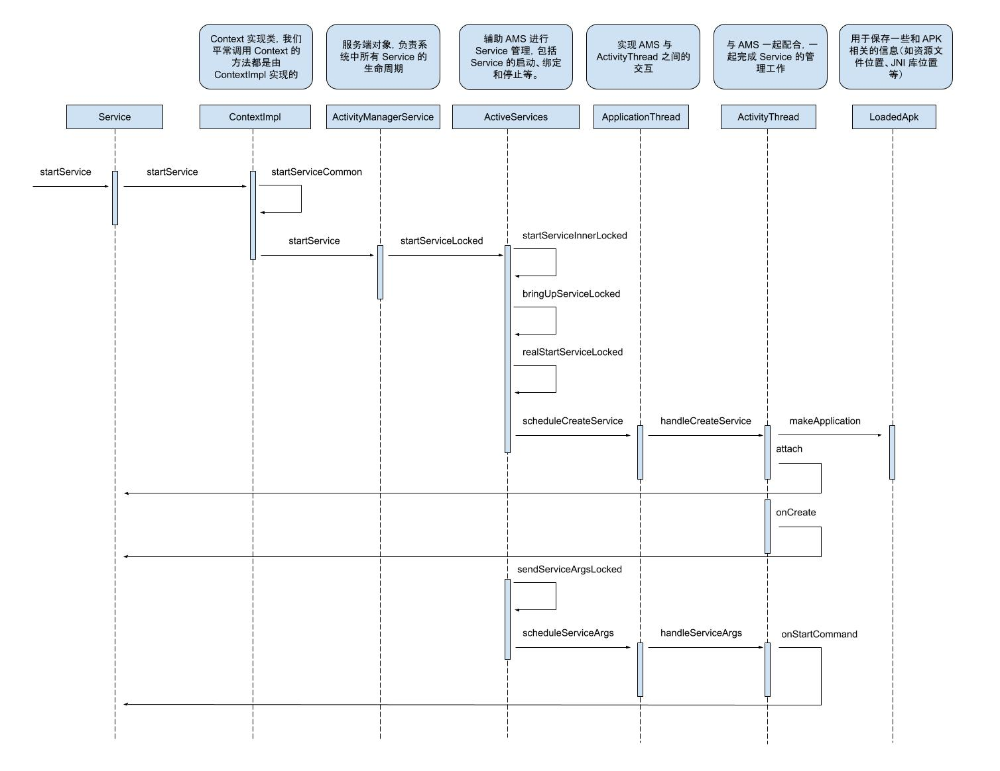
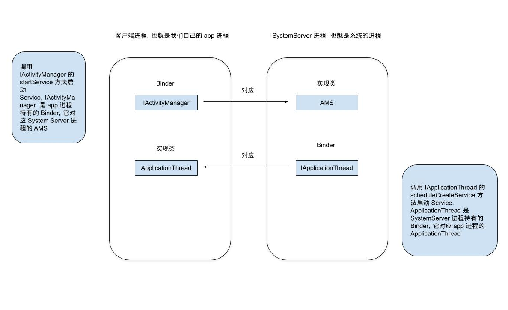

[点击查看大图](https://raw.githubusercontent.com/shadowwingz/AndroidLife/master/article/how_service_start/art/how_service_start.jpg)

启动一个 Service 很简单，只需要调用

```java
Intent intent = new Intent(this, TestService.class);
startService(intent);
```

就可以启动一个 Service 了，但是，只会启动 Service 是不够滴，我们还要知道它是怎么启动的，做一个牛（Zhuang）逼的开发者。

和 [Activity 的工作过程](https://github.com/shadowwingz/AndroidLife/blob/master/article/how_activity_start/how_activity_start.md) 中一样，我们也先提前讲下 Service 启动过程中涉及到的一些对象，以及它们的作用，避免看源码的时候一脸懵逼。

- ContextImpl，Context 实现类，我们平常调用 Context 的方法都是 ContextImpl 实现的，比如获取包名 `getPackageName`、获取资源 `getResources`。
- ActivityManagerService，简称 AMS，服务端对象，负责系统中所有 Service 的生命周期。
- ApplicationThread，用来实现 AMS 与 ActivityThread 之间的交互。在 AMS 需要管理相关应用程序中的 Service 的生命周期时，通过 Application 的代理对象与 ActivityThread 通讯。
- ApplicationThreadProxy，是 ApplicationThread 在服务端的代理，负责和客户端的 ApplicationThread 通讯，AMS 就是通过该代理与 ActivityThread 通信的。
- ActivityThread，App 的真正入口，与 AMS 一起配合，一起完成 Service 的管理工作，比如启动 Service。
- LoaderApk，用于保存一些和 APK 相关的信息（如资源文件位置、JNI 库位置等）。

先大致描述一下 Service 的启动过程：

> Service 的启动过程，我们从 ContextWrapper 的 startService 说起，先是 ContextImpl 的 startService，然后内部会通过 startServiceCommon 来尝试启动 Service，这是一个跨进程过程，它会调用 AMS 的 startService 方法，AMS 校验完 Service 的合法性后，会通过 ApplicationThread 回调到我们的进程，这也是一次跨进程过程，而 ApplicationThread 就是一个 Binder，回调逻辑是在我们进程的 Binder 线程池中完成，所以需要通过 Handler H 将其切回 UI 线程，启动 Service 对应的消息是 CREATE_SERVICE,它对应着 handleCreateService，在这个方法里面完成了 Service 的创建和启动。

我们把 Service 的启动过程和 [Activity 的工作过程](https://github.com/shadowwingz/AndroidLife/blob/master/article/how_activity_start/how_activity_start.md) 比较一下，就会发现，它俩很像，这说明了虽然 Android 系统源码贼特么复杂，但依然是有迹可寻的。

#### 目的 ####

看源码要带着目的去看，我们这篇文章，主要分析从调用 `startService` 方法开始，到 Service 的 `onCreate` 方法和 `onStartCommand` 方法被回调，中间经历了怎样的流程。

我们来看 ContextWrapper 的 `startService` 方法，在 Activity 中调用 `startService` 走到并不是 Activity 的 `startService` 方法，而是 ContextWrapper 的 `startService` 方法：

```java
ContextWrapper # startService

@Override
public ComponentName startService(Intent service) {
    return mBase.startService(service);
}
```

startService 方法里又调用了 mBase 的 startService 方法，这里的 mBase 是 Context 的实现类 ContextImpl，我们再看 ContextImpl 的 startService 方法：

```java
ContextImpl # startService

@Override
public ComponentName startService(Intent service) {
    warnIfCallingFromSystemProcess();
    return startServiceCommon(service, mUser);
}

ContextImpl # stopServiceCommon

private ComponentName startServiceCommon(Intent service, UserHandle user) {
    try {
        ......
        ComponentName cn = ActivityManagerNative.getDefault().startService(
            mMainThread.getApplicationThread(), service,
            service.resolveTypeIfNeeded(getContentResolver()), user.getIdentifier());
        ......
    } catch (RemoteException e) {
        return null;
    }
}
```

在 ContextImpl 的 startService 方法中，最终调用了 `ActivityManagerNative.getDefault().stopService` 方法，`ActivityManagerNative.getDefault()` 在 [Activity 的工作过程](https://github.com/shadowwingz/AndroidLife/blob/master/article/how_activity_start/how_activity_start.md) 中我们已经分析过了，它就是 ActivityManagerService（后面简称 AMS），所以这里是调用 AMS 的 startService 方法，这是一个跨进程调用（IPC）的过程，我们看看 AMS 的 startService 方法：

```java
AMS # startService

@Override
public ComponentName startService(IApplicationThread caller, Intent service,
        String resolvedType, int userId) {
    ......
    ComponentName res = mServices.startServiceLocked(caller, service,
            resolvedType, callingPid, callingUid, userId);
    ......
}
```

现在代码已经执行到了服务端，在 AMS 的 startService 方法中，又调用了 `mServices.startServiceLocked` 方法，mService 是 `ActiveServices` 类新的对象，它是一个辅助 AMS 进行 Service 管理的类，包括 Service 的启动、绑定和停止等。我们继续看 ActiveServices 的 startServiceLocked 方法：

```java
ActiveServices # startServiceLocked

ComponentName startServiceLocked(IApplicationThread caller,
            Intent service, String resolvedType,
            int callingPid, int callingUid, int userId) {
    ......

    return startServiceInnerLocked(smap, service, r, callerFg, addToStarting);
}

ActiveServices # startServiceInnerLocked

ComponentName startServiceInnerLocked(ServiceMap smap, Intent service,
            ServiceRecord r, boolean callerFg, boolean addToStarting) {
    ......
    String error = bringUpServiceLocked(r, service.getFlags(), callerFg, false);
    ......

    return r.name;
}

ActiveServices # bringUpServiceLocked

private final String bringUpServiceLocked(ServiceRecord r,
            int intentFlags, boolean execInFg, boolean whileRestarting) {
    ......

    if (!isolated) {
        ......
        if (app != null && app.thread != null) {
            try {
                ......
                realStartServiceLocked(r, app, execInFg);
                return null;
            } catch (RemoteException e) {
                Slog.w(TAG, "Exception when starting service " + r.shortName, e);
            }

            // If a dead object exception was thrown -- fall through to
            // restart the application.
        }
    } else {
       ......
    }

    ......

    return null;
}
```

在 ActiveServices 的 startServiceLocked 方法中，跳转了好几次，最终调用了 `realStartServiceLocked` 方法，从名字上看，应该是要启动 Service 了，我们看看它的实现：

```java
ActiveServices # realStartServiceLocked

private final void realStartServiceLocked(ServiceRecord r,
            ProcessRecord app, boolean execInFg) throws RemoteException {
    ......
    try {
        ......
        app.thread.scheduleCreateService(r, r.serviceInfo,
                mAm.compatibilityInfoForPackageLocked(r.serviceInfo.applicationInfo),
                app.repProcState);
        r.postNotification();
        created = true;
    } catch (DeadObjectException e) {
        Slog.w(TAG, "Application dead when creating service " + r);
        mAm.appDiedLocked(app);
    } finally {
        if (!created) {
            app.services.remove(r);
            r.app = null;
            scheduleServiceRestartLocked(r, false);
            return;
        }
    }

    ......
}
```

在 realStartServiceLocked 方法中，调用了 `app.thread.scheduleCreateService`，感觉和 Activity 启动的套路差不多嘛，连方法名都这么类似，app.thread 就是一个 Binder，它在客户端（也就是我们自己的进程）的实现是 ApplicationThread 和 ApplicationThreadNative，ApplicationThread 是客户端具体的实现，比如启动 Service，它里面的方法都是执行在客户端进程的 Binder 线程池里，ApplicationThreadNative 是 Binder 对象，启动 Service 就是通过它来调用 ApplicationThread 的方法。

所以 `app.thread.scheduleCreateService` 就是服务端远程调用客户端的 `scheduleCreateService` 方法。

我们看下 ApplicationThread 的 scheduleCreateService 方法：

```java
ApplicationThread # scheduleCreateService

public final void scheduleCreateService(IBinder token,
                ServiceInfo info, CompatibilityInfo compatInfo, int processState) {
    updateProcessState(processState, false);
    CreateServiceData s = new CreateServiceData();
    s.token = token;
    s.info = info;
    s.compatInfo = compatInfo;

    sendMessage(H.CREATE_SERVICE, s);
}
```

scheduleCreateService 方法的实现很简单，就是通过 H 这个 Handler 来发送一个消息到主线程。因为 ApplicationThread 的 方法都是执行在客户端的 Binder 线程池中，而子线程中不能更新 UI，所以要切换到主线程，也就是 ActivityThread 中，我们看下 H 的 CREATE_SERVICE：

```java
ActivityThread.H # CREATE_SERVICE

case CREATE_SERVICE:
    Trace.traceBegin(Trace.TRACE_TAG_ACTIVITY_MANAGER, "serviceCreate");
    handleCreateService((CreateServiceData)msg.obj);
    Trace.traceEnd(Trace.TRACE_TAG_ACTIVITY_MANAGER);
```

在 CREATE_SERVICE 中，调用了 handleCreateService 方法：

```java
private void handleCreateService(CreateServiceData data) {
    // If we are getting ready to gc after going to the background, well
    // we are back active so skip it.
    unscheduleGcIdler();

    LoadedApk packageInfo = getPackageInfoNoCheck(
            data.info.applicationInfo, data.compatInfo);
    Service service = null;
    try {
        // 通过类加载器创建 Service 的实例
        java.lang.ClassLoader cl = packageInfo.getClassLoader();
        service = (Service) cl.loadClass(data.info.name).newInstance();
    } catch (Exception e) {
        ......
    }

    try {
        if (localLOGV) Slog.v(TAG, "Creating service " + data.info.name);

        // 创建 ContextImpl 对象
        ContextImpl context = ContextImpl.createAppContext(this, packageInfo);
        context.setOuterContext(service);

        // 创建 Application 对象，如果有，就从缓存取
        Application app = packageInfo.makeApplication(false, mInstrumentation);
        // 通过 attach 方法将 ContextImpl 对象和 Service 关联起来
        service.attach(context, this, data.info.name, data.token, app,
                ActivityManagerNative.getDefault());
        // 回调 Service 的 onCreate 方法
        service.onCreate();
        // 将 Service 对象缓存到 ActivityThread 中的一个列表中
        mServices.put(data.token, service);
        try {
            ActivityManagerNative.getDefault().serviceDoneExecuting(
                    data.token, 0, 0, 0);
        } catch (RemoteException e) {
            // nothing to do.
        }
    } catch (Exception e) {
        if (!mInstrumentation.onException(service, e)) {
            throw new RuntimeException(
                "Unable to create service " + data.info.name
                + ": " + e.toString(), e);
        }
    }
}
```

在 handleCreateService 中，主要做了这么几件事：

-  通过类加载器创建 Service 的实例
-  如果 Application 已经被创建就从缓存取，否则就创建
-  创建 ContextImpl 并关联 Service
-  回调 Service 的 onCreate 方法
-  缓存 Service 对象

到这里，Service 就已经启动了。

在前面 ActiveServices 的 realStartServiceLocked 方法中，还调用了 `sendServiceArgsLocked` 方法：

```java
ActiveServices # sendServiceArgsLocked

private final void sendServiceArgsLocked(ServiceRecord r, boolean execInFg,
            boolean oomAdjusted) {
    ......

    while (r.pendingStarts.size() > 0) {
        try {
            ......
            r.app.thread.scheduleServiceArgs(r, si.taskRemoved, si.id, flags, si.intent);
        } catch (RemoteException e) {
            ......
        } catch (Exception e) {
            Slog.w(TAG, "Unexpected exception", e);
            break;
        }
    }
}
```

在 `sendServiceArgsLocked` 方法中，又调用了 ApplicationThread 的 `scheduleServiceArgs`，这是一次跨进程调用，服务端远程调用客户端的方法，我们看下 ApplicationThread 的 `scheduleServiceArgs` 方法：

```java
ApplicationThread # scheduleServiceArgs

public final void scheduleServiceArgs(IBinder token, boolean taskRemoved, int startId,
            int flags ,Intent args) {
    ServiceArgsData s = new ServiceArgsData();
    s.token = token;
    s.taskRemoved = taskRemoved;
    s.startId = startId;
    s.flags = flags;
    s.args = args;

    sendMessage(H.SERVICE_ARGS, s);
}
```

和上面 `scheduleCreateService` 的源码差不多，也是给 H 这个 Handler 发消息，来切换到主线程。我们再看 H 的 SERVICE_ARGS：

```java
ActivityThread.H # SERVICE_ARGS

case SERVICE_ARGS:
    Trace.traceBegin(Trace.TRACE_TAG_ACTIVITY_MANAGER, "serviceStart");
    handleServiceArgs((ServiceArgsData)msg.obj);
    Trace.traceEnd(Trace.TRACE_TAG_ACTIVITY_MANAGER);
    break;
```

在 SERVICE_ARGS 中，调用了 `handleServiceArgs` 方法：

```java
ActivityThread # handleServiceArgs

private void handleServiceArgs(ServiceArgsData data) {
    Service s = mServices.get(data.token);
    if (s != null) {
        try {
            ......
            if (!data.taskRemoved) {
                res = s.onStartCommand(data.args, data.flags, data.startId);
            } else {
                ......
            }

            ......
        } catch (Exception e) {
            ......
        }
    }
}
```

在 `handleServiceArgs` 中，回调了 Service 的 `onStartCommand` 方法。

到这里 Service 的启动过程就分析完了。

#### Service 启动过程中涉及到的 Binder ####

Service 启动过程中涉及到的 Binder 和 Activity 是一样的：

