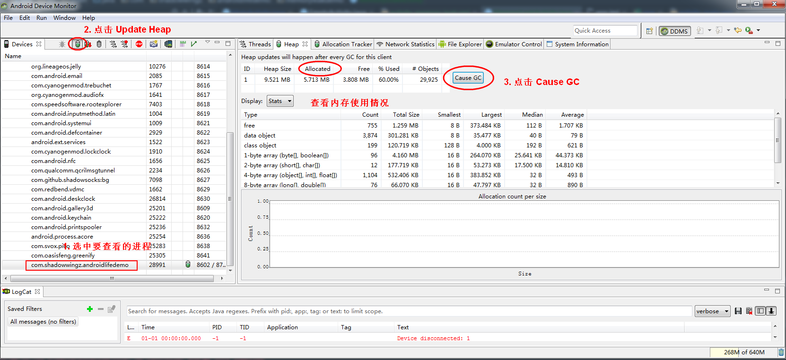
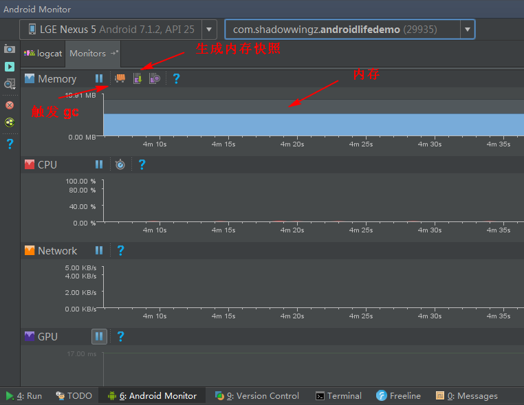

#### 什么是内存泄漏？

首先，Java 是有垃圾回收机制的，我们 new 一个对象，就会向 JVM 申请一块内存，当任务完成了，JVM 是要把内存回收回去的，有借有还，再借不难嘛，如果由于某些原因，JVM 无法回收这块内存，那么就发生了内存泄漏。

#### 内存泄漏的危害

刚刚我们说了，内存泄漏是因为 JVM 无法回收这块内存，无法回收这块内存，就意味 JVM 可分配给应用程序的内存就变少了，如果持续发生内存泄漏，JVM 可以分配的内存就越来越少，到最后，应用就会 OOM（Out Of Memory）。当然 OOM 的原因不止内存泄漏，还有其他原因也会造成 OOM。OOM 对于 Android 应用程序的表现就是应用崩溃。

#### 怎么判断对象可以回收

判断对象可以回收，就看对象有没有被引用，那么，怎么判断对象有没有被引用，这个就要牵扯到 JVM 的垃圾回收算法了。

- 引用计数法

对象每被引用一次，计数器就加 1，计数器为 0 时，这个对象就会被 JVM 回收。但是有个问题，如果出现两个对象相互引用，即使这两个对象没有被外部引用，那这两个对象的计数器也都不为 0，那么 JVM 是不会回收这两个对象的。由于引用计数法有这个问题，所以主流的 JVM 都没有采用这种垃圾回收算法。

- 可达性分析算法（主流算法）

以 `GC Roots` 对象作为起始点，向下搜索，如果搜不到这个对象，证明这个对象是不可用的。

可以作为 `GC Roots` 的对象：

1. 虚拟机栈中引用的对象
2. 方法区中类静态属性引用的对象
3. 方法区中常量引用的对象
4. 本地方法栈中 JNI 引用的对象

#### 怎么发现内存泄漏 ####

1. 使用 Android Studio 的 `Android Device Monitor`，通过 DDMS 的 heap 工具，查看内存的使用情况

2. 使用 Android Studio 的 `Android Monitor` 的 `Monitor`，可以更直观的看到内存使用情况

3. 使用代码检测 Activity 泄漏

[怎么用代码检测内存泄漏？](https://github.com/shadowwingz/AndroidLife/blob/master/article/handler_memory_leak/handler_memory_leak.md#%E6%80%8E%E4%B9%88%E7%94%A8%E4%BB%A3%E7%A0%81%E6%A3%80%E6%B5%8B%E5%86%85%E5%AD%98%E6%B3%84%E6%BC%8F)

