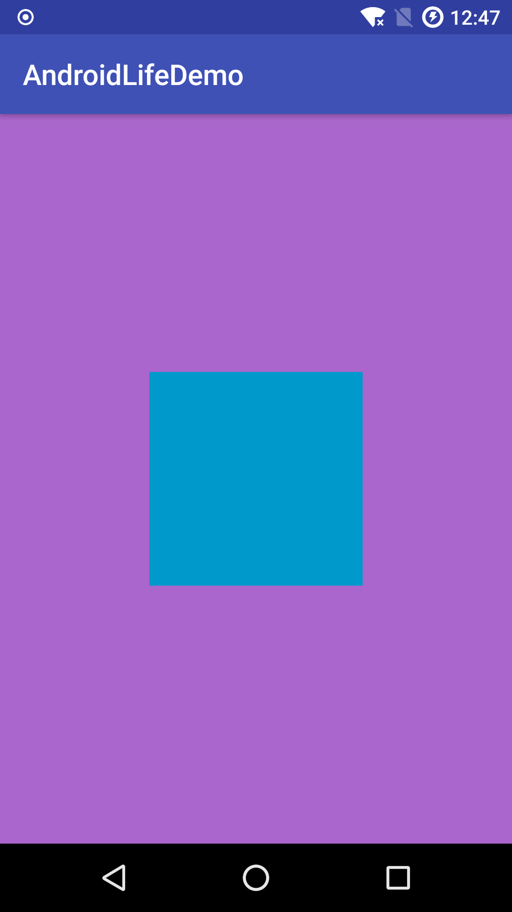
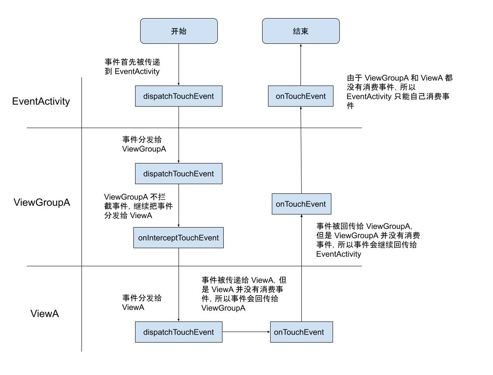

在 [事件分发源码解析](https://github.com/shadowwingz/AndroidLife/blob/master/article/%E4%BA%8B%E4%BB%B6%E5%88%86%E5%8F%91%E6%BA%90%E7%A0%81%E8%A7%A3%E6%9E%90.md) 中，我们从源码的角度分析了一个点击事件的传递流程，这篇文章中，我们用一个实例来看下一个点击事件是怎么传递的。

我们先写一个简单的布局，这个布局是这个样子：



中间蓝色的方块是 ViewA，紫色的背景是 ViewGroupA，它们两个都依附于 EventActivity 之上。

ViewA 代码：

```java
public class ViewA extends View {

    public ViewA(Context context) {
        super(context);
    }

    public ViewA(Context context, @Nullable AttributeSet attrs) {
        super(context, attrs);
    }

    public ViewA(Context context, @Nullable AttributeSet attrs, int defStyleAttr) {
        super(context, attrs, defStyleAttr);
    }

    @Override
    public boolean dispatchTouchEvent(MotionEvent event) {
        LogUtil.d("dispatchTouchEvent viewA");
        return super.dispatchTouchEvent(event);
    }

    @Override
    public boolean onTouchEvent(MotionEvent event) {
        LogUtil.d("onTouchEvent viewA");
        return super.onTouchEvent(event);
    }
}
```

ViewA 继承自 View，然后重写了 `dispatchTouchEvent` 方法和 `onTouchEvent` 方法，加上了日志打印。

ViewGroupA 代码：

```java
public class ViewGroupA extends LinearLayout {

    public ViewGroupA(Context context) {
        super(context);
    }

    public ViewGroupA(Context context, AttributeSet attrs) {
        super(context, attrs);
    }

    public ViewGroupA(Context context, AttributeSet attrs, int defStyleAttr) {
        super(context, attrs, defStyleAttr);
    }

    @Override
    public boolean dispatchTouchEvent(MotionEvent ev) {
        LogUtil.d("dispatchTouchEvent ViewGroupA");
        return super.dispatchTouchEvent(ev);
    }

    @Override
    public boolean onInterceptTouchEvent(MotionEvent ev) {
        LogUtil.d("onInterceptTouchEvent ViewGroupA");
        return super.onInterceptTouchEvent(ev);
    }

    @Override
    public boolean onTouchEvent(MotionEvent event) {
        LogUtil.d("onTouchEvent ViewGroupA");
        return super.onTouchEvent(event);
    }
}
```

ViewGroupA 继承自 LinearLayout，然后重写了 `dispatchTouchEvent` 方法、 `onInterceptTouchEvent` 方法和 `onTouchEvent` 方法，加上了日志打印。

EventActivity 代码：

```java
public class EventActivity extends AppCompatActivity {

    @Override
    protected void onCreate(Bundle savedInstanceState) {
        super.onCreate(savedInstanceState);
        setContentView(R.layout.activity_event);
    }

    @Override
    public boolean dispatchTouchEvent(MotionEvent ev) {
        switch (ev.getAction()) {
            case MotionEvent.ACTION_DOWN: {
                LogUtil.d("event type ACTION_DOWN");
                break;
            }
            case MotionEvent.ACTION_MOVE: {
                LogUtil.d("event type ACTION_MOVE");
                break;
            }
            case MotionEvent.ACTION_UP: {
                LogUtil.d("event type ACTION_UP");
                break;
            }
            default:
                break;
        }
        LogUtil.d("dispatchTouchEvent EventActivity");
        return super.dispatchTouchEvent(ev);
    }

    @Override
    public boolean onTouchEvent(MotionEvent event) {
        LogUtil.d("onTouchEvent EventActivity");
        return super.onTouchEvent(event);
    }
}
```

EventActivity 中，我们重写了 `dispatchTouchEvent` 方法和 `onTouchEvent` 方法，加上了日志打印，在 `dispatchTouchEvent` 方法中，我们还判断了当前传递的事件是 `ACTION_DOWN` 事件（手指按下）还是 `ACTION_UP` 事件（手指抬起）。

EventActivity 的布局文件代码如下：

```xml
<?xml version="1.0" encoding="utf-8"?>
<FrameLayout
    xmlns:android="http://schemas.android.com/apk/res/android"
    xmlns:tools="http://schemas.android.com/tools"
    android:id="@+id/fl_root"
    android:layout_width="match_parent"
    android:layout_height="match_parent"
    tools:context=".eventdemo.EventActivity">

    <com.shadowwingz.androidlifedemo.eventdemo.viewgroup.ViewGroupA
        android:id="@+id/viewGroupA"
        android:layout_width="match_parent"
        android:layout_height="match_parent"
        android:background="@android:color/holo_purple"
        android:gravity="center"
        android:orientation="vertical">

        <com.shadowwingz.androidlifedemo.eventdemo.view.ViewA
            android:id="@+id/viewA"
            android:layout_width="150dp"
            android:layout_height="150dp"
            android:background="@android:color/holo_blue_dark"/>
    </com.shadowwingz.androidlifedemo.eventdemo.viewgroup.ViewGroupA>

</FrameLayout>
```

代码写好之后，我们点击一下中间蓝色的方块，也就是 ViewA，点击之后滑动一下，然后抬起手指。整个过程打印日志如下：

```
[手指按下]
event type ACTION_DOWN
dispatchTouchEvent EventActivity
dispatchTouchEvent ViewGroupA
onInterceptTouchEvent ViewGroupA
dispatchTouchEvent viewA
onTouchEvent viewA
onTouchEvent ViewGroupA
onTouchEvent EventActivity
[手指移动]
event type ACTION_MOVE
dispatchTouchEvent EventActivity
onTouchEvent EventActivity
event type ACTION_MOVE
dispatchTouchEvent EventActivity
onTouchEvent EventActivity
......
[手指抬起]
event type ACTION_UP
dispatchTouchEvent EventActivity
onTouchEvent EventActivity
```

从日志中，我们可以看出，事件分为三个事件。

- 手指按下的事件，也就是 `ACTION_DOWN` 事件
- 手指移动的事件，也就是 `ACTION_MOVE` 事件
- 是手指抬起的事件，也就是 `ACTION_UP` 事件

我们先分析手指按下的事件：

#### 手指按下事件 ####



首先，事件会被传递到 EventActivity，此时，EventActivity 的 `dispatchTouchEvent` 会被调用：

```
dispatchTouchEvent EventActivity
```

EventActivity 的 onTouchEvent 默认不消费事件，所以事件会继续传递到 ViewGroupA，ViewGroupA 的 dispatchTouchEvent 会被调用：

```
dispatchTouchEvent ViewGroupA
```

接着，ViewGroupA 会调用自己的 `onInterceptTouchEvent` 方法判断是否拦截这个事件，返回 `true` 就是拦截，返回 `false` 就是不拦截，默认返回的 `super.onInterceptTouchEvent(ev)` 是 false，也就是不拦截，所以事件会继续传递到 ViewA：

```
dispatchTouchEvent viewA
```

ViewA 没有 `onInterceptTouchEvent` 方法来拦截事件，它只能调用 `onTouchEvent` 方法选择是否消费这个事件，返回 true 就是消费，返回 false 就是不消费。如果不消费事件，事件就会继续传递下去，传递给 ViewGroupA，如果消费事件，事件就不会传递给 ViewGroupA 了，那么 ViewGroupA 的 `onTouchEvent` 就不会再被调用。默认返回的 `super.onTouchEvent(event)` 是 false，也就是不消费，所以事件会继续传递到 ViewGroupA，ViewGroupA 的 onTouchEvent 会被调用。

```
onTouchEvent viewA
onTouchEvent ViewGroupA
```

事件被传递给了 ViewGroupA，ViewGroupA 也没有消费事件，它的 `onTouchEvent` 方法的默认返回的 `super.onTouchEvent(event)` 是 false，也就是不消费。所以事件会继续传递到 EventActivity：

```
onTouchEvent EventActivity
```

到这里，手指按下的事件传递我们就分析完了。

#### 手指移动事件 ####

我们先看下手指移动时，打印的日志：

```
[手指移动]
event type ACTION_MOVE
dispatchTouchEvent EventActivity
onTouchEvent EventActivity
event type ACTION_MOVE
dispatchTouchEvent EventActivity
onTouchEvent EventActivity
......
```

我们惊奇的发现，ACTION_MOVE 居然都没有进到 ViewGroupA 和 View 中，只进入 EventActivity 的 `dispatchTouchEvent` 方法和 `onTouchEvent` 方法。为什么会这样呢？

要回答这个问题，要先解释下事件序列。

同一个事件序列是指从手指触摸屏幕的那一刻起，到手指离开屏幕的那一刻结束，在这个过程中所产生的一系列事件，这个事件序列以 down 事件开始，中间含有数量不定的 move 事件，最终以 up 事件结束。

因为 ACTION_DOWN 事件被传递到 ViewGroupA 和 ViewA 中，ViewGroupA 和 ViewA 都没有消费。所以同一时间序列中剩下的事件就不再交给 ViewGroupA 和 ViewA 处理了。所以 ViewGroupA 和 ViewA 的 `dispatchTouchEvent` 方法都没有被回调。

我们继续分析，

首先，事件会被传递到 EventActivity，此时，EventActivity 的 `dispatchTouchEvent` 会被调用：

```
dispatchTouchEvent EventActivity
```

