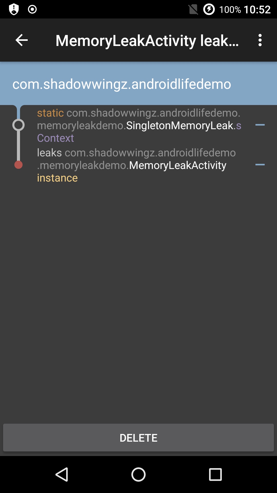

不正确的使用单例模式会引起内存泄漏，由于单例对象是静态变量，静态变量是属于类的实例对象，所以静态变量的生命周期实际也就是类的生命周期，而类的生命周期就是类从加载，到进程死掉的过程，所以静态变量会在进程的整个生命周期中存在。如果单例对象持有外部对象的引用，那么这个对象将不能被 JVM 正常回收，导致内存泄漏。

我们用代码来试验一下，新建一个 SingletonMemoryLeak 的类：

```java
public class SingletonMemoryLeak {

    public static Activity sActivity;

    private static SingletonMemoryLeak instance = new SingletonMemoryLeak();

    private SingletonMemoryLeak() {
    }

    public static SingletonMemoryLeak getInstance(Activity activity) {
        sActivity = activity;
        return instance;
    }
}
```

在这个类的构造方法中，我们传入了 Activity 对象，由于 SingletonMemoryLeak 的生命周期是进程的声明周期，而 Activity 一旦退出页面，Activity 就会被销毁，所以 Activity 的生命周期比 SingletonMemoryLeak 短。

在 Activity 的 onCreate 方法中，我们把 Activity 的实例传入 SingletonMemoryLeak 中：

```java
SingletonMemoryLeak.getInstance(this);
```

运行程序，进入这个 Activity 再退出，等一会，就可以看到内存泄漏信息了。



可以看到

SingletonMemoryLeak 中 `sActivity` 静态变量导致了 MemoryLeakActivity 发生内存泄漏。

#### 怎样避免单例模式内存泄漏 ####

1. 考虑用生命周期长的 Context，比如 ApplicationContext
2. 如果必须要传入 Activity 的话，考虑使用弱引用 WeakReference 关联，代码如下：

```java
public class SingletonNoMemoryLeak {
    public static WeakReference<Context> sActivityRef;

    private static SingletonNoMemoryLeak instance = new SingletonNoMemoryLeak();

    private SingletonNoMemoryLeak() {
    }

    public static SingletonNoMemoryLeak getInstance(Context context) {
        sActivityRef = new WeakReference<>(context);
        return instance;
    }
}
```

在 JVM 垃圾回收时，一旦发现【只有】弱引用关联的对象，不管当前内存够不够用，都会回收它的内存，所以我们用弱引用来关联 Activity，Activity 退出的时候，如果没有被其它的引用关联，只有 SingletonNoMemoryLeak 中的弱引用关联，那么 JVM 就会回收 Activity 的内存，这样就避免了内存泄漏。