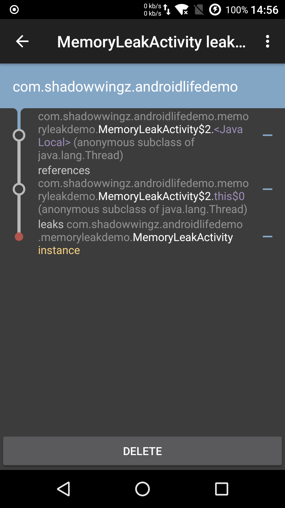

当我们用多线程时，一般会用匿名内部类，就像这样：

```java
private void threadMemoryLeak() {
    new Thread() {
        @Override
        public void run() {
            SystemClock.sleep(3 * 60 * 1000);
        }
    }.start();
}
```

而我们知道，匿名内部类会持有外部类的引用，也就是 Thread 会持有 Activity 的引用，如果 Activity 即将退出的时候，Thread 正在执行耗时任务，还没执行完。那么 Activity 就无法被垃圾回收器回收，因为 Activity 此时还在被 Thread 引用。

我们用 LeakCanary 来检测一下上面的代码是否会内存泄漏，运行一下程序



可以看到，MemoryLeakActivity 的 `this$0`，也就是匿名内部类指向外部类的引用，也就是 Thread，导致 MemoryLeakActivity 发生内存泄漏。

#### 避免多线程引起的内存泄漏

##### 对于 Thread，改用静态内部类

既然是匿名内部类导致 Activity 无法被回收，那我们就用静态内部类：

```java
private void threadNoMemoryLeak() {
    new WorkThread().start();
}

private static class WorkThread extends Thread {
    @Override
    public void run() {
        super.run();
        SystemClock.sleep(3 * 60 * 1000);
    }
}
```

##### Activity 退出时，让线程停止工作

```java
private class WorkThreadCanStop extends Thread {

    private volatile boolean finished = false;

    public void stopWork() {
        finished = true;
    }

    @Override
    public void run() {
        super.run();
        while (!finished) {
            // 耗时操作
            System.out.println("线程在运行");
        }
        System.out.println("线程停止");
    }
}

@Override
protected void onDestroy() {
    super.onDestroy();
    if (mThreadCanStop != null) {
        mThreadCanStop.stopWork();
    }
}
```

由于 Thread 的 `stop` 已经废弃了，而且在 Android 中调用 `Thread.stop` 方法会报异常，所以我们用另一种方法来停止线程，用一个 `volatile` 修饰的变量 `finished`，来控制线程任务的执行，如果 `finished` 为 `false`，就执行耗时任务，如果 `finished` 为 `true`，就跳出 `while` 循环，`run` 方法执行完毕，线程就退出了。