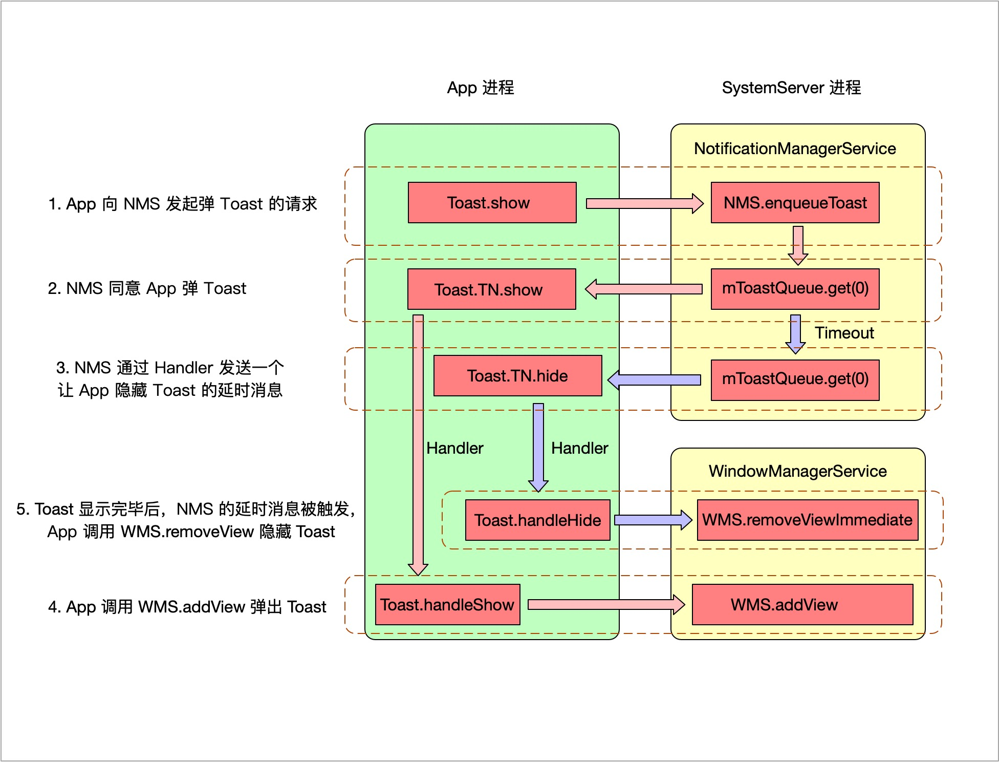

# Toast 流程解析

<!-- TOC -->

- [简单使用](#%E7%AE%80%E5%8D%95%E4%BD%BF%E7%94%A8)
- [如果让我们设计一个 Toast，我们要怎么设计？](#%E5%A6%82%E6%9E%9C%E8%AE%A9%E6%88%91%E4%BB%AC%E8%AE%BE%E8%AE%A1%E4%B8%80%E4%B8%AA-toast%E6%88%91%E4%BB%AC%E8%A6%81%E6%80%8E%E4%B9%88%E8%AE%BE%E8%AE%A1)
    - [Toast 的显示怎么实现？](#toast-%E7%9A%84%E6%98%BE%E7%A4%BA%E6%80%8E%E4%B9%88%E5%AE%9E%E7%8E%B0)
        - [把显示 Toast 封装在 Activity 中？](#%E6%8A%8A%E6%98%BE%E7%A4%BA-toast-%E5%B0%81%E8%A3%85%E5%9C%A8-activity-%E4%B8%AD)
        - [把显示 Toast 的任务交给 Service？](#%E6%8A%8A%E6%98%BE%E7%A4%BA-toast-%E7%9A%84%E4%BB%BB%E5%8A%A1%E4%BA%A4%E7%BB%99-service)
        - [借助 WMS 来弹 Toast](#%E5%80%9F%E5%8A%A9-wms-%E6%9D%A5%E5%BC%B9-toast)
    - [Toast 弹出后，过几秒钟消失怎么实现？](#toast-%E5%BC%B9%E5%87%BA%E5%90%8E%E8%BF%87%E5%87%A0%E7%A7%92%E9%92%9F%E6%B6%88%E5%A4%B1%E6%80%8E%E4%B9%88%E5%AE%9E%E7%8E%B0)
    - [方案确定](#%E6%96%B9%E6%A1%88%E7%A1%AE%E5%AE%9A)
- [Toast 的显示流程图](#toast-%E7%9A%84%E6%98%BE%E7%A4%BA%E6%B5%81%E7%A8%8B%E5%9B%BE)
- [源码分析](#%E6%BA%90%E7%A0%81%E5%88%86%E6%9E%90)
    - [App 向 NMS 发起弹 Toast 的请求](#app-%E5%90%91-nms-%E5%8F%91%E8%B5%B7%E5%BC%B9-toast-%E7%9A%84%E8%AF%B7%E6%B1%82)
    - [NMS 同意 App 弹 Toast](#nms-%E5%90%8C%E6%84%8F-app-%E5%BC%B9-toast)
    - [NMS 通过 Handler 发送一个让 App 隐藏 Toast 的延时消息](#nms-%E9%80%9A%E8%BF%87-handler-%E5%8F%91%E9%80%81%E4%B8%80%E4%B8%AA%E8%AE%A9-app-%E9%9A%90%E8%97%8F-toast-%E7%9A%84%E5%BB%B6%E6%97%B6%E6%B6%88%E6%81%AF)
    - [App 调用 WMS.add 弹出 Toast](#app-%E8%B0%83%E7%94%A8-wmsadd-%E5%BC%B9%E5%87%BA-toast)
    - [Toast 显示完毕后，App 调用 WMS.removeView 隐藏 Toast](#toast-%E6%98%BE%E7%A4%BA%E5%AE%8C%E6%AF%95%E5%90%8Eapp-%E8%B0%83%E7%94%A8-wmsremoveview-%E9%9A%90%E8%97%8F-toast)
- [细节问题](#%E7%BB%86%E8%8A%82%E9%97%AE%E9%A2%98)
    - [Toast 显示过程涉及到的 Binder](#toast-%E6%98%BE%E7%A4%BA%E8%BF%87%E7%A8%8B%E6%B6%89%E5%8F%8A%E5%88%B0%E7%9A%84-binder)
    - [Toast 有个数限制吗？](#toast-%E6%9C%89%E4%B8%AA%E6%95%B0%E9%99%90%E5%88%B6%E5%90%97)
    - [Toast 可以自定义时长吗？](#toast-%E5%8F%AF%E4%BB%A5%E8%87%AA%E5%AE%9A%E4%B9%89%E6%97%B6%E9%95%BF%E5%90%97)
    - [可以在子线程弹 Toast 吗？](#%E5%8F%AF%E4%BB%A5%E5%9C%A8%E5%AD%90%E7%BA%BF%E7%A8%8B%E5%BC%B9-toast-%E5%90%97)

<!-- /TOC -->

## 简单使用

```java
Toast.makeText(this, "a", Toast.LENGTH_SHORT).show();

// 或者
Toast toast = Toast.makeText(this, "a", Toast.LENGTH_SHORT);
toast.show();
toast.cancel();
```

Toast 的使用相信肯定难不倒大家，这里就不再多说了，我们接着想一想，如果让我们自己设计一个 Toast，我们怎么设计比较好？

## 如果让我们设计一个 Toast，我们要怎么设计？

设计一个 Toast，主要有两点：

1. Toast 的显示怎么实现？
2. Toast 弹出后，过几秒钟消失怎么实现？

### Toast 的显示怎么实现？

#### 把显示 Toast 封装在 Activity 中？

第一个问题的话，首先我们要思考 Toast 应该显示在哪里，是 Activity 里吗？Activity 里好像不大合适，因为我们在每个 Activity 里都可能会弹出 Toast，那难不成要在每个 Activity 里都预先放置一个 Toast？有的童鞋可能会说，可以把 Toast 封装在 BaseActivity 里。

这么一说好像可以哎，等等，那如果显示在 Activity 里，那 App 切换到后台怎么办？这个时候是看不到 Activity 的，那不就没法显示 Toast 了吗。

#### 把显示 Toast 的任务交给 Service？

那放在 Service 里？好像也不行，Service 是在后台默默运行的，它是没有界面的，没有界面的话，我们的 Toast 的 View 就没法加载了。

#### 借助 WMS 来弹 Toast

那有没有其他方法呢？可以随时随地加载 View。

有，我们可以借助 WMS（WindowManagerService），WMS 作为一个常驻的服务，Android 一开机就自动启动这个服务了，不需要我们手动去启动，而且我们在任意一个 Activity 中都可以轻易调用 WMS，刚好 WMS 也有一个 addView 方法可以用来显示 View，因此 WMS 很适合用来弹 Toast。

当我们需要显示一个 Toast 的时候，就调用 WMS.addView 方法添加一个 View 就可以了，Toast 就被显示出来了。Toast 的布局就是一个 TextView 嘛。

### Toast 弹出后，过几秒钟消失怎么实现？

显示 Toast 的方案有了，那过几秒消失也很简单了。我们显示 Toast 之后，用 Handler 发一个延时消息，在这个延时消息中，我们调用 WMS.removeView 移除 View，Toast 就可以被隐藏了。

看上去 Toast 的实现方案已经有了，那有没有什么问题呢？

思考一个场景，假设我们的 App 调用 WMS.addView 弹了一个 Toast 出来，然后别的 App 也调用 WMS.addView 弹了一个 Toast 出来。这个时候我们发现我们的 Toast 被别的 App 的 Toast 给挡住了。

这是什么原因呢？我们还没有一个专门管理 Toast 的管理者，假设有这么一个管理者的话，当我们的 App 弹出一个 Toast，别的 App 再想弹，得先等我们的 App 的 Toast 显示完毕后才能弹出。

那找谁作为这么一个管理者呢？其实 Android 系统已经为我们准备好了一个 Toast 的管理者，就是 NMS（NotificationManagerService）。NMS 中有一个 ArrayList，专门存放 Toast，每次要弹 Toast 的时候就从 ArrayList 中取出一个 Toast 对象，我们要弹的 Toast 也是先被存放到这个 ArrayList 中。

### 方案确定

OK，那我们的方案就可以确定了：

我们的 App 如果想弹 Toast，得先找 NMS 安排，如果 NMS 同意我们弹，我们就调用 WMS.addView 来弹 Toast，弹出 Toast 后，我们用 Handler 发送一个延时消息，在延时消息中，我们再调用 WMS.removeView 隐藏 Toast。

嗯，其实 Android 系统的 Toast 方案也是这样的。我们来看下 Toast 的显示流程图。

## Toast 的显示流程图



从流程图可以看出，Toast 的显示流程大概分为 4 个步骤：

1. App 向 NMS 发起弹 Toast 的请求
2. NMS 同意 App 弹 Toast
3. NMS 通过 Handler 发送一个让 App 隐藏 Toast 的延时消息
4. App 调用 `WMS.add` 弹出 Toast
5. Toast 显示完毕后，App 调用 `WMS.removeViewImmediate` 隐藏 Toast

Toast 的显示涉及到两个系统服务，一个是 `NotificationManagerService`（简称 NMS），一个是 `WindowManagerService`（简称 WMS），这两个系统服务以及 App 自身在 Toast 显示流程中的作用分别是：

- App 负责发起弹出 Toast 和隐藏 Toast 的请求
- NMS 负责存储 App 想要弹出的 Toast，以及决定下一个要弹出的是哪一个 Toast
- WMS 负责 Toast 的具体显示和隐藏的实现

这样看上去，职责划分还是非常明确的。

好了，大致流程我们已经弄清楚了，那我们来跟下源码看下具体流程。

## 源码分析

### App 向 NMS 发起弹 Toast 的请求

先看 `makeText` 源码：

```java
Toast # makeText

public static Toast makeText(Context context, CharSequence text, @Duration int duration) {
    Toast result = new Toast(context);

    LayoutInflater inflate = (LayoutInflater)
            context.getSystemService(Context.LAYOUT_INFLATER_SERVICE);
    // Toast 的布局文件是 transient_notification
    View v = inflate.inflate(com.android.internal.R.layout.transient_notification, null);
    // 默认的 Toast 里只有一个 TextView
    TextView tv = (TextView)v.findViewById(com.android.internal.R.id.message);
    tv.setText(text);
    
    // 从布局文件加载出的 View 会赋值给 mNextView
    result.mNextView = v;
    result.mDuration = duration;

    return result;
}
```

从上面的代码中，我们可以发现，原来 Toast，其实就是一个 TextView，也就是上面的 `mNextView`然后，这个 TextView，会显示一定的时间，就会自己消失，这个时间就是 `mDuration`。

所以，总结一下，makeToast 方法，会把我们想要显示的文本设置到 TextView 里，这个 TextView 会显示一定的时间。

那么 TextView 已经创建好了，什么时候显示出来呢？我们继续看，看 `show` 方法：

```java
Toast # show

public void show() {
    if (mNextView == null) {
        throw new RuntimeException("setView must have been called");
    }

    INotificationManager service = getService();
    String pkg = mContext.getOpPackageName();
    TN tn = mTN;
    tn.mNextView = mNextView;

    try {
        service.enqueueToast(pkg, tn, mDuration);
    } catch (RemoteException e) {
        // Empty
    }
}
```

首先，对 mNextView 进行了判空处理，mNextView 就是我们要显示的 Toast，也就是 TextView，如果它为空，那我们就直接抛异常，这个很好理解。

接着调用了 getService 方法，我们看下这个方法：

```java
private static INotificationManager sService;

static private INotificationManager getService() {
    if (sService != null) {
        return sService;
    }
    sService = INotificationManager.Stub.asInterface(ServiceManager.getService("notification"));
    return sService;
}
```

看到 getService 方法里面的 Stub，还有 asInterface，我们很容易的猜到，这里和 Binder 有关，也就是 NotificationManagerService，后面简称 `NMS`。NMS 负责安卓系统的通知管理，我们使用的 Toast，作用就是通知用户有什么事件发生了。所以 Toast 当然也是 NMS 来管理的。

所以，调用 getService 方法，是为了获取 NMS 的实例。

我们接着看 show 方法，调用了 `tn.mNextView = mNextView`，这句代码把我们之前创建的 nNextView 赋值给了 TN 对象的 mNextView 字段。TN 是 Toast 的一个静态内部类：

```java
private static class TN extends ITransientNotification.Stub {
    View mNextView;

    @Override
    public void show() {
        if (localLOGV) Log.v(TAG, "SHOW: " + this);
        mHandler.post(mShow);
    }

    @Override
    public void hide() {
        if (localLOGV) Log.v(TAG, "HIDE: " + this);
        mHandler.post(mHide);
    }
}
```

TN 继承了 `ITransientNotification.Stub`，所以 TN 是远程服务真正干活的类，这也告诉我们，弹一个 Toast 并没有我们想象中的那么简单，而是一个 IPC 过程。

TN 是服务端，内部封装了 `show` 方法和 `hide` 方法。也就是说，能否显示和隐藏 Toast 并不是我们决定的，而是服务端，也就是 NMS 决定的。

接着，调用了 NMS 的 `enqueueToast` 方法，这是一次跨进程调用，客户端远程调用服务端的方法：

```java
NotificationManagerService # enqueueToast

// 第一个参数是当前应用的包名，第二个参数表示回调，第三个参数表示 Toast 的时长
@Override
public void enqueueToast(String pkg, ITransientNotification callback, int duration)
{
    ......

    synchronized (mToastQueue) {
        int callingPid = Binder.getCallingPid();
        long callingId = Binder.clearCallingIdentity();
        try {
            ToastRecord record;
            int index = indexOfToastLocked(pkg, callback);
            // If it's already in the queue, we update it in place, we don't
            // move it to the end of the queue.
            if (index >= 0) {
                record = mToastQueue.get(index);
                record.update(duration);
            } else {
                // Limit the number of toasts that any given package except the android
                // package can enqueue.  Prevents DOS attacks and deals with leaks.
                // 如果是非系统应用，mToastQueue 中最多能同时
                // 存在 50 个（MAX_PACKAGE_NOTIFICATIONS） ToastRecord
                if (!isSystemToast) {
                    int count = 0;
                    final int N = mToastQueue.size();
                    for (int i=0; i<N; i++) {
                         final ToastRecord r = mToastQueue.get(i);
                         if (r.pkg.equals(pkg)) {
                             count++;
                             if (count >= MAX_PACKAGE_NOTIFICATIONS) {
                                 Slog.e(TAG, "Package has already posted " + count
                                        + " toasts. Not showing more. Package=" + pkg);
                                 return;
                             }
                         }
                    }
                }

                Binder token = new Binder();
                mWindowManagerInternal.addWindowToken(token,
                        WindowManager.LayoutParams.TYPE_TOAST);
                // 将 Toast 请求封装为 ToastRecord 对象并将其添加到 mToastQueue 中
                record = new ToastRecord(callingPid, pkg, callback, duration, token);
                mToastQueue.add(record);
                index = mToastQueue.size() - 1;
                keepProcessAliveIfNeededLocked(callingPid);
            }
            // If it's at index 0, it's the current toast.  It doesn't matter if it's
            // new or just been updated.  Call back and tell it to show itself.
            // If the callback fails, this will remove it from the list, so don't
            // assume that it's valid after this.
            if (index == 0) {
                // 通过 showNextToastLocked 方法来显示当前的 Toast
                showNextToastLocked();
            }
        } finally {
            Binder.restoreCallingIdentity(callingId);
        }
    }
}
```

在 NotificationManagerService 中，有一个 ArrayList，叫 `mToastQueue`，从命名来看，Toast 应该就是被存储到这个 List 中。

在 `enqueueToast` 方法中，主要是封装 Toast 为 ToastRecord，然后把 ToastRecord 添加到 `mToastQueue` 中。

把 Toast 添加到 `mToastQueue` 中后，接下来就是要显示 Toast 了，显示 Toast 是调用 showNextToastLocked 来实现的，我们看下 `showNextToastLocked` 方法：

```java
NotificationManagerService # showNextToastLocked

void showNextToastLocked() {
    // 从 mToastQueue 中取出第一个 ToastRecord
    ToastRecord record = mToastQueue.get(0);
    while (record != null) {
        if (DBG) Slog.d(TAG, "Show pkg=" + record.pkg + " callback=" + record.callback);
        try {
            // 调用 callback 的 show 方法来显示 Toast
            record.callback.show(record.token);
            // 显示 Toast 之后，发送一个延时消息来隐藏 Toast 并将其从 mToastQueue 中移除
            scheduleTimeoutLocked(record);
            return;
        } catch (RemoteException e) {
            Slog.w(TAG, "Object died trying to show notification " + record.callback
                    + " in package " + record.pkg);
            // remove it from the list and let the process die
            int index = mToastQueue.indexOf(record);
            if (index >= 0) {
                mToastQueue.remove(index);
            }
            keepProcessAliveIfNeededLocked(record.pid);
            if (mToastQueue.size() > 0) {
                record = mToastQueue.get(0);
            } else {
                record = null;
            }
        }
    }
}
```

### NMS 同意 App 弹 Toast

在 showNextToastLocked 方法中，调用了 `record.callback.show(record.token)` 方法来显示 Toast，`record.callback` 是 `ITransientNotification` 类型，也就是上文中的 TN，也就是说，服务端远程调用客户端的 show 方法，show 方法是运行在客户端的 Binder 线程池里。

这里服务端调用客户端（App）的 show 方法，说明 NMS 同意了 App 弹 Toast 的请求。

### NMS 通过 Handler 发送一个让 App 隐藏 Toast 的延时消息

在调用 show 方法之后，NMS 又调用了 `scheduleTimeoutLocked` 方法，这个方法就是隐藏 Toast 的关键了，这个方法会发送一个隐藏 Toast 的延时消息，当这个延时消息被触发的时候，App 会远程调用 WMS 来隐藏 Toast。

```java
private void scheduleTimeoutLocked(ToastRecord r)
{
    mHandler.removeCallbacksAndMessages(r);
    // 创建一个隐藏 Toast 延时消息，延时时间为 Toast 的显示时长
    Message m = Message.obtain(mHandler, MESSAGE_TIMEOUT, r);
    long delay = r.duration == Toast.LENGTH_LONG ? LONG_DELAY : SHORT_DELAY;
    // 发送延时消息
    mHandler.sendMessageDelayed(m, delay);
}
```

隐藏 Toast 的后续实现我们先不看，我们先看 show 方法的具体实现：

```java
Toast.TN # show

@Override
public void show() {
    if (localLOGV) Log.v(TAG, "SHOW: " + this);
    mHandler.post(mShow);
}

Toast.TN # mShow

final Runnable mShow = new Runnable() {
    @Override
    public void run() {
        handleShow();
    }
};

Toast.TN # handleShow

public void handleShow() {
    if (localLOGV) Log.v(TAG, "HANDLE SHOW: " + this + " mView=" + mView
            + " mNextView=" + mNextView);
    if (mView != mNextView) {
        // remove the old view if necessary
        handleHide();
        mView = mNextView;
        ......
        mWM = (WindowManager)context.getSystemService(Context.WINDOW_SERVICE);
        ......
        if (mView.getParent() != null) {
            if (localLOGV) Log.v(TAG, "REMOVE! " + mView + " in " + this);
            mWM.removeView(mView);
        }
        ......
        mWM.addView(mView, mParams);
        ......
    }
}
```

刚刚我们说了，服务端远程调用客户端的 show 方法，所以 show 方法是运行在 Binder 线程池里的，而显示 Toast 属于一个更新 UI 操作，当然不能在线程池里完成，所以要用 Handler 来切换线程。所以在 TN 的 show 方法中，调用了 `mHandler.post(mShow);`，把 mShow 这个 Runnable 任务投递到 mHandler 所在线程，也就是主线程关联的消息队列里，这样 mShow 就会在主线程执行了。

### App 调用 `WMS.add` 弹出 Toast

在 `mShow` 中，调用了 `handleShow` 方法，在这个方法中，调用了 WindowManager 的 addView 方法，把 Toast 显示了出来。

Toast 显示出来之后，过段时间就要消失，我们再来看下让 Toast 消失的代码，也就是 `scheduleTimeoutLocked` 方法：

```java
NotificationManagerService # scheduleTimeoutLocked

private void scheduleTimeoutLocked(ToastRecord r)
{
    mHandler.removeCallbacksAndMessages(r);
    Message m = Message.obtain(mHandler, MESSAGE_TIMEOUT, r);
    long delay = r.duration == Toast.LENGTH_LONG ? LONG_DELAY : SHORT_DELAY;
    mHandler.sendMessageDelayed(m, delay);
}

private final class WorkerHandler extends Handler
{
    @Override
    public void handleMessage(Message msg)
    {
        switch (msg.what)
        {
            case MESSAGE_TIMEOUT:
                handleTimeout((ToastRecord)msg.obj);
                break;
            ......
        }
    }

}

private void handleTimeout(ToastRecord record)
{
    synchronized (mToastQueue) {
        int index = indexOfToastLocked(record.pkg, record.callback);
        if (index >= 0) {
            cancelToastLocked(index);
        }
    }
}

void cancelToastLocked(int index) {
    // 取出 ToastRecord
    ToastRecord record = mToastQueue.get(index);
    try {
        // 调用 callback 的 hide 方法隐藏 Toast
        record.callback.hide();
    } catch (RemoteException e) {
        Slog.w(TAG, "Object died trying to hide notification " + record.callback
                + " in package " + record.pkg);
        // don't worry about this, we're about to remove it from
        // the list anyway
    }

    // 从 mToastQueue 中移除 ToastRecord
    ToastRecord lastToast = mToastQueue.remove(index);
    mWindowManagerInternal.removeWindowToken(lastToast.token, true);

    keepProcessAliveIfNeededLocked(record.pid);
    if (mToastQueue.size() > 0) {
        // Show the next one. If the callback fails, this will remove
        // it from the list, so don't assume that the list hasn't changed
        // after this point.
        // 如果 mToastQueue 不为空，说明还有 Toast 需要显示，就继续显示下一个 Toast
        showNextToastLocked();
    }
}
```

在 scheduleTimeoutLocked 方法中，首先调用了 Handler 的 sendMessageDelayed 方法发送了一个延时消息，这个延时消息就是 Toast 要显示的时长。

### Toast 显示完毕后，App 调用 `WMS.removeView` 隐藏 Toast

接着，会调用 `record.callback.hide()` 方法，也就是 TN 的 hide 方法，来隐藏 Toast。这个时候，代码调用就从 NMS 转移到了 App，我们看下 hide 方法：

```java
Toast.TN # hide

@Override
public void hide() {
    if (localLOGV) Log.v(TAG, "HIDE: " + this);
    // 将 mHide 任务切换到主线程执行
    mHandler.post(mHide);
}

Toast.TN # mHide

final Runnable mHide = new Runnable() {
    @Override
    public void run() {
        handleHide();
        // Don't do this in handleHide() because it is also invoked by handleShow()
        mNextView = null;
    }
};

Toast.TN # handleHide

public void handleHide() {
    if (localLOGV) Log.v(TAG, "HANDLE HIDE: " + this + " mView=" + mView);
    if (mView != null) {
        // note: checking parent() just to make sure the view has
        // been added...  i have seen cases where we get here when
        // the view isn't yet added, so let's try not to crash.
        if (mView.getParent() != null) {
            if (localLOGV) Log.v(TAG, "REMOVE! " + mView + " in " + this);
            // 调用 WMS.removeView 隐藏 Toast
            mWM.removeView(mView);
        }

        mView = null;
    }
}
```

hide 方法和 show 方法的实现类似，也是通过 Handler 来切换线程，然后调用 WindowManager 的 removeView 方法来移除 View，也就是隐藏 Toast，这个时候，代码调用就从 App 转移到了 WMS。

隐藏完 Toast 之后，还有些工作要收尾，就是 `mToastQueue` 队列，因为 Toast 已经隐藏了，所以它就没用了，没用的话就要从队列中移除掉了。

到这里，一个 Toast 的显示和隐藏我们就分析完了。

## 细节问题

### Toast 显示过程涉及到的 Binder ####


### Toast 有个数限制吗？

有，对于非系统应用，每个应用弹的 Toast 的最大限制为 `MAX_PACKAGE_NOTIFICATIONS`，超过这个数量 Toast 会被丢弃，不会弹出。

不同 Android 版本 `MAX_PACKAGE_NOTIFICATIONS` 值的大小也不同，Android 9 及以下版本中，`MAX_PACKAGE_NOTIFICATIONS` 的值是 50，从 Android 10 开始，`MAX_PACKAGE_NOTIFICATIONS` 的值是 25。

具体实现在 NMS 的 `enqueueToast` 方法中：

```java
NMS # enqueueToast

// Toast 个数限制
static final int MAX_PACKAGE_NOTIFICATIONS = 25;

// Limit the number of toasts that any given package except the android
// package can enqueue.  Prevents DOS attacks and deals with leaks.
if (!isSystemToast) {
    int count = 0;
    final int N = mToastQueue.size();
    for (int i=0; i<N; i++) {
            final ToastRecord r = mToastQueue.get(i);
            if (r.pkg.equals(pkg)) {
                count++;
                if (count >= MAX_PACKAGE_NOTIFICATIONS) {
                    Slog.e(TAG, "Package has already posted " + count
                        + " toasts. Not showing more. Package=" + pkg);
                    return;
                }
            }
    }
}
```

### Toast 可以自定义时长吗？

不可以，虽然在 Toast 的 `makeText` 方法中，第三个参数可以让我们传入 Toast 要显示的时长 `duration`，但是时长其实只有内置的 `Toast.LENGTH_SHORT` 和 `LENGTH_LONG` 可以选，即使传入自定义的时长，在源码中也会被转换成内置的时长。具体可以查看 `NMS` 的 `scheduleTimeoutLocked` 方法：

```java
NMS # scheduleTimeoutLocked

private void scheduleTimeoutLocked(ToastRecord r)
{
    mHandler.removeCallbacksAndMessages(r);
    Message m = Message.obtain(mHandler, MESSAGE_TIMEOUT, r);
    long delay = r.duration == Toast.LENGTH_LONG ? LONG_DELAY : SHORT_DELAY;
    mHandler.sendMessageDelayed(m, delay);
}
```

在 `scheduleTimeoutLocked` 方法中，会判断 `r.duration` 是不是等于 `Toast.LENGTH_LONG`，`r.duration` 就是我们传入 Toast 的时长，如果我们传入的时长是 `Toast.LENGTH_LONG`，那么 Toast 显示的时长就是 `LONG_DELAY`，也就是 3.5 秒，如果我们传入的时长不是 `Toast.LENGTH_LONG`，而是传入了 `Toast.LENGTH_SHORT`，或者自定义的时长，那么 Toast 显示的时长就是 `SHORT_DELAY`，也就是 2 秒。

### 可以在子线程弹 Toast 吗？

可以，不过方法比较特殊，方法如下：

```kotlin
Thread(Runnable {
    Looper.prepare()
    Toast.makeText(this, "子线程的 Toast", Toast.LENGTH_SHORT).show()
    Looper.loop()
}).start()
```

具体原因可以参考 [子线程中能否弹 Toast]()