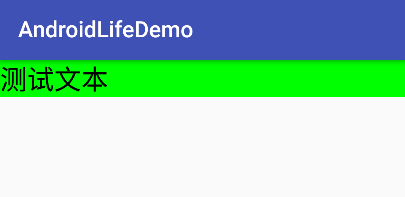

### [Demo 地址](https://github.com/shadowwingz/AndroidLifeDemo/tree/master/AndroidLifeDemo/app/src/main/java/com/shadowwingz/androidlifedemo/layoutparamsdemo) ###

在 [View 的 measure 原理](https://github.com/shadowwingz/AndroidLife/blob/master/article/View%20%E7%9A%84%20measure%20%E5%8E%9F%E7%90%86.md) 中，我们提到了：

> View 的大小由 View 的 MeasureSpec 的 specSize 决定，而 View 的 MeasureSpec 又由 View 的 LayoutParams 和父容器的 MeasureSpec 决定。

MeasureSpec 在 [MeasureSpec 源码解析](https://github.com/shadowwingz/AndroidLife/blob/master/article/MeasureSpec%20%E6%BA%90%E7%A0%81%E8%A7%A3%E6%9E%90.md) 中已经分析过了，这里就不再多说了。我们这里分析下 LayoutParams。

#### LayoutParams 是什么？

其实我们一直都在和 LayoutParams 打交道，回忆一下我们写布局文件的时候，是不是经常要写 `layout_width` 和 `layout_height`。比如：

```java
<TextView
    android:layout_width="wrap_content"
    android:layout_height="wrap_content"
    android:layout_marginLeft="10dp"
    android:text="测试"
    android:textColor="@color/colorAccent"
    android:textSize="16sp" />
```

话说，刚学安卓的时候，我就在疑惑，为什么有的属性，前面不带 `layout` 前缀，比如 `text`、`textColor `、`textSize `，而有的属性，前面要带 `layout` 前缀，比如 `layout_width `，`layout_height `、`layout_marginLeft `。

用通俗的话讲，不带 `layout` 前缀的属性都是只和当前 View 相关的。

- 比如 `text `，View 要显示什么文字，就显示文字
- 比如 `textColor `，View 要显示什么颜色，就显示颜色
- 比如 `textSize `，View 的字体多大，就是多大

而带 `layout ` 前缀的属性呢？它们不但和当前 View 相关，还和当前 View 的父布局相关。

- 比如 `layout_width`，当这个属性是 `match_parent` 时，View 的宽度是父布局的剩余宽度，也就是说，View 想要多大的宽度，得看父布局还有多大的宽度。
- 比如 `layout_marginLeft`，当这个属性是 `0dp` 时，如果 View 的父布局紧贴屏幕左边缘，那么 View 也会紧贴屏幕左边缘，但是如果 View 的父布局紧贴屏幕右边缘,那 View 离屏幕左边缘就远了去了。

讲到这里，我们就可以解开谜底了，LayoutParams 到底是什么？LayoutParams 就是带 `layout` 前缀属性的集合，是 View 用来告诉它的父控件如果放置自己。

### LayoutParams 的使用

前面说到的 `layout_width `、`layout_height ` 是在 xml 布局文件中使用的，我们也可以直接使用 LayoutParams，新建一个 LayoutParamsActivity：

```java
public class LayoutParamsActivity extends AppCompatActivity {

    @Override
    protected void onCreate(Bundle savedInstanceState) {
        super.onCreate(savedInstanceState);
        setContentView(R.layout.activity_layout_params);

        // 这里相当于布局文件中的
        // android:layout_width="match_parent"
        // android:layout_height="wrap_content"
        LinearLayout.LayoutParams params = new LinearLayout.LayoutParams(
                ViewGroup.LayoutParams.MATCH_PARENT, ViewGroup.LayoutParams.WRAP_CONTENT);

        LinearLayout parent = (LinearLayout) findViewById(R.id.container);
        TextView textView = new TextView(this);
        textView.setText("测试文本");
        textView.setTextSize(24);
        textView.setTextColor(Color.BLACK);
        textView.setLayoutParams(params);
        textView.setBackgroundColor(Color.GREEN);
        parent.addView(textView);
    }
}
```

运行一下：



可以看到，TextView 已经显示出来了，这里我们使用的是 LinearLayout 的 LayoutParams，因为 TextView 的父布局是 LinearLayout。

我们再修改一下它的 LayoutParams：

```java
public class LayoutParamsActivity extends AppCompatActivity {

    @Override
    protected void onCreate(Bundle savedInstanceState) {
        super.onCreate(savedInstanceState);
        setContentView(R.layout.activity_layout_params);

        // 这里相当于布局文件中的
        // android:layout_width="match_parent"
        // android:layout_height="wrap_content"
        LinearLayout.LayoutParams params = new LinearLayout.LayoutParams(
                ViewGroup.LayoutParams.MATCH_PARENT, ViewGroup.LayoutParams.WRAP_CONTENT);

        LinearLayout parent = (LinearLayout) findViewById(R.id.container);
        TextView textView = new TextView(this);
        textView.setText("测试文本");
        textView.setTextSize(24);
        textView.setTextColor(Color.BLACK);
        textView.setLayoutParams(params);
        textView.setBackgroundColor(Color.GREEN);
        parent.addView(textView);

        // 修改 LayoutParams，长度修改为 200 像素
        textView.setLayoutParams(new LinearLayout.LayoutParams(200, ViewGroup.LayoutParams.MATCH_PARENT));
    }
}
```

运行一下：


可以看到，TextView 的长度改变了。

我们在上面给 TextView 使用的 LayoutParams 都是 LinearLayout 的 LayoutParams，那我们给 TextView 使用 RelativeLayout 的 LayoutParams 会是什么效果呢？我们试验一下，修改 LayoutParamsActivity 代码：

```java
public class LayoutParamsActivity extends AppCompatActivity {

    @Override
    protected void onCreate(Bundle savedInstanceState) {
        super.onCreate(savedInstanceState);
        setContentView(R.layout.activity_layout_params);

        // 这里相当于布局文件中的
        // android:layout_width="match_parent"
        // android:layout_height="wrap_content"
//        LinearLayout.LayoutParams params = new LinearLayout.LayoutParams(
//                ViewGroup.LayoutParams.MATCH_PARENT, ViewGroup.LayoutParams.WRAP_CONTENT);

        RelativeLayout.LayoutParams params = new RelativeLayout.LayoutParams(
        ViewGroup.LayoutParams.MATCH_PARENT, ViewGroup.LayoutParams.WRAP_CONTENT);

        LinearLayout parent = (LinearLayout) findViewById(R.id.container);
        TextView textView = new TextView(this);
        textView.setText("测试文本");
        textView.setTextSize(24);
        textView.setTextColor(Color.BLACK);
        textView.setLayoutParams(params);
        textView.setBackgroundColor(Color.GREEN);
        parent.addView(textView);

        // 修改 LayoutParams，长度修改为 200 像素
//        textView.setLayoutParams(new LinearLayout.LayoutParams(200, ViewGroup.LayoutParams.MATCH_PARENT));
    }
}
```

运行一下：


我们发现，居然没有报错。我们明明给 TextView 设置的是 RelativeLayout 的 LayoutParams。

我们继续试验，让 TextView 修改一下 LayoutParams，修改为 RelativeLayout 的 LayoutParams：

```java
public class LayoutParamsActivity extends AppCompatActivity {

    @Override
    protected void onCreate(Bundle savedInstanceState) {
        super.onCreate(savedInstanceState);
        setContentView(R.layout.activity_layout_params);

        // 这里相当于布局文件中的
        // android:layout_width="match_parent"
        // android:layout_height="wrap_content"
//        LinearLayout.LayoutParams params = new LinearLayout.LayoutParams(
//                ViewGroup.LayoutParams.MATCH_PARENT, ViewGroup.LayoutParams.WRAP_CONTENT);

        RelativeLayout.LayoutParams params = new RelativeLayout.LayoutParams(
        ViewGroup.LayoutParams.MATCH_PARENT, ViewGroup.LayoutParams.WRAP_CONTENT);

        LinearLayout parent = (LinearLayout) findViewById(R.id.container);
        TextView textView = new TextView(this);
        textView.setText("测试文本");
        textView.setTextSize(24);
        textView.setTextColor(Color.BLACK);
        textView.setLayoutParams(params);
        textView.setBackgroundColor(Color.GREEN);
        parent.addView(textView);

        // 修改 LayoutParams，长度修改为 200 像素
//        textView.setLayoutParams(new LinearLayout.LayoutParams(200, ViewGroup.LayoutParams.MATCH_PARENT));
        textView.setLayoutParams(new RelativeLayout.LayoutParams(200, ViewGroup.LayoutParams.MATCH_PARENT));
    }
}
```

运行一下，App 崩溃了。

看下报错信息：

> java.lang.ClassCastException: android.widget.RelativeLayout$LayoutParams cannot be cast to android.widget.LinearLayout$LayoutParams

意思是 RelativeLayout.LayoutParams 不能转换为 LinearLayout.LayoutParams

我们定位到代码报错的地方，`at android.widget.LinearLayout.measureVertical(LinearLayout.java:731)` 

```java
final LayoutParams lp = (LayoutParams) child.getLayoutParams();
```

可以看到，这行代码会把子 View 的 LayoutParams 转换为 `LinearLayout.LayoutParams`，因为此时子 View 是在父布局 LinearLayout 中，所以会把子 View 的 LayoutParams 转换为 `LinearLayout.LayoutParams`。而我们设置的 `LayoutParams` 是 `RelativeLayout.LayoutParams`，所以就报错了。

那为什么我们第一次给 TextView 设置 `RelativeLayout.LayoutParams` 没有报错呢？

要解答这个问题，我们需要看下 `addView` 的源码。

```java
ViewGroup # addView

public void addView(View child) {
    addView(child, -1);
}

public void addView(View child, int index) {
    if (child == null) {
        throw new IllegalArgumentException("Cannot add a null child view to a ViewGroup");
    }
    LayoutParams params = child.getLayoutParams();
    if (params == null) {
        params = generateDefaultLayoutParams();
        if (params == null) {
            throw new IllegalArgumentException("generateDefaultLayoutParams() cannot return null");
        }
    }
    addView(child, index, params);
}
```

首先，`addView` 内部会检查添加进来的 View 是否为 null。如果为 null，就直接抛异常。这个很好理解。

然后，调用 `child.getLayoutParams()` 获取到 child 的 LayoutParams，如果 LayoutParams 为 null，就调用 `generateDefaultLayoutParams` 方法生成一个默认的 LayoutParams。

`generateDefaultLayoutParams` 方法是 ViewGroup 中的方法，被 LinearLayout 和 RelativeLayout 重写了，我们看下 LinearLayout 的 `generateDefaultLayoutParams` 方法：

```java
LinearLayout # generateDefaultLayoutParams

@Override
protected LayoutParams generateDefaultLayoutParams() {
    if (mOrientation == HORIZONTAL) {
        return new LayoutParams(LayoutParams.WRAP_CONTENT, LayoutParams.WRAP_CONTENT);
    } else if (mOrientation == VERTICAL) {
        return new LayoutParams(LayoutParams.MATCH_PARENT, LayoutParams.WRAP_CONTENT);
    }
    return null;
}
```

LinearLayout 会判断当前的方向，当前方向是在 xml 布局文件中指定的，`android:orientation="vertical"`。

当前是竖直方向，所以如果 LayoutParams 为 null，那么会生成一个宽度是 `match_parent`，高度是 `wrap_content` 的 LayoutParams 作为默认 LayoutParams。

所以到这里，我们就可以解答 [LayoutInflater 源码解析](https://github.com/shadowwingz/AndroidLife/blob/master/article/LayoutInflater%20%E6%BA%90%E7%A0%81%E8%A7%A3%E6%9E%90.md) 中的一个疑问了，为什么 root 为 null 时，按钮会撑满全屏。

因为当 root 为 null 时，`params = root.generateLayoutParams(attrs)` 不会执行，所以 params 为 null，最终 inflate 出来的 View 是没有 LayoutParams 的。

接着执行 `mainLayout.addView(view)`，因为 view 的 LayoutParams 为 null 并且父布局 LinearLayout 的方向是竖直方向，所以 LinearLayout 会生成一个默认的 LayoutParams，宽度为 `match_parent`，高度为 `wrap_content`。

所以加载出来的按钮宽度是撑满全屏的。

OK，到这里，[LayoutInflater 源码解析](https://github.com/shadowwingz/AndroidLife/blob/master/article/LayoutInflater%20%E6%BA%90%E7%A0%81%E8%A7%A3%E6%9E%90.md) 中的疑问我们就解答完了。我们继续看。

接着会执行 `addView(child, index, params)`：

```java
ViewGroup # addView

public void addView(View child, int index, LayoutParams params) {
    if (DBG) {
        System.out.println(this + " addView");
    }

    if (child == null) {
        throw new IllegalArgumentException("Cannot add a null child view to a ViewGroup");
    }

    // addViewInner() will call child.requestLayout() when setting the new LayoutParams
    // therefore, we call requestLayout() on ourselves before, so that the child's request
    // will be blocked at our level
    requestLayout();
    invalidate(true);
    addViewInner(child, index, params, false);
}

ViewGroup # addViewInner

private void addViewInner(View child, int index, LayoutParams params,
            boolean preventRequestLayout) {
    ......

    if (!checkLayoutParams(params)) {
        params = generateLayoutParams(params);
    }

    if (preventRequestLayout) {
        child.mLayoutParams = params;
    } else {
        child.setLayoutParams(params);
    }

    ......
}
```

在 `addView` 方法中，调用了 `addViewInner` 方法，在 `addViewInner` 方法中，首先调用了 `checkLayoutParams` 方法检查 LayoutParams 的合法性，我们看下 LinearLayout 对 `checkLayoutParams` 方法的重写：

```java
@Override
protected boolean checkLayoutParams(ViewGroup.LayoutParams p) {
    return p instanceof LinearLayout.LayoutParams;
}
```

可以看到，LinearLayout 只是简单检查了下 LayoutParams 是不是 LinearLayout.LayoutParams。

如果 LayoutParams 不是 LinearLayout.LayoutParams，那么会调用 generateLayoutParams 来再生成一个合法的 LayoutParams，这样看来，之前我们传入 RelativeLayout.LayoutParams 也没有报错，是因为 LinearLayout 又帮我们创建了一个 LayoutParams：

```java
@Override
protected LayoutParams generateLayoutParams(ViewGroup.LayoutParams lp) {
    if (sPreserveMarginParamsInLayoutParamConversion) {
        if (lp instanceof LayoutParams) {
            return new LayoutParams((LayoutParams) lp);
        } else if (lp instanceof MarginLayoutParams) {
            return new LayoutParams((MarginLayoutParams) lp);
        }
    }
    return new LayoutParams(lp);
}
```

从这里我们也可以看出，当子 View 还没有添加到父布局中时，就算子 View 设置了一个错误的 LayoutParams，父布局也能帮忙纠正过来。

但是如果子 View 已经被添加到父布局中，再给子 View 设置一个错误的 LayoutParams，这个时候父布局也爱莫能助了，因为这个时候父布局不会再帮子 View 生成默认 LayoutParams 了。

最后，调用 `child.setLayoutParams(params)` 来为 View 设置 LayoutParams。

