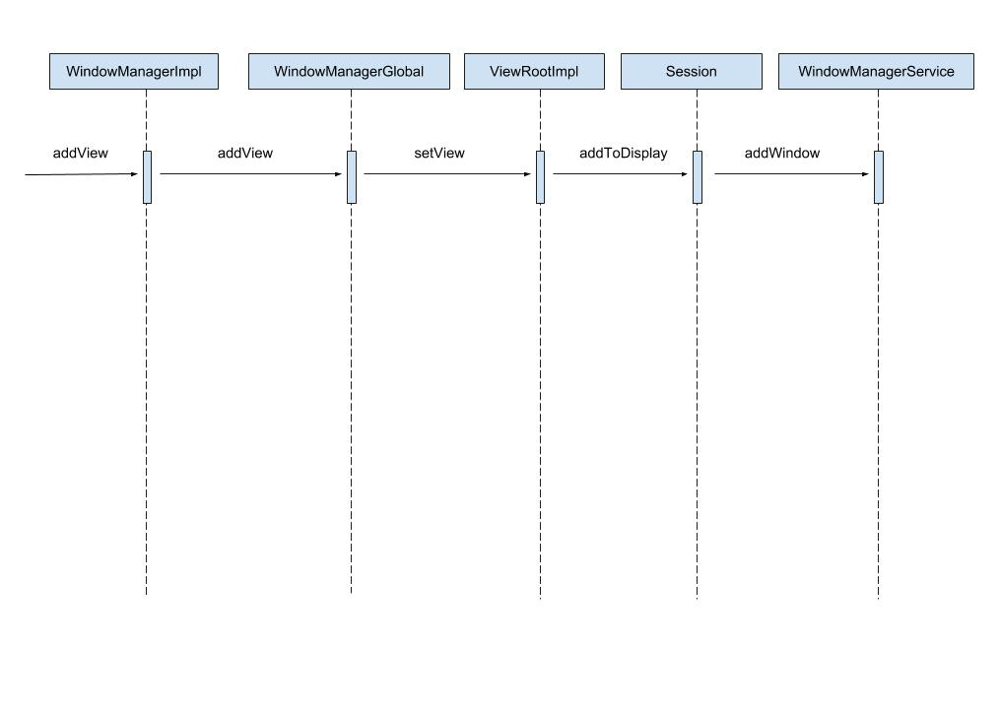

<p align="center">
  
</p>

在讲解 Window 的添加过程之前，先简单说下 Window 这个概念。其实在我们平常开发过程中，见的最多的应该是 Activity，Activity 是一切 View 的父容器，但是实际上 Activity 是附加在 Window 上的。不止 Activity，还有 Dialog，Toast，它们的视图都是附加到 Window 上的。Window 是一个抽象类，它的具体实现是 PhoneWindow。

首先，我们要明确一下我们分析的是什么，当我们创建了一个 View，也创建了它的 LayoutParams，这时我们调用 `WindowManager.addView` 方法，传入 View 和 LayoutParams，就可以把 View 添加到 Window 上了。界面上的表现就是我们可以在 Activity 上看到这个 View 了。接下来，我们就分析 `WindowManager.addView` 方法的流程。

WindowManager 是一个接口，它的实现类是 WindowManagerImpl：

```java
WindowManagerImpl # addView

private final WindowManagerGlobal mGlobal = WindowManagerGlobal.getInstance();

@Override
public void addView(View view, ViewGroup.LayoutParams params) {
    mGlobal.addView(view, params, mDisplay, mParentWindow);
}
```

可以看到，在 `addView` 中，调用了 WindowManagerGlobal 的 `addView` 方法。看来真正的逻辑是写在 WindowManagerGlobal 中的，我们继续看下 WindowManagerGlobal 的 `addView` 方法：

```java
WindowManagerGlobal # addView

// mViews 存储的是所有 Window 对应的 View
private final ArrayList<View> mViews = new ArrayList<View>();
// mRoots 存储的是所有 Window 所对应的 ViewRootImpl
private final ArrayList<ViewRootImpl> mRoots = new ArrayList<ViewRootImpl>();
// mParams 存储的是所有 Window 所对应的布局参数
private final ArrayList<WindowManager.LayoutParams> mParams =
        new ArrayList<WindowManager.LayoutParams>();
// mDyingViews 存储的是正在被删除的 View 对象
private final ArraySet<View> mDyingViews = new ArraySet<View>();

public void addView(View view, ViewGroup.LayoutParams params,
            Display display, Window parentWindow) {
    // 检查参数是否合法
    if (view == null) {
        throw new IllegalArgumentException("view must not be null");
    }
    if (display == null) {
        throw new IllegalArgumentException("display must not be null");
    }
    if (!(params instanceof WindowManager.LayoutParams)) {
        throw new IllegalArgumentException("Params must be WindowManager.LayoutParams");
    }

    final WindowManager.LayoutParams wparams = (WindowManager.LayoutParams)params;
    if (parentWindow != null) {
        parentWindow.adjustLayoutParamsForSubWindow(wparams);
    } else {
        // If there's no parent and we're running on L or above (or in the
        // system context), assume we want hardware acceleration.
        final Context context = view.getContext();
        if (context != null
                && context.getApplicationInfo().targetSdkVersion >= Build.VERSION_CODES.LOLLIPOP) {
            wparams.flags |= WindowManager.LayoutParams.FLAG_HARDWARE_ACCELERATED;
        }
    }

    ViewRootImpl root;
    View panelParentView = null;

    synchronized (mLock) {
        ......

        // 创建 View 对应的 ViewRootImpl
        root = new ViewRootImpl(view.getContext(), display);

        // 给 View 设置布局参数
        view.setLayoutParams(wparams);

        // 存储 view
        mViews.add(view);
        // 存储 ViewRootImpl
        mRoots.add(root);
        // 存储布局参数
        mParams.add(wparams);
    }

    // do this last because it fires off messages to start doing things
    try {
        // 更新界面
        root.setView(view, wparams, panelParentView);
    } catch (RuntimeException e) {
        // BadTokenException or InvalidDisplayException, clean up.
        synchronized (mLock) {
            final int index = findViewLocked(view, false);
            if (index >= 0) {
                removeViewLocked(index, true);
            }
        }
        throw e;
    }
}
```

总结一下，在 WindowManagerGlobal 的 addView 方法中并没有直接去添加 View，而是先检查了参数是否合法，然后把 View、ViewRootImpl，LayoutParams 保存到列表中。这里有个陌生的东西，ViewRootImpl。ViewRootImpl 是什么？简单来说，ViewRootImpl 是负责管理 View 的测量，布局和绘制的。当然，它的作用远不止这点，这里就不多说了，后面会写文章专门分析。

接下来，会调用 ViewRootImpl 的 `setView` 方法：

```java
ViewRootImpl # setView

final IWindowSession mWindowSession;

public void setView(View view, WindowManager.LayoutParams attrs, View panelParentView) {
    ......

    // Schedule the first layout -before- adding to the window
    // manager, to make sure we do the relayout before receiving
    // any other events from the system.
    // 绘制 View
    requestLayout();
    try {
        mOrigWindowType = mWindowAttributes.type;
        mAttachInfo.mRecomputeGlobalAttributes = true;
        collectViewAttributes();
        // 调用 IWindowSession 的 addToDisplay 方法来添加 Window。
        // mWindowSession 是一个 Binder 对象，它的实现类是 Session，
        // 也就是说，addToDisplay 方法是执行在服务端进程中的。
        res = mWindowSession.addToDisplay(mWindow, mSeq, mWindowAttributes,
                getHostVisibility(), mDisplay.getDisplayId(),
                mAttachInfo.mContentInsets, mInputChannel);
    } catch (RemoteException e) {
        mAdded = false;
        mView = null;
        mAttachInfo.mRootView = null;
        mInputChannel = null;
        mFallbackEventHandler.setView(null);
        unscheduleTraversals();
        setAccessibilityFocus(null, null);
        throw new RuntimeException("Adding window failed", e);
    } finally {
        if (restore) {
            attrs.restore();
        }
    }

    ......
}
```

总结一下，`setView` 方法先绘制了 View，然后就调用 Session 的 `addToDisplay` 方法来添加 Window。再看下 Session 的  `addToDisplay` 方法：

```java
Session # addToDisplay

final WindowManagerService mService;

@Override
public int addToDisplay(IWindow window, int seq, WindowManager.LayoutParams attrs,
        int viewVisibility, int displayId, Rect outContentInsets,
        InputChannel outInputChannel) {
    return mService.addWindow(this, window, seq, attrs, viewVisibility, displayId,
            outContentInsets, outInputChannel);
}
```

可以看到，在 Session 的 `addToDisplay` 方法中，又调用了 WindowManagerService 的 `addWindow` 方法，到这里，Window 的添加请求就交给 WindowManagerService 去处理了。

总结一下，Window 的添加过程就是：

1. ViewRootImpl 绘制好 View
2. WindowManagerService 添加 Window