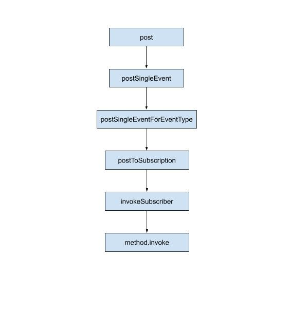

# EventBus#post 流程



EventBus 是通过调用 `post` 方法来发送事件的，我们来看看 post 方法：

```java
public void post(Object event) {
    // 获取当前线程的 posting 状态
    PostingThreadState postingState = currentPostingThreadState.get();
    // 获取当前线程的事件队列
    List<Object> eventQueue = postingState.eventQueue;
    // 把新注册的事件添加到队列中
    eventQueue.add(event);

    // 判断当前线程的 posting 状态
    if (!postingState.isPosting) {
        postingState.isMainThread = Looper.getMainLooper() == Looper.myLooper();
        postingState.isPosting = true;
        if (postingState.canceled) {
            throw new EventBusException("Internal error. Abort state was not reset");
        }
        try {
            // 如果事件队列不为空，就一直发送事件
            while (!eventQueue.isEmpty()) {
                // 发送单个事件
                postSingleEvent(eventQueue.remove(0), postingState);
            }
        } finally {
            postingState.isPosting = false;
            postingState.isMainThread = false;
        }
    }
}
```

首先，从 currentPostingThreadState 中获取当前线程的 PostingThreadState 对象，currentPostingThreadState 是 ThreadLocal 类型的对象，关于 ThreadLocal，可以看 [ThreadLocal 源码解析](https://github.com/shadowwingz/AndroidLife/blob/master/article/ThreadLocal%20%E6%BA%90%E7%A0%81%E8%A7%A3%E6%9E%90.md) 这篇文章，简单的说，ThreadLocal 是一个线程内部的数据存储类，通过它可以在指定的线程中存储数据。在不同的线程通过 get 方法获取，取到的只能是自己线程对应的数据。所以在这里，取到的是当前线程的 postingState。

接着，把要发送的事件添加到事件队列中，现在的开源框架都是这种思想，要做的操作都放到队列中，然后不停从队列中取出去执行。因为在这个操作前面，肯定还有操作在等待被执行，所以要排队，那如果要插队呢？可以用优先级 priority 来控制。

把事件添加到事件队列中之后，就可以遍历这个队列了，如果队列不为空，就说明里面还有事件，有事件，就要调用 postSingleEvent 发送：

```java
private void postSingleEvent(Object event, PostingThreadState postingState) throws Error {
    Class<?> eventClass = event.getClass();
    boolean subscriptionFound = false;
    if (eventInheritance) {
        List<Class<?>> eventTypes = lookupAllEventTypes(eventClass);
        int countTypes = eventTypes.size();
        for (int h = 0; h < countTypes; h++) {
            Class<?> clazz = eventTypes.get(h);
            subscriptionFound |= postSingleEventForEventType(event, postingState, clazz);
        }
    } else {
        // post 单个事件
        subscriptionFound = postSingleEventForEventType(event, postingState, eventClass);
    }
    if (!subscriptionFound) {
        if (logNoSubscriberMessages) {
            Log.d(TAG, "No subscribers registered for event " + eventClass);
        }
        if (sendNoSubscriberEvent && eventClass != NoSubscriberEvent.class &&
                eventClass != SubscriberExceptionEvent.class) {
            post(new NoSubscriberEvent(this, event));
        }
    }
}
```

在 postSingleEvent 中，做了很多逻辑判断，最终调用 postSingleEventForEventType 方法来发送事件：

```java
private boolean postSingleEventForEventType(Object event, PostingThreadState postingState, Class<?> eventClass) {
    CopyOnWriteArrayList<Subscription> subscriptions;
    synchronized (this) {
        // 获取订阅了这个事件的 subscriptions 列表
        subscriptions = subscriptionsByEventType.get(eventClass);
    }
    if (subscriptions != null && !subscriptions.isEmpty()) {
        // 遍历  subscriptions 列表
        for (Subscription subscription : subscriptions) {
            postingState.event = event;
            postingState.subscription = subscription;
            boolean aborted = false;
            try {
                // 分发给订阅者
                postToSubscription(subscription, event, postingState.isMainThread);
                aborted = postingState.canceled;
            } finally {
                postingState.event = null;
                postingState.subscription = null;
                postingState.canceled = false;
            }
            if (aborted) {
                break;
            }
        }
        return true;
    }
    return false;
}
```

首先获取到订阅了这个事件的 subscriptions 列表，因为发送事件，我们要知道有谁是需要这个事件的（谁调用 register 方法注册了），我们不能把事件发送给不需要这个事件的对象。

获取到订阅列表之后，就调用 postToSubscription 来分发事件给订阅者：

```java
private void postToSubscription(Subscription subscription, Object event, boolean isMainThread) {
    switch (subscription.subscriberMethod.threadMode) {
        case POSTING:
            invokeSubscriber(subscription, event);
            break;
        case MAIN:
            if (isMainThread) {
                invokeSubscriber(subscription, event);
            } else {
                mainThreadPoster.enqueue(subscription, event);
            }
            break;
        case BACKGROUND:
            if (isMainThread) {
                backgroundPoster.enqueue(subscription, event);
            } else {
                invokeSubscriber(subscription, event);
            }
            break;
        case ASYNC:
            asyncPoster.enqueue(subscription, event);
            break;
        default:
            throw new IllegalStateException("Unknown thread mode: " + subscription.subscriberMethod.threadMode);
    }
}
```

可以看到，EventBus 在分发事件时，是区分线程的，这个线程是我们在使用 EventBus 的时候定义的：

```java
@Subscribe(threadMode = ThreadMode.MAIN)
public void onReceive(Event event) {

}
```

上面的例子，就是告诉 EventBus，你要在主线程（MAIN）中，通过回调我的 onReceive 方法，把事件发送给我。

既然是 MAIN 线程，就走 `case MAIN`，EventBus 会判断当前是否是主线程，如果是主线程，就调用 invokeSubscriber 来分发：

```java
void invokeSubscriber(Subscription subscription, Object event) {
    try {
        // 回调订阅方法
        subscription.subscriberMethod.method.invoke(subscription.subscriber, event);
    } catch (InvocationTargetException e) {
        handleSubscriberException(subscription, event, e.getCause());
    } catch (IllegalAccessException e) {
        throw new IllegalStateException("Unexpected exception", e);
    }
}
```

真正执行分发事件的方法就是 invokeSubscriber 了，它里面的代码也很简单，通过反射调用了 method.invoke，也就是 `onReceive.invoke`，这样，我们的 onReceive 就被调用了。

到这里，EventBus 的发送事件流程我们就分析完了，我们最后再总结一下：

> EventBus 会先把要发送的事件添加到队列中，然后队列中的事件发送给事件的订阅者。

EventBus 的发送事件流程我们清楚了，接着我们再来分析 [EventBus 的解除注册流程](https://github.com/shadowwingz/AndroidLife/blob/master/article/eventbus/eventbus_unregister.md)。