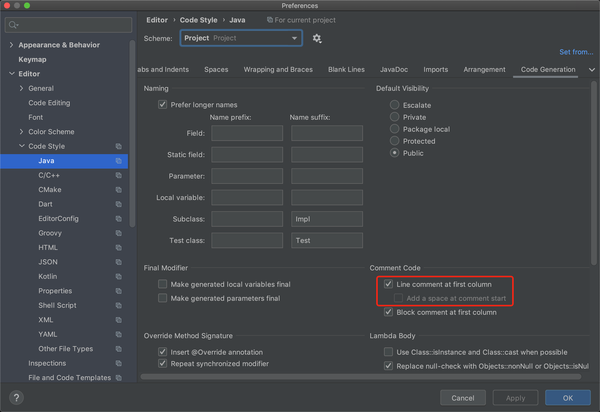

在项目开发中，我们难免会注释一些代码，比如我们有这些一段代码：

```kotlin
    val i = 0
    val j = 0
```

要给这么一段代码加上注释，有的同学可能会手动敲两次 <kbd>/</kbd> 键：

```kotlin
    val i = 0
    // 手动敲两次 / 键添加的注释
    // val j = 0
```

这样也没什么问题，但是由于我们用的都是中文输入法，而在输入中文时，我们敲下 <kbd>/</kbd> 键，实际上出来的是 <kbd>、</kbd>，这就很不舒服了，我们不得不敲一下  <kbd>Shift</kbd> 键将输入法由中文切换到英文。

当然了，我们也可以使用快捷键 <kbd>CTRL + /</kbd> 来注释代码。

但是这样注释也有个问题，注释 `//` 会加在缩进之前：

```kotlin
    val i = 0
    // 使用快捷键添加的注释
//    val j = 0
```

可以看到，注释和代码之间隔着四个空格的缩进，导致上下两行代码看起来没对齐的样子。

我们可以通过修改 `Code Style` 来修改默认的注释风格为我们手动添加的注释的风格。



这里圈出的 2 个选项分别是 `Line comment at first column` 和 `Add a space at comment start`。

第一个选项的意思是，将注释放在行首，这个选项是默认打开的，至于效果嘛...我们刚刚也看到了，并不符合我们的预期。所以我们关闭试试：

```kotlin
    val i = 0
    //val j = 0
```

嗯，生效了，现在注释不在行首了，不过...好像还是有点问题，注释和代码之间的空格也没了，之前是有一个空格的。

这个时候第二个选项就要发挥作用了。

第二个选项的意思是，在注释和代码之间加一个空格。我们把这个选项勾选上，再来看看效果：

```kotlin
    val i = 0
    // val j = 0
```

大功告成！现在我们使用 <kbd>CTRL + /</kbd> 快捷键来注释代码，和我们敲 2 次 <kbd>/</kbd> 键注释代码的效果是一样的，但是从此以后不用再切换输入法了。