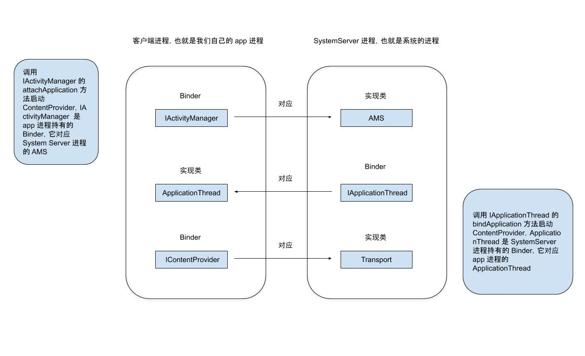

# ContentProvider 的启动过程

先大致描述一下 ContentProvider 的启动过程

>ContentProvider 是在应用启动的时候创建的，而且创建时间比 Application 的 onCreate 方法要早，具体来说是跨进程调用了 AMS 的 `attachApplication` 方法，AMS 又远程调用了 ApplicationThread 的 `bindApplication` 方法，`bindApplication` 方法是在我们进程的 Binder 线程池中完成的，所以需要 Handler H 将其切换回 UI 线程，对应的消息是 `BIND_APPLICATION`，在这个方法里完成了 ContentProvider 的创建。

首先我们看下 ActivityThread 的 `main` 方法，App 就是从这里启动的：

```java
ActivityThread # main

public static void main(String[] args) {
    ......

    ActivityThread thread = new ActivityThread();
    thread.attach(false);

    ......
}
```

在 main 方法中，首先创建了 ActivityThread 对象，然后调用了 ActivityThread 的 `attach` 方法，我们看下 `attach` 方法：

```java
ActivityThread # attach

private void attach(boolean system) {
    sCurrentActivityThread = this;
    mSystemThread = system;
    if (!system) {
        ......
        // 获取 AMS
        final IActivityManager mgr = ActivityManagerNative.getDefault();
        try {
            // 远程调用 AMS 的 attachApplication 方法
            mgr.attachApplication(mAppThread);
        } catch (RemoteException ex) {
            // Ignore
        }
        ......
    } 

    ......
}
```

在 `attach` 方法中，远程调用了 AMS 的 `attachApplication` 方法，这时一次跨进程调用，代码会执行到服务端：

```java
AMS # attachApplication

@Override
public final void attachApplication(IApplicationThread thread) {
    synchronized (this) {
        int callingPid = Binder.getCallingPid();
        final long origId = Binder.clearCallingIdentity();
        attachApplicationLocked(thread, callingPid);
        Binder.restoreCallingIdentity(origId);
    }
}

AMS # attachApplicationLocked

private final boolean attachApplicationLocked(IApplicationThread thread,
            int pid) {

    ......
    try {
        ......
        thread.bindApplication(processName, appInfo, providers, app.instrumentationClass,
                profilerInfo, app.instrumentationArguments, app.instrumentationWatcher,
                app.instrumentationUiAutomationConnection, testMode, enableOpenGlTrace,
                isRestrictedBackupMode || !normalMode, app.persistent,
                new Configuration(mConfiguration), app.compat, getCommonServicesLocked(),
                mCoreSettingsObserver.getCoreSettingsLocked());
        ......
    } catch (Exception e) {
        ......
    }
    ......

    return true;
}
```

在 `attachApplication` 中，调用了 `attachApplicationLocked` 方法，在 `attachApplicationLocked` 方法中，又调用了 `thread.bindApplication` 方法，这里的 `thread` 是 IApplicationThread，它的实现类是 ApplicationThread，调用 ApplicationThread 的 `bindApplication` 方法之后，代码又从服务端执行到了客户端，也就是我们自己的进程。

```java
ActivityThread # bindApplication

public final void bindApplication(String processName, ApplicationInfo appInfo,
        List<ProviderInfo> providers, ComponentName instrumentationName,
        ProfilerInfo profilerInfo, Bundle instrumentationArgs,
        IInstrumentationWatcher instrumentationWatcher,
        IUiAutomationConnection instrumentationUiConnection, int debugMode,
        boolean enableOpenGlTrace, boolean isRestrictedBackupMode, boolean persistent,
        Configuration config, CompatibilityInfo compatInfo, Map<String, IBinder> services,
        Bundle coreSettings) {
    ......
    sendMessage(H.BIND_APPLICATION, data);
}
```


在 `bindApplication` 方法中，只是给 Handler 发送了一个 `BIND_APPLICATION` 消息，这样，代码就切换到了主线程：

```java
case BIND_APPLICATION:
    Trace.traceBegin(Trace.TRACE_TAG_ACTIVITY_MANAGER, "bindApplication");
    AppBindData data = (AppBindData)msg.obj;
    handleBindApplication(data);
    Trace.traceEnd(Trace.TRACE_TAG_ACTIVITY_MANAGER);
    break;
```

在 Handler 中，调用了 `handleBindApplication` 方法：

```java
private void handleBindApplication(AppBindData data) {
    ......
    try {
        // If the app is being launched for full backup or restore, bring it up in
        // a restricted environment with the base application class.
        // 创建 Application
        Application app = data.info.makeApplication(data.restrictedBackupMode, null);
        mInitialApplication = app;

        // don't bring up providers in restricted mode; they may depend on the
        // app's custom Application class
        if (!data.restrictedBackupMode) {
            List<ProviderInfo> providers = data.providers;
            if (providers != null) {
                // 创建 ContentProvider
                installContentProviders(app, providers);
                // For process that contains content providers, we want to
                ......
            }
        }

        ......

        try {
            // 回调 Application 的 onCreate 方法
            mInstrumentation.callApplicationOnCreate(app);
        } catch (Exception e) {
            if (!mInstrumentation.onException(app, e)) {
                throw new RuntimeException(
                    "Unable to create application " + app.getClass().getName()
                    + ": " + e.toString(), e);
            }
        }
    } finally {
        StrictMode.setThreadPolicy(savedPolicy);
    }
}
```

在 `handleBindApplication` 方法中，先调用 `installContentProviders` 方法来创建 ContentProvider，又调用了 Appliation 的 `onCreate` 方法，所以我们可以知道，ContentProvider 是在 Application 启动前创建的。

我们再看下 `installContentProviders` 方法：

```java
ActivityThread # installContentProviders

private void installContentProviders(
            Context context, List<ProviderInfo> providers) {
    final ArrayList<IActivityManager.ContentProviderHolder> results =
        new ArrayList<IActivityManager.ContentProviderHolder>();

    for (ProviderInfo cpi : providers) {
        ......
        // 创建 ContentProvider
        IActivityManager.ContentProviderHolder cph = installProvider(context, null, cpi,
                false /*noisy*/, true /*noReleaseNeeded*/, true /*stable*/);
        if (cph != null) {
            cph.noReleaseNeeded = true;
            results.add(cph);
        }
    }

    ......
}
```

在 `installContentProviders` 中，并没有直接创建 ContentProvider，而是调用 `installProvider` 方法创建了 ContentProviderHolder 对象，从名字来看，ContentProviderHolder 应该是持有 ContentProvider 的，我们看看 ContentProviderHolder：

```java
public static class ContentProviderHolder implements Parcelable {
    public final ProviderInfo info;
    public IContentProvider provider;
    public IBinder connection;
    public boolean noReleaseNeeded;

    ......
}
```

ContentProviderHolder 中并没有直接持有 ContentProvider，而是持有了 IContentProvider，其实在我们开发中，代码内部也是通过 IContentProvider 去调用的。

我们再看下 `installProvider` 方法：

```java
private IActivityManager.ContentProviderHolder installProvider(Context context,
            IActivityManager.ContentProviderHolder holder, ProviderInfo info,
            boolean noisy, boolean noReleaseNeeded, boolean stable) {
    ContentProvider localProvider = null;
    IContentProvider provider;
    if (holder == null || holder.provider == null) {
        ......
        if (c == null) {
            Slog.w(TAG, "Unable to get context for package " +
                  ai.packageName +
                  " while loading content provider " +
                  info.name);
            return null;
        }
        try {
            final java.lang.ClassLoader cl = c.getClassLoader();
            // 创建 ContentProvider
            localProvider = (ContentProvider)cl.
                loadClass(info.name).newInstance();
            // 通过 localProvider 创建 IContentProvider，实现类是 Transport，
            // 通过 Transport 来操作 ContentProvider
            provider = localProvider.getIContentProvider();
            ......
            // XXX Need to create the correct context for this provider.
            // 在 attachInfo 中会回调 ContentProvider 的 onCreate 方法
            localProvider.attachInfo(c, info);
        } catch (java.lang.Exception e) {
            if (!mInstrumentation.onException(null, e)) {
                throw new RuntimeException(
                        "Unable to get provider " + info.name
                        + ": " + e.toString(), e);
            }
            return null;
        }
    } else {
        provider = holder.provider;
        if (DEBUG_PROVIDER) Slog.v(TAG, "Installing external provider " + info.authority + ": "
                + info.name);
    }

    ......

    return retHolder;
}
```

`installProvider` 方法中，先是创建了 ContentProvider，接着通过 `attachInfo` 方法回调了 ContentProvider 的 `onCreate` 方法：

```java
ContentProvider # attachInfo

private void attachInfo(Context context, ProviderInfo info, boolean testing) {
    ......
    if (mContext == null) {
        ......
        ContentProvider.this.onCreate();
    }
}
```

接着，通过 ContentProvider 的 `getIContentProvider` 方法，创建 IContentProvider 的实现类 Transport 的实例：

```java
Content # getIContentProvider

private Transport mTransport = new Transport();

public IContentProvider getIContentProvider() {
    return mTransport;
}
```

我们看一下 Transport 的继承关系：

```java
class Transport extends ContentProviderNative {
}

abstract public class ContentProviderNative extends Binder implements IContentProvider {
}
```

可以看到，Transport 实现了 IContentProvider 接口，所以 Transport 就是 IContentProvider 这个 Binder 的实现类。

绕来绕去，头都晕了，我们总结一下，当代码执行到我们自己进程时，首先通过 Handler 切换到主线程，接着，在主线程中完成了 ContentProvider 和 IContentProvider 的创建，并回调了 ContentProvider 的 onCreate 方法，ContentProvider 也就完成创建了。

#### ContentProvider 支持跨进程吗？为什么？ ####

支持，在 ContentProvider 中，是通过 IContentProvider 去完成各种工作的，IContentProvider 是一个 Binder，它的实现类是 Transport。

#### ContentProvider 中涉及到的 Binder ####

