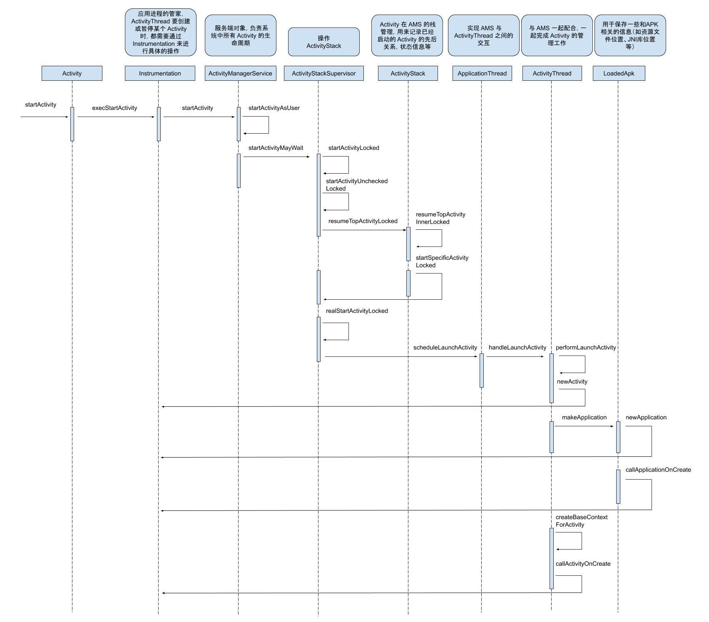
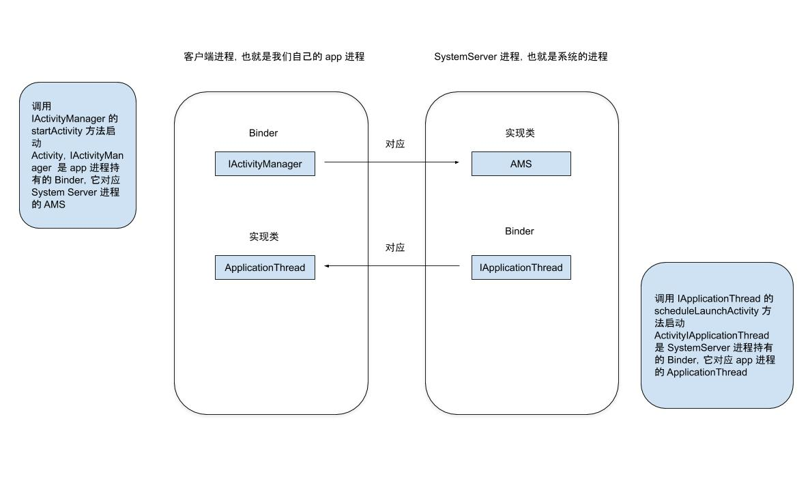

# Activity 启动流程



[点击查看大图](https://raw.githubusercontent.com/shadowwingz/AndroidLife/master/article/how_activity_start/art/how_activity_start.jpg)

当我们启动一个 Activity 的时候，只需要调用

```
Intent intent = new Intent(this, TestActivity.class);
startActivity(intent);
```

就可以启动一个 Activity 了，这对 Android 开发者来说是个很熟悉的操作。但是系统内部到底是怎么启动一个 Activity 呢？
在上一篇文章 [Activity 启动的大体流程](https://github.com/shadowwingz/AndroidLife/blob/master/article/activity/general_process/general_process.md) 中我们已经知道了，Activity 启动得先找上级 Instrumentation 审批，Instrumentation 审批通过后再找老板 AMS 审批，老板同意后 Activity 就可以启动了。那么具体到源码又是什么样的呢？我们跟进去看一看。

这篇文章，重点分析 Activity 的创建，Activity 的生命周期方法的回调。而对于启动模式和任务栈，这篇文章并不会分析。

在分析之前，我们先提前讲下 Activity 启动过程中涉及到的一些对象，以及它们的作用，避免看源码的时候一脸懵逼。

- ActivityManagerServices，简称 AMS，服务端对象，负责系统中所有 Activity 的生命周期
- ActivityThread，App 的真正入口，与 AMS 一起配合，一起完成 Activity 的管理工作。
- ApplicationThread，用来实现 AMS 与 ActivityThread 之间的交互。在 AMS 需要管理相关应用程序中的 Activity 的生命周期时，通过 Application 的代理对象与 ActivityThread 通讯。
- ApplicationThreadProxy，是 ApplicationThread 在服务端的代理，负责和客户端的 ApplicationThread 通讯，AMS 就是通过该代理与 ActivityThread 通信的。
- Instrumentation，每一个应用程序只有一个 Instrumentation 对象，每个 Activity 内都有一个对该对象的引用。可以理解为应用进程的管家，ActivityThread 要创建或暂停某个 Activity 时，都需要通过 Instrumentation 来进行具体的操作。
- ActivityStack，Activity 在 AMS 的栈管理，用来记录已经启动的 Activity 的先后关系，状态信息等。通过 ActivityStack 决定是否需要启动新的进程。
- ActivityRecord，ActivityStack 的管理对象，每个 Activity 在 AMS 对应一个 ActivityRecord，来记录 Activity 的状态以及其他的管理信息。
- TaskRecord，AMS 抽象出来的一个“任务”的概念，是记录 ActivityRecord 的栈，一个“Task”包含若干个 ActivityRecord 。AMS 用 TaskRecord 确保 Activity 启动和退出的顺序。如果你清楚 Activity 的 4 种 launchMode，那么对这个概念应该不陌生。

另外，建议在阅读这篇文章之前，先看下 [Binder 的使用及上层原理](https://github.com/shadowwingz/AndroidLife/blob/master/article/Binder%20%E7%9A%84%E4%BD%BF%E7%94%A8%E5%8F%8A%E4%B8%8A%E5%B1%82%E5%8E%9F%E7%90%86.md)，因为在 Activity 的启动过程中，涉及到了 Binder。

然后，我先贴一段 任玉刚 总结的 Activity 的启动过程，让大家先有个感性的认识：

>Activity 的启动过程，我们从 Context 的 startActivity 说起，先是 ContextImpl 的 startActivity，然后内部会通过 Instrumentation 来尝试启动 Activity，这是一个跨进程过程，它会调用 AMS 的 startActivity 方法，当 AMS 校验完  Activity 的合法性后，会通过 ApplicationThread 回调到我们的进程，这也是一次跨进程过程，而 ApplicationThread 就是一个 Binder，回调逻辑是在我们进程的 Binder 线程池中完成，所以需要通过 Handler H 将其切回 UI 线程，第一个消息是 LAUNCH_ACTIVITY,它对应着 handleLaunchActivity，在这个方法里面完成了 Activity 的创建和启动。接着，在 Activity 的 onResume 中，Activity 的内容将开始渲染到 Window 上面，然后开始绘制直到我们可以看到。

我们来看 Activity 的 startActivity 方法：

```java
Activity # startActivity

@Override
public void startActivity(Intent intent) {
    this.startActivity(intent, null);
}

Activity # startActivity

@Override
public void startActivity(Intent intent, @Nullable Bundle options) {
    if (options != null) {
        startActivityForResult(intent, -1, options);
    } else {
        // Note we want to go through this call for compatibility with
        // applications that may have overridden the method.
        startActivityForResult(intent, -1);
    }
}

Activity # startActivityForResult

public void startActivityForResult(Intent intent, int requestCode) {
        startActivityForResult(intent, requestCode, null);
}

Activity # startActivityForResult

public void startActivityForResult(Intent intent, int requestCode, @Nullable Bundle options) {
    if (mParent == null) {
        // 这里 mMainThread.getApplicationThread() 的类型是 ApplicationThread
        Instrumentation.ActivityResult ar =
            mInstrumentation.execStartActivity(
                this, mMainThread.getApplicationThread(), mToken, this,
                intent, requestCode, options);
        if (ar != null) {
            mMainThread.sendActivityResult(
                mToken, mEmbeddedID, requestCode, ar.getResultCode(),
                ar.getResultData());
        }
        ......
    }
    ......
}
```

`startActivity` 中最终调用了 `startActivityForResult` 方法，在 `startActivityForResult` 方法中，会走 `mParent == null` 这个逻辑，然后调用了 Instrumentation 的 `execStartActivity`，`execStartActivity` 中有一个参数是 `mMainThread.getApplicationThread()`，它的类型是 `ApplicationThread`，`ApplicationThread` 是 `ActivityThread` 的一个内部类，`ApplicationThread` 和 `ActivityThread` 在 Activity 的启动过程中发挥着很重要的作用。

接着看 Instrumentation 的 `execStartActivity` 方法：

```java
Instrumentation # execStartActivity

public ActivityResult execStartActivity(
            Context who, IBinder contextThread, IBinder token, Activity target,
            Intent intent, int requestCode, Bundle options) {
    ......
    try {
        ......
        int result = ActivityManagerNative.getDefault()
            .startActivity(whoThread, who.getBasePackageName(), intent,
                    intent.resolveTypeIfNeeded(who.getContentResolver()),
                    token, target != null ? target.mEmbeddedID : null,
                    requestCode, 0, null, options);
        checkStartActivityResult(result, intent);
    } catch (RemoteException e) {
    }
    return null;
}
```

在 Instrumentation 的 `execStartActivity` 方法中，调用了 `ActivityManagerNative.getDefault()` 的 `startActivity` 方法，ActivityManagerNative 继承自 Binder 并实现了 `IActivityManager` 接口，所以 ActivityManagerNative 也是一个 Binder，但是 ActivityManagerNative 只是一个抽象类，所以我们还得找它的实现类，这个实现类就是 `ActivityManagerService`（下面简称 AMS），所以 `ActivityManagerNative.getDefault()` 的返回类型就是 `IActivityManager` 类型的 Binder 对象，而这个 Binder 对象的具体实现是 AMS。

我们接着看 AMS 的 startActivity 方法：

```java
ActivityManagerService # startActivity

@Override
public final int startActivity(IApplicationThread caller, String callingPackage,
        Intent intent, String resolvedType, IBinder resultTo, String resultWho, int requestCode,
        int startFlags, ProfilerInfo profilerInfo, Bundle options) {
    return startActivityAsUser(caller, callingPackage, intent, resolvedType, resultTo,
        resultWho, requestCode, startFlags, profilerInfo, options,
        UserHandle.getCallingUserId());
}

ActivityManagerService # startActivityAsUser

@Override
public final int startActivityAsUser(IApplicationThread caller, String callingPackage,
        Intent intent, String resolvedType, IBinder resultTo, String resultWho, int requestCode,
        int startFlags, ProfilerInfo profilerInfo, Bundle options, int userId) {
    enforceNotIsolatedCaller("startActivity");
    userId = handleIncomingUser(Binder.getCallingPid(), Binder.getCallingUid(), userId,
            false, ALLOW_FULL_ONLY, "startActivity", null);
    // TODO: Switch to user app stacks here.
    return mStackSupervisor.startActivityMayWait(caller, -1, callingPackage, intent,
            resolvedType, null, null, resultTo, resultWho, requestCode, startFlags,
            profilerInfo, null, null, options, userId, null, null);
}

ActivityManagerService # startActivityAsCaller

@Override
public final int startActivityAsCaller(IApplicationThread caller, String callingPackage,
        Intent intent, String resolvedType, IBinder resultTo, String resultWho, int requestCode,
        int startFlags, ProfilerInfo profilerInfo, Bundle options, int userId) {

    ......
    try {
        int ret = mStackSupervisor.startActivityMayWait(null, targetUid, targetPackage, intent,
                resolvedType, null, null, resultTo, resultWho, requestCode, startFlags, null,
                null, null, options, userId, null, null);
        return ret;
    } catch (SecurityException e) {
        ......
    }
}
```

AMS 的 startActivity 方法最终会调用 ActivityStackSupervisor 的 `startActivityMayWait` 方法：

```java
ActivityStackSupervisor # startActivityMayWait

final int startActivityMayWait(IApplicationThread caller, int callingUid,
            String callingPackage, Intent intent, String resolvedType,
            IVoiceInteractionSession voiceSession, IVoiceInteractor voiceInteractor,
            IBinder resultTo, String resultWho, int requestCode, int startFlags,
            ProfilerInfo profilerInfo, WaitResult outResult, Configuration config,
            Bundle options, int userId, IActivityContainer iContainer, TaskRecord inTask) {
        ......

        int res = startActivityLocked(caller, intent, resolvedType, aInfo,
                voiceSession, voiceInteractor, resultTo, resultWho,
                requestCode, callingPid, callingUid, callingPackage,
                realCallingPid, realCallingUid, startFlags, options,
                componentSpecified, null, container, inTask);

        ......
}

ActivityStackSupervisor # startActivityLocked

final int startActivityLocked(IApplicationThread caller,
            Intent intent, String resolvedType, ActivityInfo aInfo,
            IVoiceInteractionSession voiceSession, IVoiceInteractor voiceInteractor,
            IBinder resultTo, String resultWho, int requestCode,
            int callingPid, int callingUid, String callingPackage,
            int realCallingPid, int realCallingUid, int startFlags, Bundle options,
            boolean componentSpecified, ActivityRecord[] outActivity, ActivityContainer container,
            TaskRecord inTask) {
    ......

    err = startActivityUncheckedLocked(r, sourceRecord, voiceSession, voiceInteractor,
            startFlags, true, options, inTask);

    ......
}

ActivityStackSupervisor # startActivityUncheckedLocked

final int startActivityUncheckedLocked(ActivityRecord r, ActivityRecord sourceRecord,
            IVoiceInteractionSession voiceSession, IVoiceInteractor voiceInteractor, int startFlags,
            boolean doResume, Bundle options, TaskRecord inTask) {
                ......
                if (doResume) {
                    targetStack.resumeTopActivityLocked(null);
                }
                ......
            }
        }
        ......

    }
    ......
}
```

在 ActivityStackSupervisor 的 `startActivityMayWait` 中，最终会调用 ActivityStack 的 `resumeTopActivityLocked` 方法：

```java
ActivityStack # resumeTopActivityLocked

final boolean resumeTopActivityLocked(ActivityRecord prev) {
    return resumeTopActivityLocked(prev, null);
}

ActivityStack # resumeTopActivityLocked

final boolean resumeTopActivityLocked(ActivityRecord prev, Bundle options) {
    ......
    try {
        ......
        result = resumeTopActivityInnerLocked(prev, options);
    } finally {
        ......
    }
    return result;
}

ActivityStack # resumeTopActivityInnerLocked

final boolean resumeTopActivityInnerLocked(ActivityRecord prev, Bundle options) {
    ......
    mStackSupervisor.startSpecificActivityLocked(next, true, true);
    ......
}
```

ActivityStack 的 `resumeTopActivityLocked` 方法最终又调用了 ActivityStackSupervisor 的 `startSpecificActivityLocked`：

```java
ActivityStackSupervisor # startSpecificActivityLocked

void startSpecificActivityLocked(ActivityRecord r,
            boolean andResume, boolean checkConfig) {
    ......

    if (app != null && app.thread != null) {
        try {
            ......
            realStartActivityLocked(r, app, andResume, checkConfig);
            return;
        } catch (RemoteException e) {
            Slog.w(TAG, "Exception when starting activity "
                    + r.intent.getComponent().flattenToShortString(), e);
        }
        ......
    }

    ......
}

ActivityStackSupervisor # realStartActivityLocked

final boolean realStartActivityLocked(ActivityRecord r,
            ProcessRecord app, boolean andResume, boolean checkConfig)
            throws RemoteException {
    ......
    try {
        ......
        app.thread.scheduleLaunchActivity(new Intent(r.intent), r.appToken,
                System.identityHashCode(r), r.info, new Configuration(mService.mConfiguration),
                r.compat, r.task.voiceInteractor, app.repProcState, r.icicle, r.persistentState,
                results, newIntents, !andResume, mService.isNextTransitionForward(),
                profilerInfo);

        ......

    } catch (RemoteException e) {
        ......
    }

    ......
}
```

ActivityStackSupervisor 的 `startSpecificActivityLocked` 方法最终调用了 `app.thread.scheduleLaunchActivity` 方法，从这里开始就是这篇文章的关键了。`app.thread` 是 IApplicationThread 类型：

```java
public interface IApplicationThread extends IInterface {
    void schedulePauseActivity(IBinder token, boolean finished, boolean userLeaving,
            int configChanges, boolean dontReport) throws RemoteException;
    void scheduleStopActivity(IBinder token, boolean showWindow,
            int configChanges) throws RemoteException;
    ......
    void scheduleLaunchActivity(Intent intent, IBinder token, int ident,
            ActivityInfo info, Configuration curConfig, CompatibilityInfo compatInfo,
            IVoiceInteractor voiceInteractor, int procState, Bundle state,
            PersistableBundle persistentState, List<ResultInfo> pendingResults,
            List<Intent> pendingNewIntents, boolean notResumed, boolean isForward,
            ProfilerInfo profilerInfo) throws RemoteException;
    ......
}
```

从方法命名来看，IApplicationThread 应该和启动，停止 Activity 有关，而且 IApplicationThread 继承自 IInterface 接口，所以它是一个 Binder 类型的接口。既然是一个 Binder，又和启动，停止 Activity 有关，那它的实现类是谁呢？答案是 ApplicationThread，我们来看下 ApplicationThread 的 `scheduleLaunchActivity` 方法：

```java
ApplicationThread # scheduleLaunchActivity

public final void scheduleLaunchActivity(Intent intent, IBinder token, int ident,
        ActivityInfo info, Configuration curConfig, CompatibilityInfo compatInfo,
        IVoiceInteractor voiceInteractor, int procState, Bundle state,
        PersistableBundle persistentState, List<ResultInfo> pendingResults,
        List<Intent> pendingNewIntents, boolean notResumed, boolean isForward,
        ProfilerInfo profilerInfo) {
    ......
    sendMessage(H.LAUNCH_ACTIVITY, r);
}
```

在 ApplicationThread 的 `scheduleLaunchActivity` 方法中，只是发送一个启动 Activity 的消息。既然是发送消息，那消息最终肯定会交给 Handler 来处理，这个 Handler 就是 H：

```java
ActivityThread # H

case LAUNCH_ACTIVITY: {
    ......
    handleLaunchActivity(r, null);
    Trace.traceEnd(Trace.TRACE_TAG_ACTIVITY_MANAGER);
} 
break;

ActivityThread # HhandleLaunchActivity

private void handleLaunchActivity(ActivityClientRecord r, Intent customIntent) {
    ......

    Activity a = performLaunchActivity(r, customIntent);

    ......
}

ActivityThread # performLaunchActivity

private Activity performLaunchActivity(ActivityClientRecord r, Intent customIntent) {
    // System.out.println("##### [" + System.currentTimeMillis() + "] ActivityThread.performLaunchActivity(" + r + ")");

    // 从 ActivityClientRecord 中获取待启动的 Activity 的组件信息
    ActivityInfo aInfo = r.activityInfo;
    if (r.packageInfo == null) {
        r.packageInfo = getPackageInfo(aInfo.applicationInfo, r.compatInfo,
                Context.CONTEXT_INCLUDE_CODE);
    }

    ComponentName component = r.intent.getComponent();
    if (component == null) {
        component = r.intent.resolveActivity(
            mInitialApplication.getPackageManager());
        r.intent.setComponent(component);
    }

    if (r.activityInfo.targetActivity != null) {
        component = new ComponentName(r.activityInfo.packageName,
                r.activityInfo.targetActivity);
    }

    Activity activity = null;
    try {
        java.lang.ClassLoader cl = r.packageInfo.getClassLoader();
        // 通过 Instrumentation.newActivity 创建 Activity 对象
        activity = mInstrumentation.newActivity(
                cl, component.getClassName(), r.intent);
        StrictMode.incrementExpectedActivityCount(activity.getClass());
        r.intent.setExtrasClassLoader(cl);
        r.intent.prepareToEnterProcess();
        if (r.state != null) {
            r.state.setClassLoader(cl);
        }
    } catch (Exception e) {
        if (!mInstrumentation.onException(activity, e)) {
            throw new RuntimeException(
                "Unable to instantiate activity " + component
                + ": " + e.toString(), e);
        }
    }

    try {
        // 通过 LoadedApk 的 makeApplication 方法创建 Application 对象
        Application app = r.packageInfo.makeApplication(false, mInstrumentation);

        if (localLOGV) Slog.v(TAG, "Performing launch of " + r);
        if (localLOGV) Slog.v(
                TAG, r + ": app=" + app
                + ", appName=" + app.getPackageName()
                + ", pkg=" + r.packageInfo.getPackageName()
                + ", comp=" + r.intent.getComponent().toShortString()
                + ", dir=" + r.packageInfo.getAppDir());

        if (activity != null) {
            // 创建 Context
            Context appContext = createBaseContextForActivity(r, activity);
            CharSequence title = r.activityInfo.loadLabel(appContext.getPackageManager());
            Configuration config = new Configuration(mCompatConfiguration);
            if (DEBUG_CONFIGURATION) Slog.v(TAG, "Launching activity "
                    + r.activityInfo.name + " with config " + config);
            activity.attach(appContext, this, getInstrumentation(), r.token,
                    r.ident, app, r.intent, r.activityInfo, title, r.parent,
                    r.embeddedID, r.lastNonConfigurationInstances, config,
                    r.voiceInteractor);

            if (customIntent != null) {
                activity.mIntent = customIntent;
            }
            r.lastNonConfigurationInstances = null;
            activity.mStartedActivity = false;
            int theme = r.activityInfo.getThemeResource();
            if (theme != 0) {
                activity.setTheme(theme);
            }

            activity.mCalled = false;
            if (r.isPersistable()) {
                mInstrumentation.callActivityOnCreate(activity, r.state, r.persistentState);
            } else {
                // 回调 Activity 的 onCreate 方法
                mInstrumentation.callActivityOnCreate(activity, r.state);
            }
            ......
        }
        r.paused = true;

        mActivities.put(r.token, r);

    } catch (SuperNotCalledException e) {
        throw e;

    } catch (Exception e) {
        ......
    }

    return activity;
}
```

在 `performLaunchActivity` 中，从 ActivityClientRecord 中获取待启动的 Activity 的组件信息，然后创建了 Activity 对象，具体的创建方式是通过 Instrumentation 的 `newActivity` 方法来创建的，接着通过 LoadedApk 的 `makeApplication` 方法来创建 Application 对象，从这里我们发现，原来 Application 的创建过程也隐藏在 Activity 的启动过程中。Application 创建完成后，继续创建 Context 对象。最后调用 `mInstrumentation.callActivityOnCreate` 方法，Activity 的 `onCreate` 方法会被回调。到这里，Activity 的启动过程就完成了。

### 问答 ###

#### Activity 启动过程中涉及到的 Binder ####



#### Activity 启动过程中有几次跨进程 ####

2 次，一次是调用 AMS 的 startActivity 方法，这是客户端远程调用服务端，一次是调用 ApplicationThread 的 `scheduleLaunchActivity` 方法，这是服务端远程调用客户端。