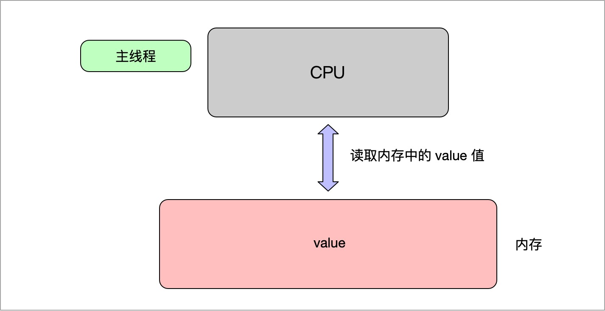
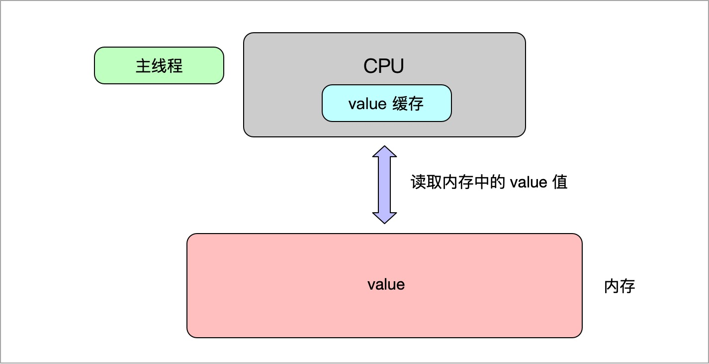
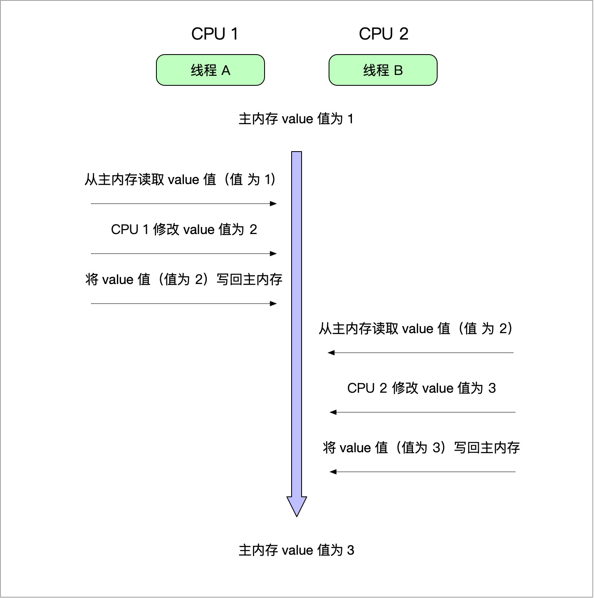
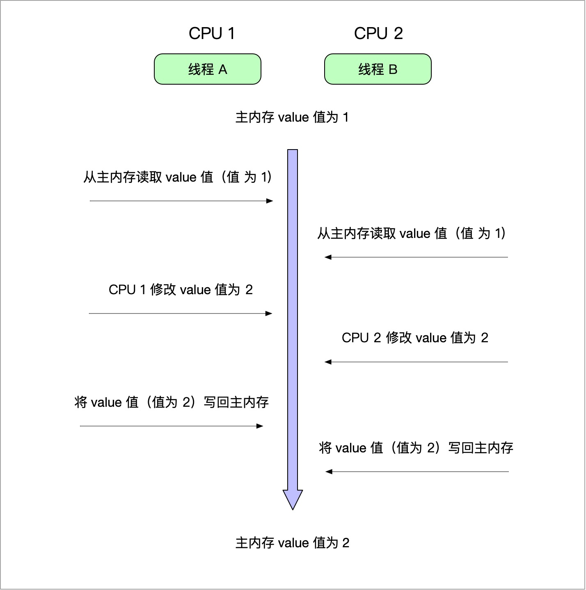

## Java 内存模型是什么

Java 内存模型的英文名称是 Java Memory Model，简称 JMM，属于 Java 并发编程中的概念。

## 为什么会有 Java 内存模型

任何技术都是慢慢演变的，我们也来尝试一下从一个单线程的 Demo 来演变。

### 单线程的小程序

```java
public class Demo {
    
    int value = 1;

    public static void main(String[] args) {
        Demo demo = new Demo();
        System.out.println(demo.value);
    }
}
```

这是一个很简单的 Java 程序，它的作用是在主线程把 value 的值打印出来，value 的值是 1。用图表示是这样是：



解释一下这张图，当 Java 程序运行的时候，会申请一块主内存，然后会在主内存中定义一个变量 value 并赋值 1，接着 CPU 会从主内存中读取 value 的值，并在主线程打印 value 的值。

### 高速缓存

我们知道 CPU 的执行速度和内存的读写速度是不一样的，CPU 的执行速度比内存的读写速度要快很多。而且随着 CPU 技术的发展，CPU 的执行速度和内存的读写速度差距会越来越大。如果每次执行命令都要先从内存中读数据，肯定是会影响效率的。

那有没有办法改进呢？

有，我们可以在 CPU 中加入高速缓存。



因为我们是嫌从主内存中取值速度太慢，那我们就在 CPU 中加入高速缓存。

要读 value 的数据时，先看 CPU 的缓存中有没有 value 的值，有就直接拿来用，没有的话再从主内存中去取。

要修改 value 的数据时，先看 CPU 的缓存中有没有 value 的值，有就直接修改，然后把修改后的值刷回（同步）主内存。

这样可以大大提高效率。

### 高速缓存带来的问题

那么引入高速缓存会不会带来什么问题呢？

假如程序运行在一个有 2 个 CPU 的机器上，程序开启了 2 个线程，都尝试修改 value 的值，大概是这个样子：



看上去好像没什么问题，但是在多线程的情况，可能会出现这种情况：



可以看到，当线程 A 刚从主内存中将 value 值取出，还没来得及修改的时候，线程 B 也从主内存中将 value 值取出，这时候就有问题了。线程 A 和线程 B 拿到的值都是 1，经过线程 A 和线程 B 的修改之后， value 的值是 2。