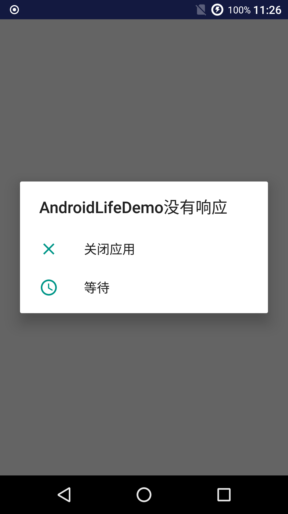

# 怎么分析 ANR 文件



当一个进程发生了 ANR 之后，系统会在 `/data/anr` 目录下生成一个文件 `traces.txt`，通过分析这个文件我们可以定位出 ANR 的原因。

我们可以用一段代码来模拟 ANR，在按钮的点击事件中休眠 30 秒，然后点击几下返回键，过几秒钟，就会弹出 ANR 的弹框。

```java
private void testANR1() {
    SystemClock.sleep(30 * 1000);
}
```

先用 cd 命令进入我们要保存 traces.txt 文件的文件夹，然后用 `adb pull /data/anr/traces.txt` 命令，就可以把 traces.txt 从手机里取出来了。

接下来，我们来分析下 traces 文件，这个文件比较大，有 300 多 KB，我们只截选部分关键代码分析：

```java
// ANR 发生时间
----- pid 10101 at 2019-07-05 22:41:14 -----
// 进程名称
Cmd line: com.shadowwingz.androidlifedemo

// main 是 ANR 发生的线程，这里是主线程
// prio 线程优先级，默认是 5
// tid 是线程唯一标识
"main" prio=5 tid=1 Sleeping
  // group 是线程组名称
  // sCount 线程被挂起的次数
  // dsCount 线程被调试器挂起的次数
  // obj 线程 Native 的地址
  | group="main" sCount=1 dsCount=0 obj=0x7434f6e8 self=0xb4305400
  // sysTid 线程号（主线程的线程号和进程号相同）
  // nice 线程的调度优先级
  // cgrp 调度归属组
  // sched 线程的调度策略/优先级
  // handle 线程处理函数的地址
  | sysTid=10101 nice=-10 cgrp=default sched=0/0 handle=0xb6fdd534
  // state 调度状态
  // schedstat 从 /proc/[pid]/task/[tid]/schedstat 读出，
  // 三个值分别表示线程在 cpu 上执行的时间、
  // 线程的等待时间和线程执行的时间片长度、
  // 不支持这项信息的三个值都是 0
  // utm 线程用户态下使用的时间值（单位是jiffies）
  // stm 内核态下的调度时间值
  // core 最后执行这个线程的 cpu 核的序号
  | state=S schedstat=( 174500355 50373028 265 ) utm=12 stm=5 core=0 HZ=100
  | stack=0xbe193000-0xbe195000 stackSize=8MB
  | held mutexes=
  // java 堆栈调用信息,可以查看调用的关系，定位到具体位置
  at java.lang.Thread.sleep!(Native method)
  - sleeping on <0x0de77716> (a java.lang.Object)
  at java.lang.Thread.sleep(Thread.java:371)
  - locked <0x0de77716> (a java.lang.Object)
  at java.lang.Thread.sleep(Thread.java:313)
  at android.os.SystemClock.sleep(SystemClock.java:120)
  at com.shadowwingz.androidlifedemo.MainActivity.testANR1(MainActivity.java:65)
  at com.shadowwingz.androidlifedemo.MainActivity.access$000(MainActivity.java:14)
  at com.shadowwingz.androidlifedemo.MainActivity$5.onClick(MainActivity.java:53)
  at android.view.View.performClick(View.java:5637)
  at android.view.View$PerformClick.run(View.java:22433)
  at android.os.Handler.handleCallback(Handler.java:751)
  at android.os.Handler.dispatchMessage(Handler.java:95)
  at android.os.Looper.loop(Looper.java:154)
  at android.app.ActivityThread.main(ActivityThread.java:6186)
  at java.lang.reflect.Method.invoke!(Native method)
  at com.android.internal.os.ZygoteInit$MethodAndArgsCaller.run(ZygoteInit.java:889)
  at com.android.internal.os.ZygoteInit.main(ZygoteInit.java:779)
```

traces 文件里字段很多，这个例子中我们主要关注 ANR 发生的线程和 Java 堆栈调用信息。`main` 说明 ANR 发生在主线程，下面的代码说明 ANR 发生是因为主线程 sleep：

```java
部分关键代码，截取自上面的 traces 内容

at android.os.SystemClock.sleep(SystemClock.java:120)
  at com.shadowwingz.androidlifedemo.MainActivity.testANR1(MainActivity.java:65)
  at com.shadowwingz.androidlifedemo.MainActivity.access$000(MainActivity.java:14)
  at com.shadowwingz.androidlifedemo.MainActivity$5.onClick(MainActivity.java:53)
```

可以看到，在 MainActivity 的 65 行，调用了 `testANR1` 方法，在这个方法中调用了 `SystemClock.sleep` 方法。这样，问题就找到了，是因为在主线程中，睡眠了 30 秒，导致主线程无法响应用户的操作，UI 线程响应超时，所以 ANR。

这个 ANR 非常简单，也很直接，下面再模拟一个稍微复杂点的 ANR。

在 Activity 的 onCreate 方法中，加上下面的代码：

```java
new Thread(new Runnable() {
    @Override
    public void run() {
        testANR2();
    }
}).start();
SystemClock.sleep(5000);
initView();
```

其中，testANR2 方法和 initView 方法的定义如下：

```java
private synchronized void testANR2() {
    SystemClock.sleep(30000 * 1000);
}

private synchronized void initView() {
}
```

`testANR2` 方法和 `initView` 方法都被 `synchronized` 修饰，在 `onCreate` 方法被调用，会先开启一个子线程，然后执行 `testANR2` 方法，子线程会取得锁，5 秒钟之后，主线程会调用 `initView` 方法，`initView` 方法会尝试获取锁，但是锁此时被子线程持有，所以主线程只能等待子线程释放锁，而子线程会持有锁很久，所以主线程会迟迟得不到锁，`onCreate` 方法无法执行完毕，造成死锁。

运行程序，程序会卡住，然后点击几下返回键，就会出现 ANR。我们还是把 traces 文件 `pull` 出来，下面是关键日志：

```
----- pid 28235 at 2019-07-06 11:11:41 -----
Cmd line: com.shadowwingz.androidlifedemo

"main" prio=5 tid=1 Blocked
  | group="main" sCount=1 dsCount=0 obj=0x7434f6e8 self=0xb4305400
  | sysTid=28235 nice=-10 cgrp=default sched=0/0 handle=0xb6fdd534
  | state=S schedstat=( 87715620 5327295 92 ) utm=4 stm=4 core=0 HZ=100
  | stack=0xbe193000-0xbe195000 stackSize=8MB
  | held mutexes=
  at com.shadowwingz.androidlifedemo.MainActivity.initView(MainActivity.java:79)
  - waiting to lock <0x0fc82301> (a com.shadowwingz.androidlifedemo.MainActivity) held by thread 11
  at com.shadowwingz.androidlifedemo.MainActivity.onCreate(MainActivity.java:67)
  at android.app.Activity.performCreate(Activity.java:6684)
  at android.app.Instrumentation.callActivityOnCreate(Instrumentation.java:1119)
  at android.app.ActivityThread.performLaunchActivity(ActivityThread.java:2637)
  at android.app.ActivityThread.handleLaunchActivity(ActivityThread.java:2751)
  at android.app.ActivityThread.-wrap12(ActivityThread.java:-1)
  at android.app.ActivityThread$H.handleMessage(ActivityThread.java:1496)
  at android.os.Handler.dispatchMessage(Handler.java:102)
  at android.os.Looper.loop(Looper.java:154)
  at android.app.ActivityThread.main(ActivityThread.java:6186)
  at java.lang.reflect.Method.invoke!(Native method)
  at com.android.internal.os.ZygoteInit$MethodAndArgsCaller.run(ZygoteInit.java:889)
  at com.android.internal.os.ZygoteInit.main(ZygoteInit.java:779)
```

`"main" prio=5 tid=1 Blocked` 说明主线程 Blocked（阻塞）了

```
at com.shadowwingz.androidlifedemo.MainActivity.initView(MainActivity.java:79)
  - waiting to lock <0x0fc82301> (a com.shadowwingz.androidlifedemo.MainActivity) held by thread 11
```

说明主线程在等待 `thread 11` 持有的锁，而 `thread 11`，也就是我们 `new` 出来的 Thread，它因为调用了 `testANR2` 方法，一直 sleep。

`testANR2` 方法和 `initView` 方法都被 `synchronized` 修饰，所以它们竞争的是同一个锁，也就是当前 Activity 的对象锁。

这样，ANR 原因我们就分析出来了。

#### 参考 ####

[Android ANR日志分析指南](https://zhuanlan.zhihu.com/p/50107397)