# 使用 MAT 分析内存泄漏 

排查内存泄漏，我们经常用 MAT（MemoryAnalyzer）这篇文章，我们学习下 MAT 的使用。

在使用 MAT 之前，我们先制造一个内存泄漏，[Hanlder 使用不当导致内存泄漏](https://github.com/shadowwingz/AndroidLife/blob/master/article/handler_memory_leak/handler_memory_leak.md#hanlder-%E4%BD%BF%E7%94%A8%E4%B8%8D%E5%BD%93%E5%AF%BC%E8%87%B4%E5%86%85%E5%AD%98%E6%B3%84%E6%BC%8F)

然后，我们让 App 跑起来，跑起来之后，我们可以在 Profiler 中看到我们的进程了，Profiler 是 Android Studio
内置的性能分析工具，我们可以用它来生成内存快照，然后再用 MAT 来分析这个内存快照。

接着点击 MEMORY：

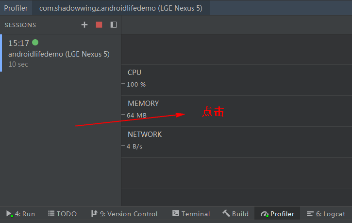

点击 MEMORY 之后，我们就可以看到一个波浪图形，这个波浪就是进程正在使用的内存：

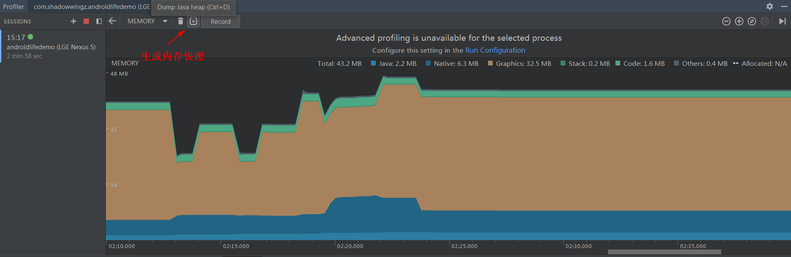

接着，我们点击一下『内存泄漏 Demo』按钮，进入 `MemoryLeakActivity`，再退出这个 Activity，由于 Handler 会持有 Activity 的引用，导致 Activity 退出之后无法被回收，从而发生内存泄漏。反复操作几次，然后点击 `Dump Java heap` 按钮，生成内存快照。

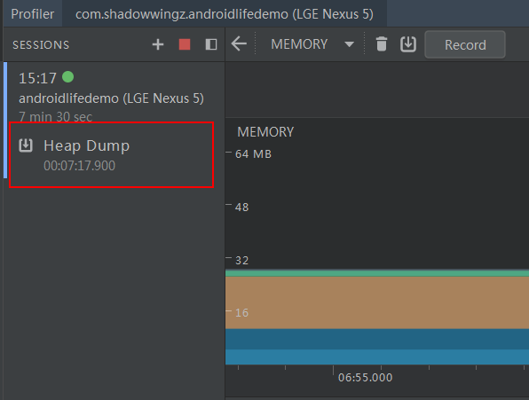

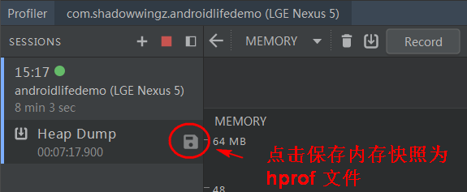

生成的内存快照是 hprof 文件，此时 hprof 文件还不能被 MAT 识别，所以需要我们把它转换一下，转换之后，才能被 MAT 识别。

```
hprof-conv D:\hprof\memory-20190728T152636.hprof D:\hprof\test.hprof
```

这句命令的意思是使用 `hprof-conv` 命令把我们刚刚生成的 `memory-20190728T152636.hprof` 文件转换成 MAT 可以识别的 `test.hprof` 文件。

接着，我们用 MAT 打开 `test.hprof` 文件：

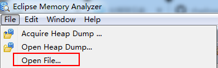

选择 `test.hprof` 文件：

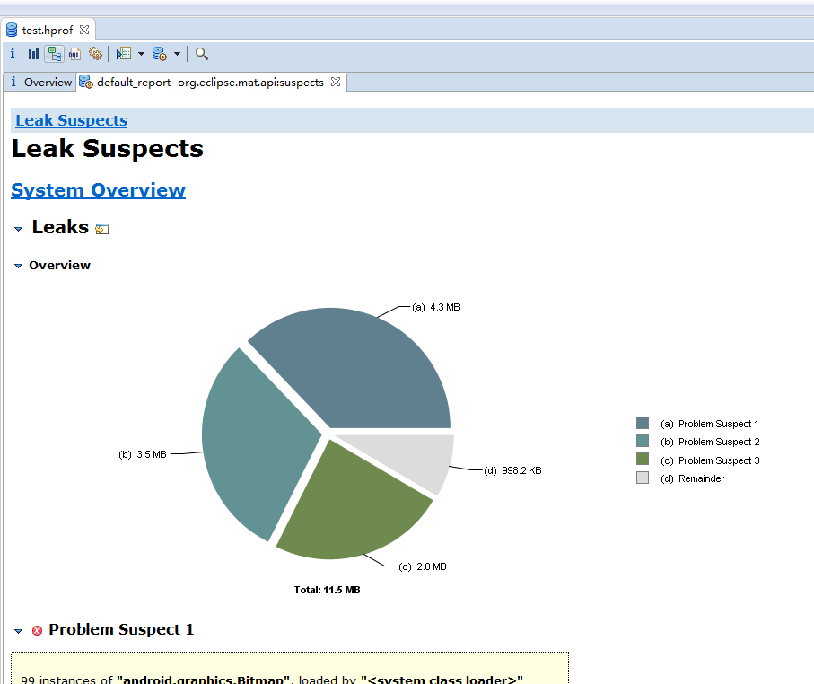

我们把视图切换到 Overriew 中：

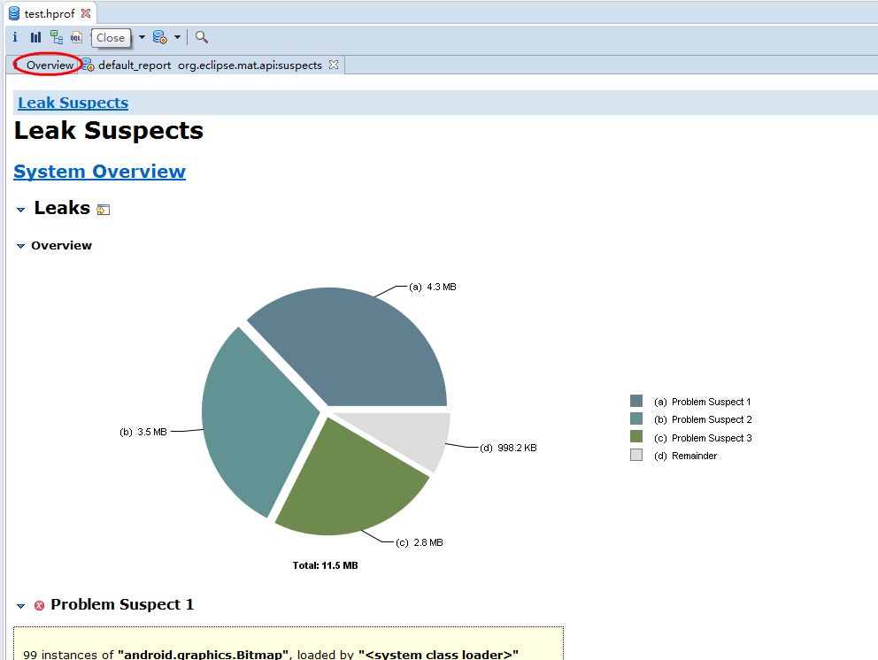

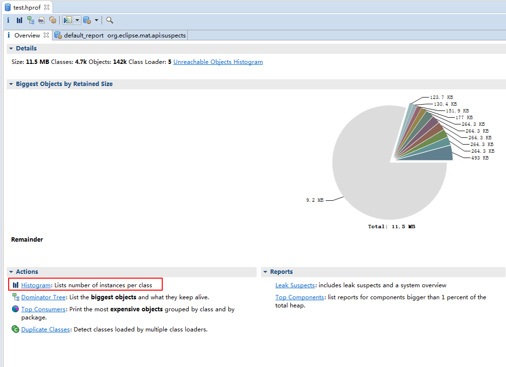

红框圈起来的是 `Histogram`，中文翻译是直方图，在 `Histogram` 中我们可以看到内存中对象的大小和个数。因为 MemoryLeakActivity 退出后没有被释放，所以 MemoryLeakActivity 在内存中肯定不止一个。我们可以根据这个条件来判断 MemoryLeakActivity 有没有发生内存泄漏。

点击 `Histogram`：

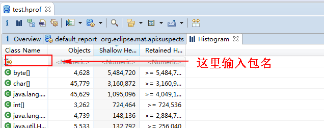

`Histogram` 中的对象有很多，但我们只x需要看我们自己的对象，那么我们用包名 `com.shadowwingz` 过滤一下，输入包名之后按回车：

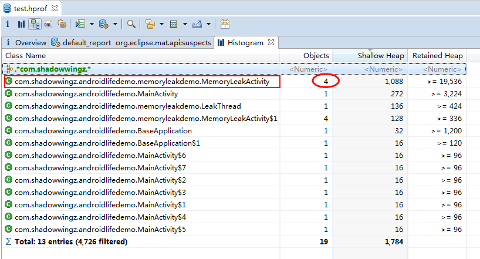

可以看到，在内存中，MemoryLeakActivity 有 4 个。所以我们可以判断出，MemoryLeakActivity 发生了内存泄漏。那么，怎么找内存泄漏的元凶呢？我们可以找下 MemoryLeakActivity 被哪些对象引用了，由于内存泄漏一般只会和强引用有关，所以我们可以把 `软引用`、`弱引用`、`虚引用` 排除掉。

右键选择 MemoryLeakActivity，点击 `Merge Shortest Paths to GC Roots`，再点击 `exclude all phantom/weak/soft etc.references`：

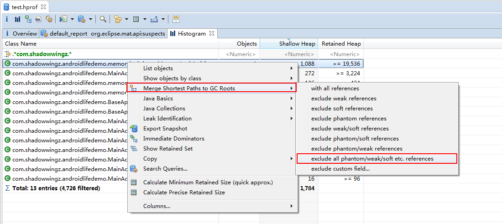

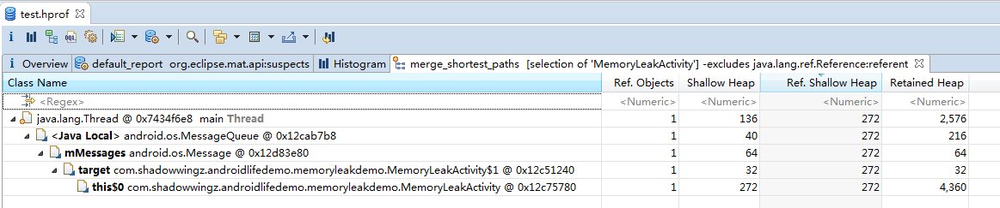

可以看到，MemoryLeakActivity 是被 `MessageQueue` 引用了，而 `MessageQueue` 我们在代码中是通过 `Handler` 来使用的，所以可以判断出，是 `Handler` 发生了内存泄漏。