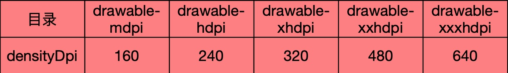
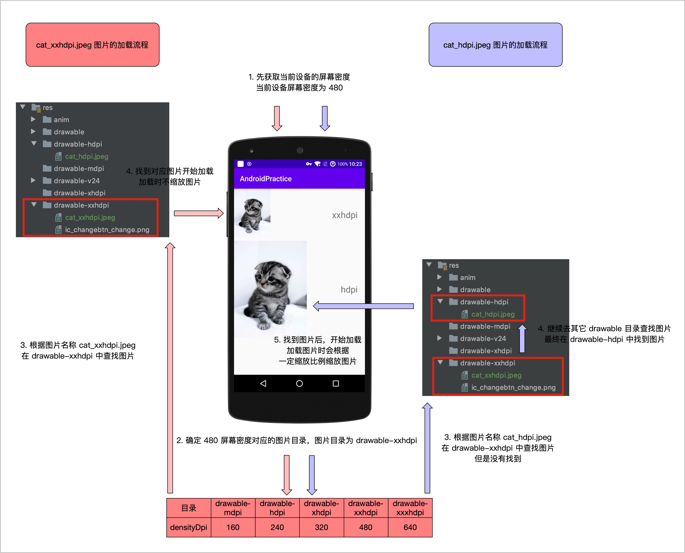

# 图片内存优化

<!-- TOC -->

- [图片占用的内存大小等于图片文件的大小吗？](#%E5%9B%BE%E7%89%87%E5%8D%A0%E7%94%A8%E7%9A%84%E5%86%85%E5%AD%98%E5%A4%A7%E5%B0%8F%E7%AD%89%E4%BA%8E%E5%9B%BE%E7%89%87%E6%96%87%E4%BB%B6%E7%9A%84%E5%A4%A7%E5%B0%8F%E5%90%97)
- [图片占用内存的计算方式](#%E5%9B%BE%E7%89%87%E5%8D%A0%E7%94%A8%E5%86%85%E5%AD%98%E7%9A%84%E8%AE%A1%E7%AE%97%E6%96%B9%E5%BC%8F)
- [assets 中的图片大小](#assets-%E4%B8%AD%E7%9A%84%E5%9B%BE%E7%89%87%E5%A4%A7%E5%B0%8F)
- [不同 drawable 目录的加载顺序](#%E4%B8%8D%E5%90%8C-drawable-%E7%9B%AE%E5%BD%95%E7%9A%84%E5%8A%A0%E8%BD%BD%E9%A1%BA%E5%BA%8F)
- [drawable 加载流程图](#drawable-%E5%8A%A0%E8%BD%BD%E6%B5%81%E7%A8%8B%E5%9B%BE)
- [图片内存优化](#%E5%9B%BE%E7%89%87%E5%86%85%E5%AD%98%E4%BC%98%E5%8C%96)
    - [使用 RGB_565 方式加载图片](#%E4%BD%BF%E7%94%A8-rgb_565-%E6%96%B9%E5%BC%8F%E5%8A%A0%E8%BD%BD%E5%9B%BE%E7%89%87)
    - [使用 inSampleSize 采样率压缩](#%E4%BD%BF%E7%94%A8-insamplesize-%E9%87%87%E6%A0%B7%E7%8E%87%E5%8E%8B%E7%BC%A9)
    - [使用 BitmapRegionDecoder 按区域加载大图](#%E4%BD%BF%E7%94%A8-bitmapregiondecoder-%E6%8C%89%E5%8C%BA%E5%9F%9F%E5%8A%A0%E8%BD%BD%E5%A4%A7%E5%9B%BE)

<!-- /TOC -->

在 Android 内存优化中，图片一直是内存大户，把图片的内存优化做好了，在很大程度上可以避免 OOM。

要做好图片的内存优化，首先我们得知道一个最基本的问题，一张图片被加载到内存中，会占用多大的内存空间？

- 图片占用的内存大小等于图片文件的大小吗？假如一张图片的大小是 50KB，这张图片被加载到内存中也占 50KB 大小吗？
- 如果不是，那图片占用的内存大小和哪些因素有关？

## 图片占用的内存大小等于图片文件的大小吗？

我们先看第一个问题，针对第一个问题，我们可以拿一张图片试验一下。


这张图的大小是 12 KB，我们把这张图放在 `drawable-xxhdpi 目录，然后用代码把这张图加载出来，然后看下它占用了多大的内存。

```kotlin
val bitmap = BitmapFactory.decodeResource(resources, R.drawable.cat)
LogUtil.d("图片占用内存 ${bitmap.allocationByteCount}")
```

输出：

```
图片占用内存 480000
```

`480000` 的单位是字节，我们需要把它转换为 KB，480000 / 1024 = `47KB`。

我们发现，一张只有 12 KB 的图片，加载到内存中居然占了 47 KB 的内存。

所以，我们现在可以解答第一个问题了，图片占用的内存大小`不等于`图片文件的大小。

那么图片占用内存的大小和哪些因素有关呢？

细心的童鞋可能发现了，我们刚刚是把图片放在 `drawable-xxhdpi` 目录加载的，如果放在别的目录加载，占用的内存会不会不一样呢？

我们再试一下把图片放在 `drawable-hdpi` 目录下：

```
图片占用内存 1920000
```

有点奇怪，同一张图片放在不同的目录下，占用的内存居然不一样。

## 图片占用内存的计算方式

实际上 BitmapFactory 在解析图片的过程中，会根据`当前设备屏幕密度`和`图片所在的 drawable 目录` 来做一个对比，根据这个对比值进行缩放操作。

- 缩放比例 scale = 当前设备密度 / 图片所在 drawable 目录对应的屏幕密度
- Bitmap 占用内存 = 宽 * scale * 高 * scale * Config 对应的存储像素数

这里牵扯到了几个概念：`屏幕密度` 和 `存储像素数`。

关于屏幕密度，可以参考一下 [屏幕尺寸，分辨率，像素，PPI之间到底什么关系？](http://www.woshipm.com/ucd/198774.html)。

关于存储像素，简单解释一下，当使用不同的 Config 来加载图片内容时，每一个像素占用的字节不同，如果是 `Bitmap.Config.ARGB_8888`，每一个像素会占用 4 字节，如果是 `Bitmap.Config.RGB_555`，每一个像素会占用 2 个字节。

刚刚加载图片时，我用的是 Nexus5 设备，我们先看一下 Nexus5 的屏幕密度，查看屏幕密度可以用 `adb shell wm density` 命令，可以看到 Nexus5 的屏幕密度是 480。

```
Physical density: 480
```

然后我们需要查一下图片所在 drawable 目录，也就是 `drawable-xxhdpi` 目录对应的屏幕密度，可以在这个表中查询。



`drawable-xxhdpi` 目录对应的屏幕密度是 480。所以 `scale = 480/480 = 1`

最后一个是 Config 对应的存储像素数，由于加载图片时，默认的 Config 是 `Bitmap.Config.ARGB_8888`，因此存储像素数是 4。

所以图片占用的内存我们就可以计算出来了：

> (300 * 1) * (400 * 1) * 4 = 480000

计算结果和我们刚刚实际运行的结果是一致的。

## assets 中的图片大小

我们知道，图片不仅可以存放在 drawable 目录，还可以存放在 assert 目录，那加载 assert 目录下的图片会占用多大内存呢，我们还是用上面那张图试验一下：

```kotlin
val inputStream = assets.open("cat_assert.jpeg")
val bitmap = BitmapFactory.decodeStream(inputStream)
LogUtil.d("Assert 图片占用内存 ${bitmap.allocationByteCount}")
```

输出：

```
Assert 图片占用内存 480000
```

可以看到，assert 中的图片和刚刚我们放在 `drawable-xxdhpi` 目录下的图片，占用的内存是一样的，说明它们的缩放比例都是 1，也就是说，系统不会对 assert 目录下的图片进行缩放操作。

## 不同 drawable 目录的加载顺序

在我们日常开发中，`drawable-hdpi`、`drawable-xhdpi`、`drawable-xxhdpi` 会存放相同图片内容的三种分辨率的图片，由于不同 drawable 目录的图片加载出来占用的内存不同，那我们有必须了解一下图片的加载规则，或者说加载顺序。

加载不同 drawable 目录的图片，是按分辨率由低到高的顺序加载呢，还是由高到低的顺序加载？

实际上，Android 在加载图片的时候，会按照这样一个顺序加载图片。

- 先获取当前设备的屏幕密度，比如刚刚我们使用的 Nexus5，它的屏幕密度是 480
- 然后再找屏幕密度对应的 drawable 目录，480 屏幕密度对应的 drawable 目录是 drawable-xxhdpi
- 如果 drawable-xxhdpi 没有找到我们需要的图片，就去更高分辨率的目录找，比如 drawable-xxxdpi
- 如果还是没有找到，就去更低分辨率的目录找

## drawable 加载流程图

大概流程图：



## 图片内存优化

### 使用 RGB_565 方式加载图片

之前我们说过，图片常见的存储像素数有 `ARGB_8888` 和 `RGB_565` 两种，`ARGB_8888` 占 4 个字节，`RGB_565` 占 2 个字节。

我们平常加载图片时，如果没有修改这个配置，那么默认就是使用 `ARGB_8888` 的配置，所以，为了优化图片加载时的内存，我们可以将配置修改为 `RGB_565`，这样加载图片时，一个像素只占 2 个字节，所以图片的占用内存可以减为之前的一半。

```kotlin
val option = BitmapFactory.Options()
option.inPreferredConfig = Bitmap.Config.RGB_565
val bitmapXXhdpi = BitmapFactory.decodeResource(resources, R.drawable.cat_xxhdpi, option)
```

### 使用 inSampleSize 采样率压缩

inSampleSize 可以理解为图片的缩小比例，如果把 inSampleSize 设置为 2，那么图片的宽度和宽度都会缩小为之前的一半，所以图片占用的内存就会缩小为之前的 1/4。

```kotlin
val option = BitmapFactory.Options()
option.inSampleSize = 2
val bitmapXXhdpi = BitmapFactory.decodeResource(resources, R.drawable.cat_xxhdpi, option)
```

### 使用 BitmapRegionDecoder 按区域加载大图

如果我们的 App 需要加载一张超级大图怎么办，比如世界地图。

这种情况下，我们一口气把图片全部加载进来肯定是不可行的，这么大的图片，手机屏幕如果一次性显示出来，局部细节肯定就照顾不了了。而且图片肯定也会占用很大的内存，这样留给 App 的内存就不多了。

这样情况我们可以使用 BitmapRegionDecoder 来实现局部加载，图片再大也没关系，我只加载你的一部分。

由于只加载了一部分，所以我们需要配合上下左右拖动的手势来让用户查看其它部分的图片。

### 使用 9-patch 图片做背景

为了适配不同的手机分辨率，图片大多需要拉伸或者压缩，这种情况下可以使用 9-patch 图片来作为背景。
9-patch 图片是一种特殊的图片格式，相比普通图片，对于一些重复的像素，它可以自由拉伸。

### 不使用图片

是的，你没有看错。既然图片耗费内存，那我们干脆就不适用图片了，但是这个是有场景限制的。
如果我们需要一张简单的图片（比如纯色图片）来作为背景图，那我们完全可以自己画一个 drawable 来充当背景图。

```xml
<?xml version="1.0" encoding="utf-8"?>
<shape xmlns:android="http://schemas.android.com/apk/res/android"
    android:shape="rectangle">

    <solid android:color="@color/colorAccent" />
    <corners android:radius="10dp" />

</shape>
```