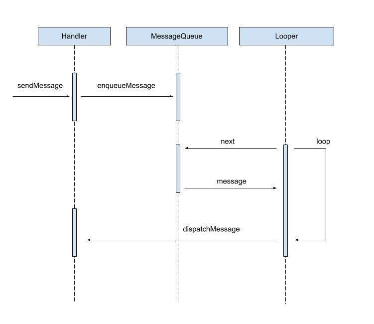

# Handler 的工作流程

<p align="center">
  
</p>

当我们调用 `Handler` 的 `sendMessage` 发送消息时，在源码中最终会调用 `MessageQueue` 的 `enqueueMessage` 方法。

```java
MessageQueue # enqueueMessage

boolean enqueueMessage(Message msg, long when) {
    // 如果 handler 为 null，就抛异常
    if (msg.target == null) {
        throw new IllegalArgumentException("Message must have a target.");
    }
    // 如果消息正在使用，就抛异常
    if (msg.isInUse()) {
        throw new IllegalStateException(msg + " This message is already in use.");
    }

    synchronized (this) {
        // 如果退出，就清空消息
        if (mQuitting) {
            IllegalStateException e = new IllegalStateException(
                    msg.target + " sending message to a Handler on a dead thread");
            Log.w("MessageQueue", e.getMessage(), e);
            msg.recycle();
            return false;
        }

        // 标记，正在使用
        msg.markInUse();
        msg.when = when;
        // 把 mMessages 赋值给 p，mMessages 是消息队列
        Message p = mMessages;
        boolean needWake;
        /**
         * 单链表插入
         */
        // 如果消息队列为空
        if (p == null || when == 0 || when < p.when) {
            // New head, wake up the event queue if blocked.
            // 就让新消息的 next 指向 null
            msg.next = p;
            mMessages = msg;
            // 新消息赋值给消息队列
            needWake = mBlocked;
        } else {
            // Inserted within the middle of the queue.  Usually we don't have to wake
            // up the event queue unless there is a barrier at the head of the queue
            // and the message is the earliest asynchronous message in the queue.
            needWake = mBlocked && p.target == null && msg.isAsynchronous();
            // 如果消息队列不为空
            Message prev;
            for (;;) {
                // 就让 prev 不停指向下一个消息，最终指向 null
                prev = p;
                p = p.next;
                // 当 prev 指向 null 的时候，跳出循环
                if (p == null || when < p.when) {
                    break;
                }
                if (needWake && p.isAsynchronous()) {
                    needWake = false;
                }
            }
            // 此时 p 为 null，所以新消息的 next 指向 null，
            msg.next = p; // invariant: p == prev.next
            // prev 的 next 指向了新消息
            // 即：把 msg 插入了消息队列的尾部
            prev.next = msg;
        }

        // We can assume mPtr != 0 because mQuitting is false.
        if (needWake) {
            nativeWake(mPtr);
        }
    }
    return true;
}
```

简单来说，就是：

- 如果消息队列为空，就直接把消息插入消息队列
- 如果消息队列不为空，就把消息插入消息队列的尾部


更简单的说，就是把消息插入消息队列。

调用 `MessageQueue` 的 `enqueueMessage` 方法，消息就被插入消息队列了。那么，消息是怎么被取出来的呢。这时，Looper 就要派上用场了，Looper 会不停扫描 MessageQueue，发现有新消息，就会取出来。具体实现是在它的 loop 方法中：

```java
Looper # loop

public static void loop() {
    // 获取当前线程的 Looper 对象，Looper 是从 ThreadLocal 中取出来的。
    final Looper me = myLooper();
    // 如果 Looper 对象为空，那就没办法扫描 MessageQueue 中的新消息了，
    // 所以直接抛异常。Looper 对象的创建是在 Looper.prepare() 方法中创建的。
    if (me == null) {
        throw new RuntimeException("No Looper; Looper.prepare() wasn't called on this thread.");
    }
    // 获取 Looper 中的 MessageQueue 对象，
    // MessageQueue 对象在 Looper 构造方法中创建的
    final MessageQueue queue = me.mQueue;

    ......

    for (;;) {
        // 获取消息，如果消息队列已退出，queue.next() 会返回 null
        Message msg = queue.next(); // might block
        // 如果消息为 null，说明消息队列已经退出了，
        // 所以 Looper 也直接 return，后面的代码不再执行。
        if (msg == null) {
            // No message indicates that the message queue is quitting.
            return;
        }

        ......

        // 调用 handler 的 dispatchMessage 方法来处理消息
        // msg.target 在 Handler 的 enqueueMessage 方法中被赋值
        msg.target.dispatchMessage(msg);

        ......

        // 消息处理完了，就回收
        msg.recycleUnchecked();
    }
}

Looper # myLooper

public static Looper myLooper() {
    // Looper 对象是存储在 ThreadLocal 中的
    return sThreadLocal.get();
}
```

再看下 MessageQueue 的 next 方法：

```java
MessageQueue # next

Message next() {
    ......

    int pendingIdleHandlerCount = -1; // -1 only during first iteration
    int nextPollTimeoutMillis = 0;
    for (;;) {
        if (nextPollTimeoutMillis != 0) {
            Binder.flushPendingCommands();
        }

        nativePollOnce(ptr, nextPollTimeoutMillis);

        synchronized (this) {
            // Try to retrieve the next message.  Return if found.
            final long now = SystemClock.uptimeMillis();
            Message prevMsg = null;
            // 从消息队列中取出第一条消息
            Message msg = mMessages;
            if (msg != null && msg.target == null) {
                // Stalled by a barrier.  Find the next asynchronous message in the queue.
                do {
                    prevMsg = msg;
                    msg = msg.next;
                } while (msg != null && !msg.isAsynchronous());
            }
            // 如果取出的消息不为空
            if (msg != null) {
                if (now < msg.when) {
                    // Next message is not ready.  Set a timeout to wake up when it is ready.
                    nextPollTimeoutMillis = (int) Math.min(msg.when - now, Integer.MAX_VALUE);
                } else {
                    // Got a message.
                    // 从消息队列中移除消息
                    mBlocked = false;
                    if (prevMsg != null) {
                        prevMsg.next = msg.next;
                    } else {
                        mMessages = msg.next;
                    }
                    msg.next = null;
                    if (DEBUG) Log.v(TAG, "Returning message: " + msg);
                    msg.markInUse();
                    // 返回消息
                    return msg;
                }
            } else {
                // No more messages.
                nextPollTimeoutMillis = -1;
            }

            // Process the quit message now that all pending messages have been handled.
            // 如果消息队列退出，mQuitting 被置为 true，那么 next 方法就返回 null
            if (mQuitting) {
                dispose();
                return null;
            }

            ......
        }

        ......
    }
}
```

可以看到，next 方法虽然代码比较多，但是思想很简单，就是取一条消息。

总结一下 loop 方法：

- 从消息队列中取出消息，然后调用 Handler 的 dispatchMessage 方法去处理消息。

再看一下 Handler 怎么处理消息：

```java
Handler # dispatchMessage

public void dispatchMessage(Message msg) {
    if (msg.callback != null) {
        handleCallback(msg);
    } else {
        if (mCallback != null) {
            if (mCallback.handleMessage(msg)) {
                return;
            }
        }
        handleMessage(msg);
    }
}
```

处理消息分三种情况：

```java
/**
 * if (msg.callback != null) {
 *    handleCallback(msg);
 * }
 */
new Handler().post(new Runnable() {
    @Override
    public void run() {

    }
});

/**
 * if (mCallback != null) {
 *    if (mCallback.handleMessage(msg)) {
 *      return;
 *    }
 * }
 */
new Handler(new Handler.Callback() {
    @Override
    public boolean handleMessage(Message msg) {
        return false;
    }
});

/**
 * handleMessage(msg);
 */
new Handler() {
    @Override
    public void handleMessage(Message msg) {
        super.handleMessage(msg);
    }
};
```

### 总结： ###

当我们调用 `Handler` 的 `sendMessage` 时，实际上是把消息存储到了 `MessageQueue` 中，`Looper` 会从 `MessageQueue` 中把消息取出来，交给 `Handler` 处理。这就是 Android 的消息机制。

#### Handler、Looper、MessageQueue 分别运行在什么线程，为什么 ####

#### *Looper* ####

我们首先分析 Looper，首先刚刚我们分析过了，Looper 的主要作用就是调用 `loop` 方法，不停的从消息队列 MessageQueue 中取出消息，那么看 Looper 运行在什么线程，就看 `loop` 方法运行在什么线程就可以了，也就是 `Looper.loop()` 方法运行在什么线程。对于 Android 系统来说，它启动的时候会默认在主线程初始化一个 Looper 并启动它，相关代码在 ActivityThread 的 `main` 方法中：

```java
ActivityThread # main

public static void main(String[] args) {
    ......
    // 创建一个关联主线程的 Looper
    Looper.prepareMainLooper();
    ......
    // 启动 Looper
    Looper.loop();
}
```

所以我们可以得出结论：

>Android 系统默认的 Looper 是运行在主线程的，如果是自定义的 Looper，则要看它的 loop 方法在哪个线程被调用。

#### *MessageQueue* ####

接着我们分析 MessageQueue，MessageQueue 的作用是调用 `enqueueMessage` 向消息队列中插入消息，调用 `next` 从消息队列中取出消息，那么看 MessageQueue 运行在什么线程，就看 `enqueueMessage` 方法和 `next` 方法运行在什么线程。

我们向消息队列中投递消息，一般用 sendMessage 或者 post 方法，这两个方法最终都会调用 `queue.enqueueMessage` 方法，而 queue 就是 MessageQueue，所以 enqueueMessage 方法运行在什么线程取决于 Handler 在什么线程发消息（投递任务）。

而 `next` 方法是在 Looper 的 loop 方法中调用的：

```java
Looper # loop

public static void loop() {
    ......
    for (;;) {
        Message msg = queue.next(); // might block
        ......
    }
}
```

所以，next 方法运行在什么线程，取决于 Looper 的 loop 方法运行在什么线程。

所以我们可以得出结论：

> enqueueMessage 方法运行在什么线程取决于 Handler 在什么线程发消息
> next 方法运行在什么线程，取决于 Looper 的 loop 方法运行在什么线程

#### *Handler* ####

终于到了我们最熟悉的 Handler，Handler 的作用是发消息，和在 handleMessage 方法中处理消息。发消息就不说了，我们分析下 handleMessage 方法，handleMessage 方法是在 Handler 的 dispatchMessage 方法中调用的，而 dispatchMessage 方法是在 Looper 的 loop 方法中调用的：

```java
Looper # loop

public static void loop() {
    ......

    for (;;) {
        ......

        msg.target.dispatchMessage(msg);

        ......
    }
}

Handler # dispatchMessage

public void dispatchMessage(Message msg) {
    if (msg.callback != null) {
        handleCallback(msg);
    } else {
        if (mCallback != null) {
            if (mCallback.handleMessage(msg)) {
                return;
            }
        }
        // 回调 Handler 的 handleMessage 方法
        handleMessage(msg);
    }
}
```

所以，handleMessage 方法运行在什么线程，取决于 Looper 的 loop 方法运行在什么线程。

#### 总结 ####

>对于 Android 系统默认初始化的 Looper 和 MessageQueue 来说，Looper 是运行在主线程，MessageQueue 插入消息，要看 Handler 在哪个线程发消息，MessageQueue 取出消息是在主线程。而我们自己 new 出来的 Handler，它的 handleMessage 方法是在主线程。

#### Handler、Looper、MessageQueue 各有几个，为什么 ####

#### *Looper* ####

我们先看 Looper.prepare 方法：

```java
Looper # prepare

private static void prepare(boolean quitAllowed) {
    // 重复创建 Looper 会抛异常
    if (sThreadLocal.get() != null) {
        throw new RuntimeException("Only one Looper may be created per thread");
    }
    sThreadLocal.set(new Looper(quitAllowed));
}
```

可以看到，在 prepare 方法中，调用了 sThreadLocal.set 方法，向当前线程中存储了这个 Looper，这说明每个线程都有对应的 Looper，如果想通过重复调用 prepare 方法来创建 Looper 的话，会抛异常，这说明，对于一个线程，系统只允许创建一个 Looper，也就是说，一个线程对应一个 Looper。

#### *MessageQueue* ####

看下 Looper 的构造方法：

```java
private Looper(boolean quitAllowed) {
    mQueue = new MessageQueue(quitAllowed);
    mThread = Thread.currentThread();
}
```

可以看到，在 Looper 的构造方法中，创建了一个 MessageQueue，并赋值给了 Looper 的成员变量 `mQueue`，这样就把 Looper 和 MessageQueue 关联起来了，一个 Looper 对应一个 MessageQueue。

#### *Handler* #### 

我们看下 Handler 的构造方法：

```java
Handler

public Handler(Callback callback, boolean async) {
    ......

    mLooper = Looper.myLooper();
    if (mLooper == null) {
        throw new RuntimeException(
            "Can't create handler inside thread that has not called Looper.prepare()");
    }
    mQueue = mLooper.mQueue;
    mCallback = callback;
    mAsynchronous = async;
}

Looper # myLooper

public static Looper myLooper() {
    return sThreadLocal.get();
}
```

在 Handler 的构造方法中，调用了 Looper.myLooper，Looper 会从 ThreadLocal 中取出当前线程对应的 Looper 赋值给 mLooper，这样 Handler 和 Looper 就关联上了，我们如果在同一个线程多创建几个 Handler，这几个 Handler 都关联的是同一个 Looper。

#### 总结 ####

>同一个线程，只有一个 Looper 和 MessageQueue，但可以有多个 Handler，它们关联的是同一个 Looper 和 MessageQueue。

#### Handler、Looper、MessageQueue 是怎么关联的 ####

Handler 和 Looper 的关联是通过 ThreadLocal 关联的，Handler 创建的时候会从 ThreadLocal 中取出当前线程的 Looper，然后和 Handler 关联。

Looper 和 MessageQueue 的关联是在 Looper 的构造方法中，创建了一个 MessageQueue，然后和 Looper 关联。

#### Handler 发送的消息可以插队执行吗？ ####

可以，调用 Handler 的 `sendMessageAtFrontOfQueue` 或 `postAtFrontOfQueue` 方法。

#### 主线程的 Handler 怎么发消息到子线程的 Looper ####

- 在子线程中调用 Looper.prepare 创建 Looper，然后调用 Looper.loop 方法启动循环
- 在主线程中创建 Handler，并在 Handler 的构造方法中传入 Looper 的实例。

#### 如果 Activity 要退出了，但是 MessageQueue 中的消息还没执行完怎么办？ ####

调用 `Handler.removeCallbacksAndMessages(null)` 移除所有消息

#### 消息队列退出后，还可以用 Handler 发消息吗？

可以，但消息不会被执行。

当消息队列退出后，我们再调用 sendMessage 方法来发送消息，最终会走到 MessageQueue 的 `enqueueMessage` 方法中

```java
boolean enqueueMessage(Message msg, long when) {
    ......
    synchronized (this) {
        if (mQuitting) {
            IllegalStateException e = new IllegalStateException(
                    msg.target + " sending message to a Handler on a dead thread");
            Log.w(TAG, e.getMessage(), e);
            msg.recycle();
            return false;
        }
        ......
    }
    return true;
}
```

因为消息队列已经退出，所以 `mQuitting` 变量为 `true`，接着会把 Handler 发送的消息调用 `msg.recycle` 方法回收，同时 `enqueueMessage` 方法会返回 `false`，最终我们的 sendMessage 方法的返回值也是 `false`。

#### 消息队列退出后，消息队列里的消息还会执行吗？

要看消息的 when 字段，如果 when 字段小于当前时间，就会执行。

我们知道，在 Looper 的 loop 方法中，会不停的调用 next 方法获取消息，我们看下 next 方法。

在 next 方法中，先判断了 when 字段，是否小于等于当前时间，如果是，就返回消息给 loop 方法来处理，就不会执行后面的代码了。

在后面的代码中，判断了 `mQuitting` 是否为 null，如果为 null，就返回 null，loop 方法的 for 循环也就退出了。

```java
Message next() {
    ......
    for (;;) {
        ......
        synchronized (this) {
            ......
            if (msg != null) {
                if (now < msg.when) {
                    // Next message is not ready.  Set a timeout to wake up when it is ready.
                    nextPollTimeoutMillis = (int) Math.min(msg.when - now, Integer.MAX_VALUE);
                } else { // 如果 now >= msg.when，就进入 else 语句
                    ......
                    // 返回消息给 loop 方法处理，就不会执行后面的代码了
                    return msg;
                }
            } else {
                // No more messages.
                nextPollTimeoutMillis = -1;
            }

            // Process the quit message now that all pending messages have been handled.
            // 如果消息队列已经退出，就返回 null
            // 如果 now >= msg.when，代码就不会执行到这里了，
            // 所以消息队列的退出，对 now >= msg.when 这种情况没有影响
            if (mQuitting) {
                dispose();
                return null;
            }

            ......
        }

        ......
    }
}
```

#### 为什么主线程不会因为 Looper.loop() 里的死循环卡死 ####

应用启动后，会在主线程启动一个默认的 Looper，并调用 Looper.loop() 方法，loop 方法中有一个死循环：

```java
for (;;) {
    // 获取消息，如果消息队列已退出，queue.next() 会返回 null
    Message msg = queue.next(); // might block
    
    ......

    msg.target.dispatchMessage(msg);

    ......
}
```

这个死循环为什么不会卡死？