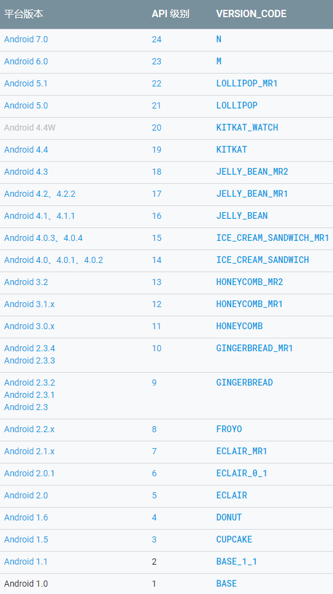

在实际开发中，当我们的 App 用户比较多时，他们的手机的安卓版本也会不同，有的是 Android 4.4，有的是 Android 6.0，还有的是 Android 8.0，等等。我们作为开发者，必须保证我们的 App 在各个版本的手机上都能正确的运行。谷歌为了帮助我们解决这个问题，引入了 `compileSdkVersion`，`minSdkVersion`、`targetSdkVersion`。

在弄清楚 `compileSdkVersion`，`minSdkVersion`、`targetSdkVersion` 之前，我们还要了解一个概念，API level，也就是上面图片中的 API 级别。

### 什么是 API level ###

首先，从上面的图片可以看出，API level 是一个整数，它是我们使用的框架（Framework）的版本，也就是我们使用的 android.jar 的版本，我们在 Android 项目中的 `External Libraries` 中可以看到。


Android 系统版本（图中的平台版本），API level（图中的 API 级别），版本代号（图中的 VERSION_CODE）是有对应关系的，具体关系可以看上面的表格。

虽然有对应关系，但是它们也不是一一对应的，比如 API level 是 9 时，对应的是 Android 2.3、Android 2.3.1、Android 2.3.2。

### compileSdkVersion ###

compileSdkVersion 告诉 Gradle 用哪个 Android SDK 版本编译你的应用，比如我们制定 `compileSdkVersion` 为 25，在 Android 项目中的 `External Libraries` 中就可以看到 API level 为 25 的 android.jar。我们平常使用的 TextView，ImageView 都是包含在 android.jar 的。

```groovy
android {
    compileSdkVersion 25
}
```


指定了 `compileSdkVersion` 后，项目在编译时，会使用 API level 为 25 的 android.jar 来编译。但是注意，`compileSdkVersion` 指定版本的 android.jar 参与编译，不参与运行。

比如说 ActionBar 相关的 API 是需要 API level 11 才能调用的，我们的 `compileSdkVersion` 是 25，是可以使用 ActionBar 的，这里说的可以使用指的是项目可以编译打包成一个 apk。但是如果这个 apk 运行在 API level 低于 11 （Android 2.3.4 及以下）的手机上，就会崩溃。因为手机上并没有 ActionBar API。为了避免出现可以打包，但是不能运行的问题，我们可以使用 `minSdkVersion` 来解决。 

### minSdkVersion ###

minSdkVersion 告诉 Gradle 程序运行所需的最小 API level，如果不指明的话，默认是 1。

如果系统的 API level 低于 minSdkVersion 设定的值，那么编译出来的 apk 是安装不上手机的。

如果我们给 minSdkVersion 指定了一个值，并且又调用了 minSdkVersion 这个 API level 的 API，那么会在编译时报错。还是拿 ActionBar 举例，假如我们把 minSdkVersion 设置为 9，我们调用 ActionBar 的 API。此时会报错：


会提示，调用这个 API 需要 API level 11，但是当前的 minSdkVersion 是 9。这是什么意思呢？

我们编译打包出来的 apk，理论上是可以运行在 API level 在 9 及以上的手机上。而我们使用的 ActionBar API 是需要 API level 11 才能调用的。

所以，如果我们的 apk 运行在 API level 在 11 及以上的手机上，是没有问题的，因为手机的 Framework 中有 ActionBar 这个 API。但是如果我们的 apk 运行在 API level 在 9-11（不包含 11）的手机上，那 apk 就会崩溃，因为找不到 ActionBar 这个 API。

所以，当我们把 minSdkVersion 设置为 9，此时调用 ActionBar 的 API，是会编译报错的。

那么，怎么解决呢？Android Studio 提供的建议是

（1）`@RequiresApi(api = Build.VERSION_CODES.HONEYCOMB)`
（2）`@TargetApi(Build.VERSION_CODES.HONEYCOMB)`
（3）判断当前的 sdk 版本，如果高于 ActionBar API 所需的版本，才调用。

这里简单解释下 `@RequiresApi` 和 `@TargetApi`，以及和它们有关的 `lint`。

先解释 lint，lint 是 Android Studio 提供的一个代码扫描工具，lint 里有完整的 Android API 的一个数据库，所以它可以知道，哪个 API 是哪个安卓版本才有的。

当我们调用 ActionBar 的 API 时，lint 检测到 ActionBar 的 API 只有 API level 11 及以上才能调用，但是项目里的 minSdkVersion 是 9，所以 lint 就报错。

我们接着说 `@RequiresApi` 和 `@TargetApi`：

- @SuppressLint("NewApi"）屏蔽一切新 api 中才能使用的方法报的 android lint 错误
- @TargetApi() 只屏蔽某一新 api 中才能使用的方法报的 android lint 错误

当我们使用 `@RequiresApi` 或 `@TargetApi` 注解时，lint 的报错就被屏蔽了，项目可以编译成功，但是运行在 API level 8 的手机上还是会报错。那有的童鞋可能会疑惑了，那 lint 到底有什么用？

其实，lint 只是提示我们，ActionBar 的 API 需要 API level 11 才能调用，所以它希望我们能判断当前版本，如果当前版本高于 11，就调用 ActionBar 的 API，如果不高于 11，就做其他的兼容性操作。类似这样：

```java
if (Build.VERSION.SDK_INT >= Build.VERSION_CODES.HONEYCOMB) {
    // 当前版本高于 11，可以调用 ActionBar
    ActionBar actionBar = getActionBar();
} else {
    // 当前版本低于 11，无法调用 ActionBar，执行其它代码
}
```

### targetSdkVersion ###

Android 系统的版本是在不断升级的，而在升级的过程中，会不断加入新的特性。

以 `运行时权限` 为例，`运行时权限` 是在 Android 6.0 （API level 23）中加入的，如果把 `targetSdkVersion` 设置为 23，然后申请运行时权限，如果 apk 运行在 Android 6.0 的手机上，那么 `Context` 的 `checkSelfPermission` 接口是没有问题的，可以查询出有没有授权权限。但是如果 apk 运行在 Android 5.1 的手机上，那么 `Context` 的 `checkSelfPermission` 接口会失效，返回值一直是 true。

所以，如果我们想使用一些新版本的特性，需要把 `targetSdkVersion` 设置为新版本的 API level。如果没有把 `targetSdkVersion` 设置为新版本的 API level，又使用了新版本的特性，那么 app 运行时，新版本的特性是不会生效的。 