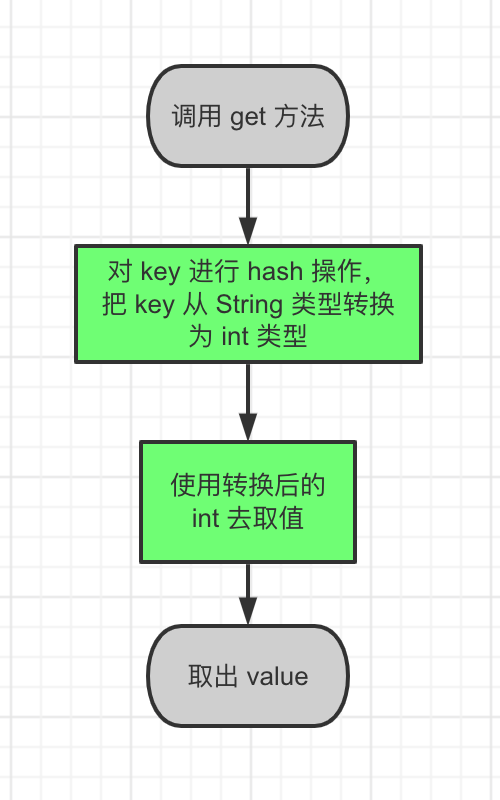

## Java 常用集合类的数据结构

ArrayList 和 LinkedList

### ArrayList 特点

1. 可能会浪费内存空间，因为数据的内存空间是连续的。创建 ArrayList 时，会一次性申请多个节点所需要的内存空间。
2. 查找效率高，因为数据支持随机访问，通过索引直接可以获取到数据。
3. 增删效率低，因为插入数据的时候，需要把插入位置后的所有数据整体往后移动，

### LinkedList 特点

1. 不会浪费内存空间，因为链表的内存空间不是连续的，创建 LinkedList 时，会按需申请每个节点所需要的内存空间。
2. 查找效率低，因为是顺序访问，每次查找数据，都需要从第一个节点开始，然后一个一个节点的寻找。
3. 增删效率高，因为只需要修改对应节点的地址。

### 设计一个 HashMap

假如我们来设计一个 HashMap，这个 HashMap 可以存储键值对 `key`、`value`。我们可以参考 ArrayList，先把 HashMap 设计为一个数组：

```java
public class HashMap<V> {
  V[] kvArray;
  
  V get(int key) {
    return kvArray[key];
  }
}
```

看上去好像没啥问题，但是 `get` 方法的形参是 `int` 类型，这就要求我们定义键值对的时候，key 也必须是 `int` 类型。

而实际开发中，我们定义的键值对往往是 `String` 类型。那就...改！

```java
public class HashMap<V> {
  V[] kvArray;
  
  V get(String key) {
    return kvArray[key];
  }
}
```

好像有点不大对劲，数组的下标只能是 `int`，不能是 `String`。

那我们就想办法先把 `key` 从 `String` 转换为 `int`，再用这个 `int` 类型的 `key` 去取值。

这个转换的过程，我们称之为 `hash`。

所以，从 HashMap 中取值的过程就变成了：

