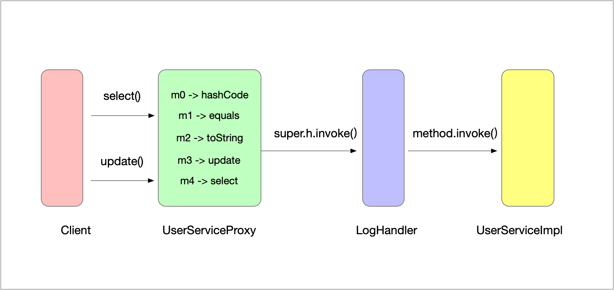

在日常的开发中，我们好像并不会直接用到动态代理这东西，不过 Retrofit 想必大家都用过，而 Retrofit 就用到了动态代理。

在前面讲静态代理的时候，我们说了，静态代理需要我们自己去写代理类。如果接口少还好说，接口多了那简直就是灾难。而动态代理就能很好的解决这个问题，为什么呢？因为它可以动态的根据我们的接口去生成代理，从此告别手写代理。

比较常见的动态代理是 JDK 动态代理。JDK 动态代理主要涉及两个类：`java.lang.reflect.Proxy` 和 `java.lang.reflect.InvocationHandler`。

`java.lang.reflect.Proxy` 的作用是帮助我们创建动态代理的对象，这样我们就不用去为每一个接口对象都创建一个 XXXProxy 对象了。直接一个动态代理对象就能搞定了。

`java.lang.reflect.InvocationHandler` 是调用请求处理器，当我们调用动态代理的方法时，调用请求会被转发到 InvocationHandler 的 invoke 方法中，最终由 InvocationHandler 完成调用请求。

我们用动态代理再来实现一下统计方法耗时的功能。首先，我们要新建一个类实现 InvocationHandler 接口，整个类会持有一个 Object 对象，这个 Object 对象是被代理的对象，在本例中是 UserServiceImpl。另外，我们还需要在 InvocationHandler 的 invoke 方法中实现逻辑处理。

```java
public class LogHandler implements InvocationHandler {

    // 被代理的对象，这里是 UserServiceImpl
    Object target;

    public LogHandler(Object target) {
        this.target = target;
    }

    // 当调用 UserService 的 select/update 方法时，会触发 invoke 方法被调用
    @Override
    public Object invoke(Object proxy, Method method, Object[] args) throws Throwable {
        System.out.println("方法名： " + method.getName());
        before();
        Object result = method.invoke(target, args);
        after();
        return result;
    }

    private void before() {
        System.out.printf("log start time [%s]%n", System.currentTimeMillis());
    }

    private void after() {
        System.out.printf("log end time [%s]%n", System.currentTimeMillis());
    }
}
```

接着，我们需要创建一个动态代理对象。

```java
public class Client2 {
    public static void main(String[] args) {
        // UserService 接口的实现类
        UserServiceImpl userServiceImpl = new UserServiceImpl();
        // 获取 ClassLoader
        ClassLoader classLoader = userServiceImpl.getClass().getClassLoader();
        // 获取类实现的接口，UserServiceImpl 实现了 UserService 接口，因此这里会获取到 UserService 接口
        Class[] interfaces = userServiceImpl.getClass().getInterfaces();
        // 调用请求处理器，当我们调用 proxy 的 select/update 方法时，实际会触发 logHandler 的 invoke 方法被调用，
        // 相当于我们的调用请求被转发给了 LogHandler 来处理。
        InvocationHandler logHandler = new LogHandler(userServiceImpl);
        // 创建动态代理对象 proxy，这里的 proxy 相当于静态代理中的 UserServiceProxy
        UserService proxy = (UserService) Proxy.newProxyInstance(classLoader, interfaces, logHandler);
        // 当调用 proxy 的 select/update 方法时，会触发 logHandler 的 invoke 方法被调用
        proxy.select();
        proxy.update();
    }
}
```

运行结果：

```
方法名： select
log start time [1634562133851]
查询
log end time [1634562133868]
方法名： update
log start time [1634562133869]
更新
log end time [1634562133869]
```

可以看到，有了 LogHandler，UserServiceProxy 就不再需要了，无论 UserServiceImpl 再怎么新增或者修改接口，我们都不用再操心代理类，因为 `Proxy.newProxyInstance` 会帮助我们生成一个类似 UserServiceProxy 的代理类。

生成的代理类是什么样子呢？我们可以用工具类把动态代理类保存下来。

```java
public class ProxyUtils {
    /**
     * 将根据类信息动态生成的二进制字节码保存到硬盘中，默认的是clazz目录下
     * params: clazz 需要生成动态代理类的类
     * proxyName: 为动态生成的代理类的名称
     */
    public static void generateClassFile(Class clazz, String proxyName) {
        // 根据类信息和提供的代理类名称，生成字节码
        byte[] classFile = ProxyGenerator.generateProxyClass(proxyName, clazz.getInterfaces());
        String paths = clazz.getResource(".").getPath();
        System.out.println(paths);
        FileOutputStream out = null;
        try {
            //保留到硬盘中
            out = new FileOutputStream(paths + proxyName + ".class");
            out.write(classFile);
            out.flush();
        } catch (Exception e) {
            e.printStackTrace();
        } finally {
            try {
                out.close();
            } catch (IOException e) {
                e.printStackTrace();
            }
        }
    }
}
```

保存下来的 UserServiceProxy 大概是这个样子：

```java
public final class UserServiceProxy extends Proxy implements UserService {
    private static Method m1;
    private static Method m2;
    private static Method m4;
    private static Method m0;
    private static Method m3;

    public UserServiceProxy(InvocationHandler var1) throws  {
        super(var1);
    }

    public final boolean equals(Object var1) throws  {
        try {
            return (Boolean)super.h.invoke(this, m1, new Object[]{var1});
        } catch (RuntimeException | Error var3) {
            throw var3;
        } catch (Throwable var4) {
            throw new UndeclaredThrowableException(var4);
        }
    }

    public final String toString() throws  {
        ......
    }

    public final void select() throws  {
        try {
            super.h.invoke(this, m4, (Object[])null);
        } catch (RuntimeException | Error var2) {
            throw var2;
        } catch (Throwable var3) {
            throw new UndeclaredThrowableException(var3);
        }
    }

    public final int hashCode() throws  {
        ......
    }

    public final void update() throws  {
        try {
            super.h.invoke(this, m3, (Object[])null);
        } catch (RuntimeException | Error var2) {
            throw var2;
        } catch (Throwable var3) {
            throw new UndeclaredThrowableException(var3);
        }
    }

    static {
        try {
            m1 = Class.forName("java.lang.Object").getMethod("equals", Class.forName("java.lang.Object"));
            m2 = Class.forName("java.lang.Object").getMethod("toString");
            m4 = Class.forName("other.静态代理.UserService").getMethod("select");
            m0 = Class.forName("java.lang.Object").getMethod("hashCode");
            m3 = Class.forName("other.静态代理.UserService").getMethod("update");
        } catch (NoSuchMethodException var2) {
            throw new NoSuchMethodError(var2.getMessage());
        } catch (ClassNotFoundException var3) {
            throw new NoClassDefFoundError(var3.getMessage());
        }
    }
}

public class Proxy implements java.io.Serializable {
    protected InvocationHandler h;
}
```

可以看到，生成的 UserServiceProxy 类有一些特点：

1. 继承了 Proxy 类，并且实现了 UserService 接口。还有 Object 对象的方法，比如 equals、hashCode、toString。
2. 类和方法都使用 final 修饰，所以代理类只能被使用，无法被继承
3. 对于每个方法，都有一个对应的 Method 对象，当调用某个方法时，会通过 `super.h.invoke` 的形式来调用对应的 Method。

`super.h` 是 LogHandler 对象，它负责实际的调用处理逻辑。当我们调用一个方法，比如 select 方法时，LogHandler 的 invoke 方法会接收到 select 方法的 method 和 args 等参数：

```java
@Override
public Object invoke(Object proxy, Method method, Object[] args) throws Throwable {
    before();
    Object result = method.invoke(target, args);
    after();
    return result;
}
```

invoke 方法中的 `method.invoke` 是通用的代码逻辑，表示用反射让被代理的对象 target 执行方法，说的直白点就是反射调用 UserServiceImpl 的 `select` 方法。

而 before 和 after 是我们自定义的代码逻辑。无论我们是调用 select 方法还是 update 方法，都会执行这 2 个方法。

JDK 动态代理执行方法调用的过程简图如下：

