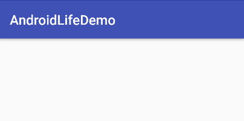
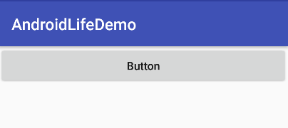

### [Demo 地址](https://github.com/shadowwingz/AndroidLifeDemo/tree/master/AndroidLifeDemo/app/src/main/java/com/shadowwingz/androidlifedemo/layoutinflaterdemo) ###

LayoutInflater 想必大家都不陌生，我们加载布局的时候用的就是它。先回忆下我们是怎么使用 LayoutInflater 的。

```java
LayoutInflater inflater = LayoutInflater.from(context);
// resourceId 是要加载的布局 id
// root 是该布局的父布局
inflater.inflate(resourceId, root)
```

首先，使用 `LayoutInflater.from(context)` 获取到 LayoutInflater 对象，然后调用 LayoutInflater 的 `inflate` 方法去加载布局就行了。这里要注意，`inflate` 有两个参数，第一个参数是要加载的布局 id，第二个参数是该布局的父布局。

我们来试一下，首先新建一个 `LayoutInflaterActivity`，然后修改 `LayoutInflaterActivity` 的布局文件 `activity_layout_inflater.xml`，给 LinearLayout 加一个 id，方便等下  `LayoutInflaterActivity` 中通过 `findViewById` 来找到这个 LinearLayout。代码如下：

```xml
<?xml version="1.0" encoding="utf-8"?>
<LinearLayout
    xmlns:android="http://schemas.android.com/apk/res/android"
    android:id="@+id/main_layout"
    android:layout_width="match_parent"
    android:layout_height="match_parent"
    android:orientation="vertical">

</LinearLayout>
```

新建一个 `button_layout.xml`，代码如下：

```xml
<?xml version="1.0" encoding="utf-8"?>
<Button xmlns:android="http://schemas.android.com/apk/res/android"
        android:layout_width="wrap_content"
        android:layout_height="wrap_content"
        android:text="Button"
        android:textAllCaps="false">

</Button>
```

这个布局文件很简单，只有一个按钮。接下来，我们就要使用 LayoutInflater 把这个按钮添加到 Activity 的 LinearLayout 中。刚刚我们说了，有一个 `inflate` 方法可以加载布局，我们试下这个方法，修改 LayoutInflaterActivity：

```java
public class LayoutInflaterActivity extends AppCompatActivity {

    @Override
    protected void onCreate(Bundle savedInstanceState) {
        super.onCreate(savedInstanceState);
        setContentView(R.layout.activity_layout_inflater);
        ViewGroup mainLayout = (ViewGroup) findViewById(R.id.main_layout);
        LayoutInflater inflater = LayoutInflater.from(this);
        inflater.inflate(R.layout.button_layout, mainLayout);
    }
}
```

我们先实例化了 LinearLayout，也就是 mainLayout。然后获取了 LayoutInflater 的实例，最后调用 `inflate` 方法加载了布局。

运行一下项目：


可以看到，Button 已经被成功的显示在界面上了。

接着，我们来看下 Button 是怎么被加载出来的。先看下 `inflate` 方法，调用 `inflate` 后，最终会进入 `inflate(parser, root, attachToRoot)` 方法中：

```java
// parser 是解析器，布局就是靠它来解析的
// root 是父布局
// attachToRoot 表示是否把解析的布局添加到父布局 root 中
public View inflate(XmlPullParser parser, ViewGroup root, boolean attachToRoot) {
    synchronized (mConstructorArgs) {
        Trace.traceBegin(Trace.TRACE_TAG_VIEW, "inflate");

        final AttributeSet attrs = Xml.asAttributeSet(parser);
        Context lastContext = (Context)mConstructorArgs[0];
        // 获取 context
        mConstructorArgs[0] = mContext;
        // 存储父布局
        View result = root;

        try {
            // Look for the root node.
            int type;
            // 解析器会不停解析布局，直到找到了布局的根标签
            while ((type = parser.next()) != XmlPullParser.START_TAG &&
                    type != XmlPullParser.END_DOCUMENT) {
                // Empty
            }

            if (type != XmlPullParser.START_TAG) {
                throw new InflateException(parser.getPositionDescription()
                        + ": No start tag found!");
            }

            final String name = parser.getName();
            
            ......
            // 解析 merge 标签
            if (TAG_MERGE.equals(name)) {
                if (root == null || !attachToRoot) {
                    throw new InflateException("<merge /> can be used only with a valid "
                            + "ViewGroup root and attachToRoot=true");
                }

                rInflate(parser, root, attrs, false, false);
            } else {
                // Temp is the root view that was found in the xml
                // 根据 xml 布局文件生成对应的 View
                final View temp = createViewFromTag(root, name, attrs, false);

                ViewGroup.LayoutParams params = null;

                if (root != null) {
                    ......
                    // Create layout params that match root, if supplied
                    // 生成布局参数，比如宽，高
                    params = root.generateLayoutParams(attrs);
                    // 如果 attachToRoot 为 false，就给 temp 设置布局参数
                    if (!attachToRoot) {
                        // Set the layout params for temp if we are not
                        // attaching. (If we are, we use addView, below)
                        temp.setLayoutParams(params);
                    }
                }

                ......
                // Inflate all children under temp
                // 解析布局里面所有的子 View，把子 View 依次添加到布局里
                rInflate(parser, temp, attrs, true, true);
                ......

                // We are supposed to attach all the views we found (int temp)
                // to root. Do that now.
                // 如果 root 不为空，且 attachToRoot 为 true，
				// 那么将 temp 添加到父视图中，
                // 把布局文件对应的 View，添加到父布局中
                if (root != null && attachToRoot) {
                    root.addView(temp, params);
                }

                // Decide whether to return the root that was passed in or the
                // top view found in xml.
                // 如果 root 为空，或者 attachToRoot 为 false，
				// 那么返回的结果就是 temp
                if (root == null || !attachToRoot) {
                    result = temp;
                }
            }

        } catch (XmlPullParserException e) {
            ......
        } finally {
            ......
        }

        Trace.traceEnd(Trace.TRACE_TAG_VIEW);

        return result;
    }
}
```

上面的 inflate 方法中，主要有下面几步：

1. 解析 xml 中的根标签（本例中是 Button），如果根标签是 merge，就直接将 merge 标签下的所有子 View 添加到根标签中；
2. 如果根标签是普通元素，就解析出根标签 temp 对应的 View；
3. 解析 temp 视图下的所有子 View 并添加到 temp 视图中（本例中没有子 View）；
4. 如果 `attachToRoot` 为 true，就把 temp 视图添加到 root 中，并返回 root 视图
5. 如果 `attachToRoot` 为 false，就直接返回 temp 视图。

我们这里分析下 `attachToRoot` 这个参数，它是 true 或者 false 对布局解析有什么影响？我们修改一下 LayoutInflaterActivity 代码：

```java
public class LayoutInflaterActivity extends AppCompatActivity {

    @Override
    protected void onCreate(Bundle savedInstanceState) {
        super.onCreate(savedInstanceState);
        setContentView(R.layout.activity_layout_inflater);
        ViewGroup mainLayout = (ViewGroup) findViewById(R.id.main_layout);
        LayoutInflater inflater = LayoutInflater.from(this);
//        inflater.inflate(R.layout.button_layout, mainLayout);
        inflater.inflate(R.layout.button_layout, mainLayout, true);
    }
}
```

之前的 `inflate` 方法中，我们传入了 2 个参数，这次我们传入 3 个参数，第三个参数就是 `attachToRoot`，这里我们传入 true。

运行一下：


Button 可以显示出来。

接着，我们把 `attachToRoot` 参数修改为 `false`：

```java
public class LayoutInflaterActivity extends AppCompatActivity {

    @Override
    protected void onCreate(Bundle savedInstanceState) {
        super.onCreate(savedInstanceState);
        setContentView(R.layout.activity_layout_inflater);
        ViewGroup mainLayout = (ViewGroup) findViewById(R.id.main_layout);
        LayoutInflater inflater = LayoutInflater.from(this);
//        inflater.inflate(R.layout.button_layout, mainLayout);
//        inflater.inflate(R.layout.button_layout, mainLayout, true);
        inflater.inflate(R.layout.button_layout, mainLayout, false);
    }
}
```

运行一下：



Button 显示不出来了。

很奇怪，我们明明传入了布局文件和父布局，只是把 `attachToRoot` 设置为 `false`，Button 就加载不出来了。是什么原因呢？我们再看看源码，找一下哪些地方用到了 `attachToRoot`：

```java
// root 是父布局
View result = root;

final View temp = createViewFromTag(root, name, attrs, false);

// 『1』
if (!attachToRoot) {
    // Set the layout params for temp if we are not
    // attaching. (If we are, we use addView, below)
    // temp 是 Button 布局对应的 View
    temp.setLayoutParams(params);
}

// 『2』
if (root != null && attachToRoot) {
    root.addView(temp, params);
}

// 『3』
if (root == null || !attachToRoot) {
    result = temp;
}

return result;
```

如果 `attachToRoot` 为 `true`，那么会执行代码『2』，`root.addView(temp, params)` 这句代码会把 temp 布局添加到父布局中，然后返回父布局。这样 Button 就可以显示出来了，这个好理解。

如果 `attachToRoot` 为 `false`，那么会执行代码『1』和代码『3』，代码『1』会给 Button 设置 `LayoutParams`，设置了 `LayoutParams`，Button 才能知道自己在父布局中的宽高。接着执行代码『3』，把 `temp` 赋值给 `result`，最后返回 `result`，此时的 `result` 就是加载好的 Button。

有的童鞋可能会疑惑，Button 都创建出来了，也返回了，为什么没有显示出来？

因为 Button 的创建和显示是两回事，创建好了，在界面上是看不到的，只有把 Button 添加到界面上，我们才能看到 Button，我们再修改下 LayoutInflaterActivity：

```java
public class LayoutInflaterActivity extends AppCompatActivity {

    @Override
    protected void onCreate(Bundle savedInstanceState) {
        super.onCreate(savedInstanceState);
        setContentView(R.layout.activity_layout_inflater);
        ViewGroup mainLayout = (ViewGroup) findViewById(R.id.main_layout);
        LayoutInflater inflater = LayoutInflater.from(this);
//        inflater.inflate(R.layout.button_layout, mainLayout);
//        inflater.inflate(R.layout.button_layout, mainLayout, true);
        View view = inflater.inflate(R.layout.button_layout, mainLayout, false);
        mainLayout.addView(view);
    }
}
```

我们把加载出来的 view（Button）添加到了 mainLayout 中。

运行一下：


可以看到，Button 显示出来了。

到这里，attachToRoot 参数我们基本就讲完了。

我们再讲下第二个参数，有的童鞋可能会疑惑，第二个参数不是明摆着让你传个 ViewGroup 嘛。没错，`inflate` 方法的第二个参数的确是 ViewGroup，但是这个参数也可以传入 `null`。

我们先试验一下，修改 LayoutInflaterActivity 代码如下：

```java
public class LayoutInflaterActivity extends AppCompatActivity {

    @Override
    protected void onCreate(Bundle savedInstanceState) {
        super.onCreate(savedInstanceState);
        setContentView(R.layout.activity_layout_inflater);
        ViewGroup mainLayout = (ViewGroup) findViewById(R.id.main_layout);
        LayoutInflater inflater = LayoutInflater.from(this);
//        inflater.inflate(R.layout.button_layout, mainLayout);
//        inflater.inflate(R.layout.button_layout, mainLayout, true);
//        View view = inflater.inflate(R.layout.button_layout, mainLayout, false);
//        mainLayout.addView(view);
        View view = inflater.inflate(R.layout.button_layout, null);
        mainLayout.addView(view);
    }
}
```

我们把 inflate 的第二个参数改成了 `null`，同时，我们把第三个参数去掉了，从源码我们可以知道，当 `root` 为 `null` 时，`attachToRoot` 参数的有无其实并没有影响。

运行一下：



我们发现，Button 不但显示出来了，而且还变宽了，撑满了全屏。

为什么 `root` 为 `null` 时，会变成这样？这里先简单的解释一下，是因为 LayoutParams。我们看下这几句代码：

```java
params = root.generateLayoutParams(attrs);
if (!attachToRoot) {
    // Set the layout params for temp if we are not
    // attaching. (If we are, we use addView, below)
    temp.setLayoutParams(params);
}
```

这几句代码是 `inflate` 方法源码的一部分，当 `root` 为 `null` 时，上面的几句代码是不执行的。那么这几句代码为什么会影响 Button 的显示效果？因为 LayoutParams，temp 没有设置 LayoutParams，导致父布局 LinearLayout 给子 View 生成了一个默认的宽度为 `match_parent`，高度为 `wrap_content` 的 LayoutParams，更详细的解释请看 [LayoutParams 解析](https://github.com/shadowwingz/AndroidLife/blob/master/article/LayoutParams%E8%A7%A3%E6%9E%90.md)。

那么我们可以总结一下 inflate 方法了：

| 方法 | 解释 |
| ------ | ------ |
| `inflate(resId, null)`| 只创建 temp 的 View，然后直接返回 temp |
| `inflate(resId, null, false)`| 只创建 temp 的 View，然后直接返回 temp |
| `inflate(resId, null, true)`| 只创建 temp 的 View，然后直接返回 temp |
| `inflate(resId, root)`| 创建 temp 的 View，然后执行 `root.addView(temp, params)` 最后返回 root |
| `inflate(resId, root, true)`| 创建 temp 的 View，然后执行 `root.addView(temp, params)` 最后返回 root |
| `inflate(resId, root, false)`| 创建 temp 的 View，然后执行 `temp.setLayoutParams(params)` 最后返回 temp |

我们接着看下 `createViewFromTag` 方法，这个方法是用来把我们在 xml 布局文件中写的控件转换成 java 版的控件，可以理解为，把控件从 xml 描述转换为 java 描述，比如说，上面我们在 xml 布局文件中写了一个 `<Button>`，它会被转换成 Button 对象。我们看下代码：

```java
LayoutInflater # createViewFromTag

View createViewFromTag(View parent, String name, AttributeSet attrs, boolean inheritContext) {
    if (name.equals("view")) {
        name = attrs.getAttributeValue(null, "class");
    }

    ......

    try {
        View view;
        if (mFactory2 != null) {
            view = mFactory2.onCreateView(parent, name, viewContext, attrs);
        } else if (mFactory != null) {
            view = mFactory.onCreateView(name, viewContext, attrs);
        } else {
            view = null;
        }

        if (view == null && mPrivateFactory != null) {
            view = mPrivateFactory.onCreateView(parent, name, viewContext, attrs);
        }
		// 没有 Factory 的情况下通过 onCreateView 或者 createView 创建 View
        if (view == null) {
            final Object lastContext = mConstructorArgs[0];
            mConstructorArgs[0] = viewContext;
            try {
                if (-1 == name.indexOf('.')) {
					// 内置 View 控件的解析
                    view = onCreateView(parent, name, attrs);
                } else {
					// 自定义控件的解析
                    view = createView(name, null, attrs);
                }
            } finally {
                mConstructorArgs[0] = lastContext;
            }
        }
        return view;
    }
}
```

当 tag 的名字中没有包含 `.` 时，LayoutInflate 会认为这是一个内置的 View，比如我们平常用的 Button，Text，这时，会调用 `onCreateView` 来解析这个 View。当我们自定义 View 时，在 xml 中写的是 View 的完整路径，比如： `<com.example.MyView>`。

在 `onCreateView` 内部调用的其实还是 `createView`，只是把 `android.widget` 前缀传递给了 `createView` 方法，这样就有了内置 View 的完整路径。再看下 `createView` 方法。

```java
LayoutInflate # createView

// 根据完整路径的类名，通过反射机制构造 View 对象
public final View createView(String name, String prefix, AttributeSet attrs)
            throws ClassNotFoundException, InflateException {
	// 从缓存中获取构造函数
    Constructor<? extends View> constructor = sConstructorMap.get(name);
    Class<? extends View> clazz = null;

    try {
		// 如果没有缓存构造函数
        if (constructor == null) {
            // Class not found in the cache, see if it's real, and try to add it
			// 如果 prefix 不为空，那么构造完整的 View 的路径，并加载该类
            clazz = mContext.getClassLoader().loadClass(
                    prefix != null ? (prefix + name) : name).asSubclass(View.class);
            // 从 Class 对象中获取构造函数
            constructor = clazz.getConstructor(mConstructorSignature);
			// 将构造函数存入缓存中
            sConstructorMap.put(name, constructor);
        } else {
        }

        Object[] args = mConstructorArgs;
        args[1] = attrs;
		// 通过反射构造 View
        final View view = constructor.newInstance(args);
        if (view instanceof ViewStub) {
            // Use the same context when inflating ViewStub later.
            final ViewStub viewStub = (ViewStub) view;
            viewStub.setLayoutInflater(cloneInContext((Context) args[0]));
        }
        return view;
    }
}
```

总结一下，就是根据类名，来构造 View 对象。这样，xml 文件里面的 `<Button>`，就转换成了 java 文件里的 Button 对象。

到这里，控件的解析我们就分析完了，但是控件里面如果还有子 View，那就要靠 `rInflate` 来解析子 View，并把子 View 添加到控件中。

```java
LayoutInflate # inflate

rInflate(parser, temp, attrs, true, true);

LayoutInflate # rInflate

void rInflate(XmlPullParser parser, View parent, final AttributeSet attrs,
            boolean finishInflate, boolean inheritContext) throws XmlPullParserException,
            IOException {
    final int depth = parser.getDepth();
    int type;

    while (((type = parser.next()) != XmlPullParser.END_TAG ||
            parser.getDepth() > depth) && type != XmlPullParser.END_DOCUMENT) {
		// 如果当前的 tag 不是 START_TAG，说明这个 tag 已经解析完了，
		// 所以提前结束这次循环，再进入下一次循环
        if (type != XmlPullParser.START_TAG) {
            continue;
        }

        final String name = parser.getName();
        
        if (TAG_REQUEST_FOCUS.equals(name)) {
            parseRequestFocus(parser, parent);
        } else if (TAG_TAG.equals(name)) {
            parseViewTag(parser, parent, attrs);
        } else if (TAG_INCLUDE.equals(name)) {
			// 解析 include 标签
            if (parser.getDepth() == 0) {
                throw new InflateException("<include /> cannot be the root element");
            }
            parseInclude(parser, parent, attrs, inheritContext);
        } else if (TAG_MERGE.equals(name)) {
			// 解析 merge 标签，抛异常，因为 merge 标签必须为根视图
            throw new InflateException("<merge /> must be the root element");
        } else {
			// 解析出这个 View
            final View view = createViewFromTag(parent, name, attrs, inheritContext);
			// 获取 View 的父控件
            final ViewGroup viewGroup = (ViewGroup) parent;
			// 获取 View 的 layoutParams
            final ViewGroup.LayoutParams params = viewGroup.generateLayoutParams(attrs);
			// 深度优先遍历
            rInflate(parser, view, attrs, true, true);
			// 将解析到的 View 元素添加到它的 parent 中
            viewGroup.addView(view, params);
        }
    }
	// 把所有子元素添加到它们的 parent 之后，解析完成
    if (finishInflate) parent.onFinishInflate();
}
```

`rInflate` 通过深度优先遍历来构造视图树，每解析到一个 View 元素就会递归调用 `rInflate`，直到这条路径下的最后一个元素，然后再回溯过来将每个 View 元素添加到它们的 `parent` 中，通过 `rInflate` 的解析之后，整颗视图树就构建完毕。这时，控件和它里面的子 View 就显示出来了。