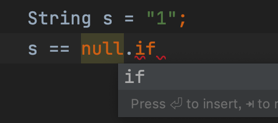
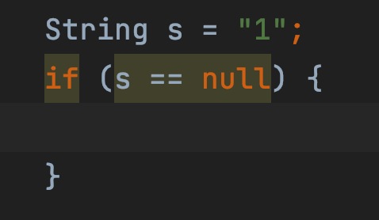

日常写代码，肯定少不了 if 判断，写一个 if 判断，需要先敲个 if，然后左手按住 Shift 键，右手找到 <kbd>(</kbd>，也就是数字 9 键。想想都觉得很麻烦。

我们可以先敲 if 表达式出来，比如我们有一个字符串 s，我们对它进行判空，就可以先把表达式敲出来：`s == null`，然后再敲 `.if`，这个时候 Android Studio 就会给出提示：

当我们看到这个提示的时候，敲下回车，Android Studio 就帮我们完成了 if 表达式：

