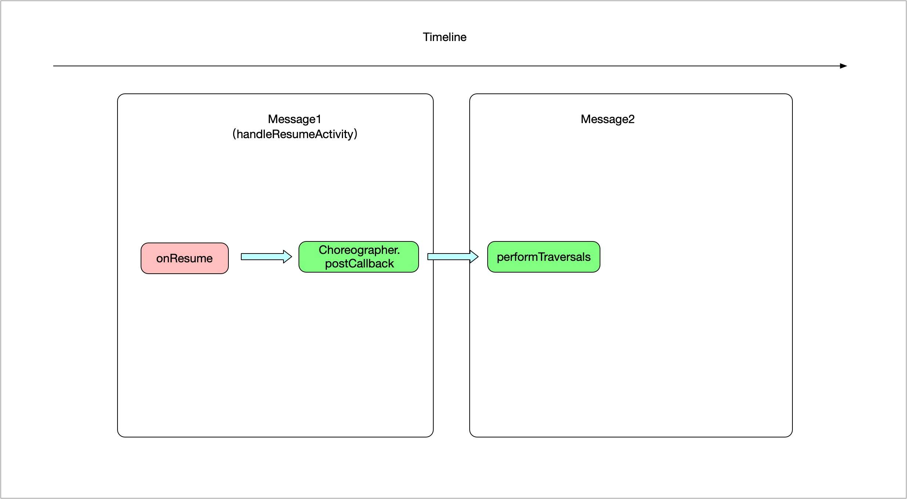

# onResume 里能获取 View 宽高吗？

不能获取到。

在 Activity 的启动过程中，会执行 ActivityThread 的 `handleResumeActivity` 方法：

```java
Activity # handleResumeActivity

@Override
public void handleResumeActivity(IBinder token, boolean finalStateRequest, boolean isForward,
        String reason) {
    ......
    // performResumeActivity 会触发 Activity 的 onResume 方法
    final ActivityClientRecord r = performResumeActivity(token, finalStateRequest, reason);
    ......
    if (r.window == null && !a.mFinished && willBeVisible) {
        ......
        if (a.mVisibleFromClient) {
            if (!a.mWindowAdded) {
                a.mWindowAdded = true;
                // 
                // wm.addView 会触发 View 的绘制流程
                wm.addView(decor, l);
            } else {
                ......
            }
        }
    } else if (!willBeVisible) {
        ......
    }
    ......
}
```

可以看到，在 `handleResumeActivity` 方法中，会先执行 `performResumeActivity` 方法，再执行 `wm.addView` 方法。

`performResumeActivity` 方法会触发 Activity 的 `onResume` 方法。
代码调用链：

```
ActivityThread.handleResumeActivity
    ActivityThread.performResumeActivity
        Activity.performResume
            Instrumentation.callActivityOnResume
                Activity.onResume
```

而 `wm.addView` 方法会触发 View 的绘制流程，也就是 `onMesasure`、`onLayout`、`onDraw` 那一套。
代码调用链：

```
ActivityThread.handleResumeActivity
    ViewManager.addView
        WindowManagerImpl.addView
            WindowManagerGlobal.addView
                ViewRootImpl.setView
                ViewRootImpl.requestLayout
                ViewRootImpl.scheduleTraversals
                    Choreographer.postCallback
                        ViewRootImpl.doTraversal
                            ViewRootImpl.performTraversals
                                ViewRootImpl.performMeasure
                                    View.onMessure
                                ViewRootImpl.performLayout
                                    View.onLayout
                                ViewRootImpl.performDraw
                                    View.onDraw
```

在这个调用链中，Choreographer.postCallback 会向 MessageQueue 中 post 一个 Runnable，这个 Runnable 会触发 View 的绘制流程。

```java
final class TraversalRunnable implements Runnable {
    @Override
    public void run() {
        doTraversal();
    }
}
```

因此，onResume 中的流程大概是这样的：



因此如果我们在  Activity 的 `onResume` 方法中去获取 View 宽高，此时 View 的 `onMesaure` 流程还没有开始，所以我们拿不到 View 的宽高值。

那有没有什么方法可以获取 View 宽高呢？


