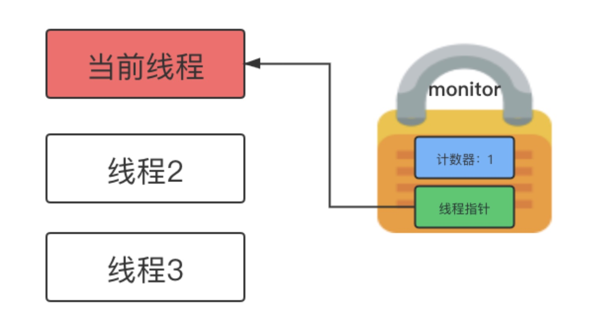

<!-- TOC -->

- [从字节码入手](#从字节码入手)
  - [两个 `monitorexit` 指令](#两个-monitorexit-指令)
  - [`monitorenter` 到底做了什么？](#monitorenter-到底做了什么)
  - [`monitorexit` 到底做了什么？](#monitorexit-到底做了什么)

<!-- /TOC -->

## 从字节码入手

要想了解 synchronized 的原理，我们得看下 synchronized 的字节码。

```java
public class Foo {

    private int number;

    public void test1() {
        int i = 0;
        synchronized (this) {
            number = i + 1;
        }
    }

    public synchronized void test2() {
        int i = 0;
        i = i + 1;
    }
}
```

这是一个简单的 Java 程序，程序中有 2 个方法，test1 方法中使用 synchronized 修饰了代码块，test2 中使用 synchronized 修饰了方法，我们看下这个程序的字节码。

使用 `javap -v Foo` 命令查看字节码，我们先截取 test1 方法的字节码看一看：

```java
public void test1();
    descriptor: ()V
    flags: ACC_PUBLIC
    Code:
        stack=3, locals=4, args_size=1
            0: iconst_0
            1: istore_1
            2: aload_0
            3: dup
            4: astore_2
            5: monitorenter
            6: aload_0
            7: iload_1
            8: iconst_1
            9: iadd
            10: putfield      #2                  // Field number:I
            13: aload_2
            14: monitorexit
            15: goto          23
            18: astore_3
            19: aload_2
            20: monitorexit
            21: aload_3
            22: athrow
            23: return
```

这段字节码中，我们可以看出，如果一个代码块被 `synchronized` 修饰，那么这个代码块的前后会被自动添加 `monitorenter` 和 `monitorexit` 指令。

那么 `monitorenter` 和 `monitorexit` 指令有什么作用呢？

当代码执行到 `synchronized` 代码块的时候，会执行 `monitorenter` 指令，接着当前线程会尝试获取锁，如果成功获取到锁，就可以接着执行同步代码块中的逻辑。

当同步代码块中的逻辑执行完毕后，就会执行 `monitorexit` 指令尝试释放锁。所以

> `monitorenter` 的作用是字节码层面的获取锁的操作
> 
> `monitorexit` 的作用是字节码层面的释放锁的操作

### 两个 `monitorexit` 指令

我们发现，在 test1 方法中有 2 个 `monitorexit` 指令，分别在 14 行和 20 行，为什么会有 2 个 `monitorexit` 指令呢？是为了保证同步代码块在执行过程中，即使抛出了异常，也能正常释放锁。

因此第一个 `monitorexit` 指令用于同步代码块正常执行完毕后释放锁，第二个 `monitorexit` 指令用于同步代码块执行异常时释放锁。

### `monitorenter` 到底做了什么？

想要知道 `monitorenter` 指令到底做了什么，为什么执行了 `monitorenter` 指令获取到锁之后，其他线程就无法再获取到锁了。

要回答这个问题，我们首先得对 锁 的概念有个感性的认识：



上图中右边是一个锁，锁由 2 个部分组成

1. 计数器

计数器代表当前线程一共访问了几次这把锁

2. 指针

指针指向持有这把锁的线程。

假如有 2 个线程竞争同一把锁，那么流程是这样的：

锁计数器默认是 0，当执行到 synchronized 时，底层会执行 monitorenter 指令，这个时候会判断锁计数器是不是 0。

如果是 0，说明此时锁并没有被其他线程持有，那么这个线程会将锁计数器加 1，并将锁中的指针指向自己。

如果不是 0，说明此时锁已经被其他线程（也可能是自己）持有，此时再看指针是否指向自己，如果指针指向自己，说明此时锁已经被其他线程持有，那么这个线程会被阻塞，等待其他线程释放锁。

所以 `monitorenter` 指令的执行会导致锁计数器的值和线程指针被修改，而锁计数器和线程指针又会影响到其他线程获取锁。

### `monitorexit` 到底做了什么？

monitorenter 我们弄清楚了，monitorexit 也就不难懂了。当线程执行完同步代码块之后，会把计数器减 1，并把指针置为 null。