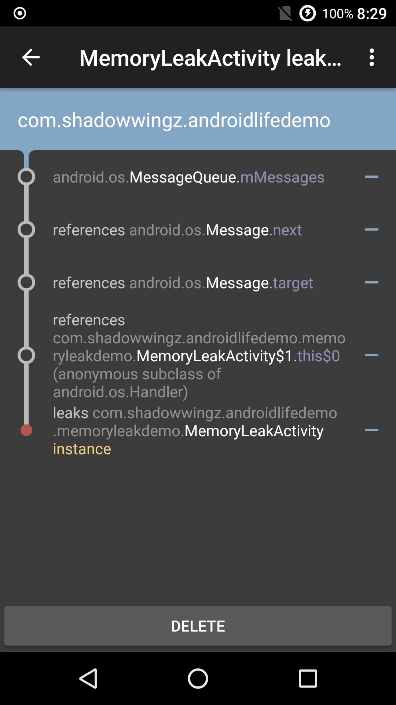
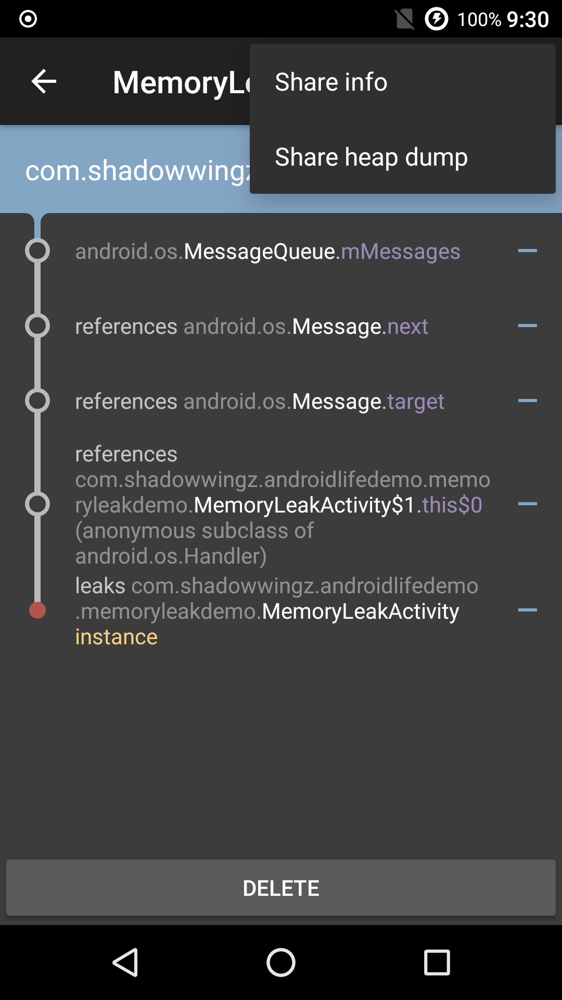

# 使用 LeakCanary 分析内存泄漏

分析内存问题时，我们一般都是先生成 hprof 文件，再用 MAT 来分析，但是这样效率会比较低，为了能够简单迅速发现并定位到内存泄漏，我们可以使用 LeakCanary 这款神器。

神器地址：

> https://github.com/square/leakcanary

#### 使用 ####

首先，在 app 目录下的 `build.gradle` 中添加 LeakCanary 的依赖：

```
debugCompile 'com.squareup.leakcanary:leakcanary-android:1.5.1'
```

接着修改 Application 代码：

```java
@Override
public void onCreate() {
    super.onCreate();
    initLeakCanary();
}

private void initLeakCanary() {
    if (LeakCanary.isInAnalyzerProcess(this)) {//1
        // This process is dedicated to LeakCanary for heap analysis.
        // You should not init your app in this process.
        return;
    }
    LeakCanary.install(this);
}
```

在 Application 的 onCreate 方法中，我们完成了 LeakCanary 的初始化。

我们写一段经典的内存泄漏代码，来测试下 LeakCanary：

```java
public class MemoryLeakActivity extends AppCompatActivity {

    public Handler mHandler = new Handler() {
        @Override
        public void handleMessage(Message msg) {
            super.handleMessage(msg);
        }
    };

    @Override
    protected void onCreate(Bundle savedInstanceState) {
        super.onCreate(savedInstanceState);
        setContentView(R.layout.activity_memory_leak);
        // 延时 3 分钟的消息
        mHandler.sendEmptyMessageDelayed(0, 3 * 60 * 1000);
    }
}
```

在这个例子中，非静态内部类 Handler 隐式持有外部类 MemoryLeakActivity 的引用，由于 Handler 发送了延时消息，这个  Message 引用被主线程 MessageQueue 持有，而主线程 MessageQueue 的生命周期跟随应用的生命周期，所以当 MemoryLeakActivity 退出的时候，由于 Handler 的引用还被 Message 持有，而 Message 引用被 MessageQueue 持有，所以 Handler 无法被释放，而 Handler 又持有 MemoryLeakActivity 的引用，导致 MemoryLeakActivity 的内存也无法被释放。

更详细的解释可以看 [为什么 Handler 发送的延时消息没有执行，会导致内存泄漏？](https://github.com/shadowwingz/AndroidLife/blob/master/article/handler_memory_leak/handler_memory_leak.md#%E4%B8%BA%E4%BB%80%E4%B9%88-handler-%E5%8F%91%E9%80%81%E7%9A%84%E5%BB%B6%E6%97%B6%E6%B6%88%E6%81%AF%E6%B2%A1%E6%9C%89%E6%89%A7%E8%A1%8C%E4%BC%9A%E5%AF%BC%E8%87%B4%E5%86%85%E5%AD%98%E6%B3%84%E6%BC%8F)

运行程序，程序再在桌面生成一个名字叫 Leaks 的应用图标，接着，我们打开 MemoryLeakActivity，再关闭，过一会，内存泄漏信息就出现在通知栏上了，点击通知栏，就可以看到下面的页面了。



通过上面的图，我们就可以很清楚的看到内存泄漏情况了

- MessageQueue 的 mMessages（消息队列）引用了 Message.next（我们发送的消息）
- Message.next（我们发送的消息）引用了 Message.target（我们创建的 Handler 对象）
- Message.target（我们创建的 Handler 对象）引用了 MemoryLeakActivity 的 `this$0`（内部类保留的一个指向外部类的引用）
- 导致 MemoryLeakActivity 发生了内存泄漏

除了在 app 里看内存泄漏情况，我们也可以把 `heap dump` 文件分享出去，用 MAT 分析。



上面是标准的内存泄漏写法，避免 Handler 内存泄漏，可以参照 [避免内存泄漏的 Handler 写法](https://github.com/shadowwingz/AndroidLife/blob/master/article/handler_memory_leak/handler_memory_leak.md#%E9%81%BF%E5%85%8D%E5%86%85%E5%AD%98%E6%B3%84%E6%BC%8F%E7%9A%84-handler-%E5%86%99%E6%B3%95)