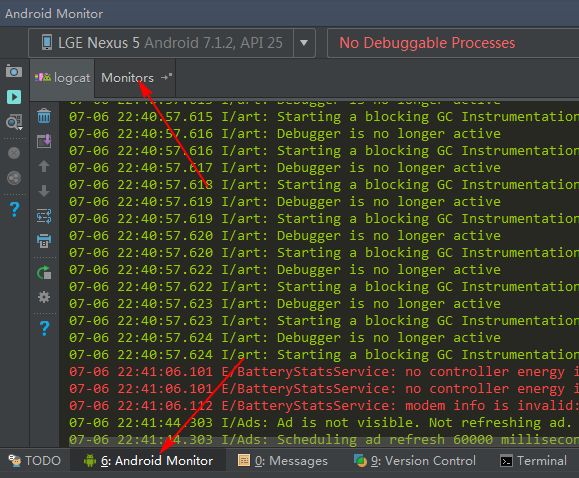
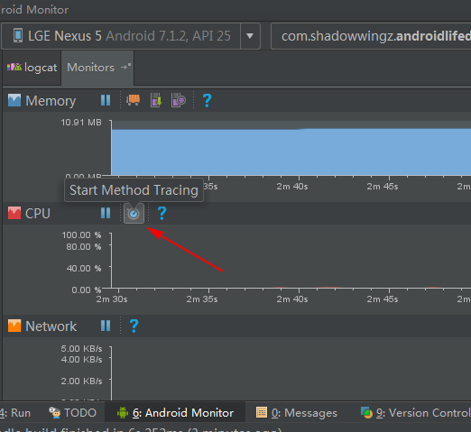
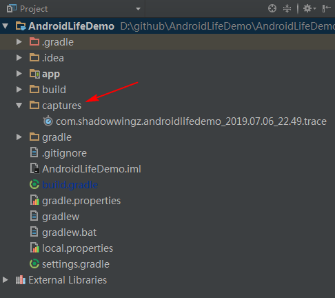
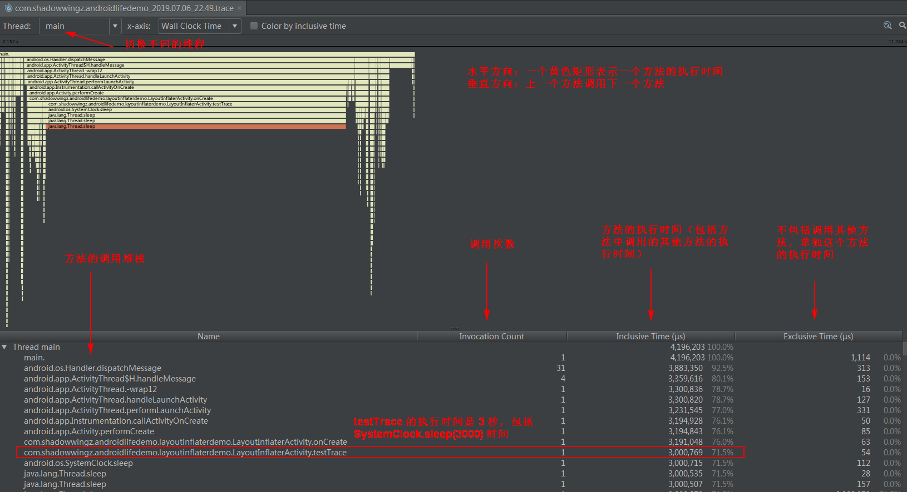

# 使用 TraceView 分析卡顿

#### TraceView 是什么 ####

当我们要找一个 Android 工程中的耗时方法时，如果要靠肉眼去寻找耗时代码，那得找到猴年马月了，这个时候就得 TraceView 出场了，TraceView 可以生成一个 trace 文件，通过分析这个文件，我们可以找出在我们 app 运行过程中，每个方法的耗时情况。

#### 生成 trace 文件 ####

trace 文件可以帮助我们分析代码的耗时情况，那 trace 文件要怎么生成呢？trace 文件有两种方法

- 使用代码
- 使用 Android Studio 的 Android Monitor

#### 使用代码生成 trace 文件 ####

我们在 Activity 的 onCreate 方法中使用 SystemClock.sleep 方法模拟一下耗时方法：

```java
// tracetest 是 trace 文件的名字，所以 trace 文件的全名是 tracetest.trace
Debug.startMethodTracing("tracetest");
testTrace();
Debug.stopMethodTracing();
```

testTrace 方法的实现如下：

```java
private void testTrace() {
    SystemClock.sleep(3000);
}
```

运行一下 app，app 会在 sd 下的应用目录下生成一个 trace 文件，也就是

```
/sdcard/Android/data/com.shadowwingz.androidlifedemo/files/tracetest.trace
```

我们用 pull 命令把 trace 文件导出，然后在 Android Studio 中，打开 `Android Device Monitor`，然后使用 `Android Device Monitor` 打开 trace 文件：


#### 分析 trace 文件 ####

上面的图，大致分为两部分，

上半部分显示了不同线程的执行时间

- 其中不同颜色表示不同的方法，这里我们只调用了 testTrace 方法，所以只有一个红色
- 同一个颜色越长，说明执行时间越久，我们调用的 testTrace 方法的执行时间，在上面的图中，是从 0 到 3000 毫秒，刚好是 3 秒钟
- 空白表示这个时间段内没有执行内容

下半部分展示了不同方法的执行时间信息，我们主要关注三个：

- CPU Time/Call：该方法平均占用 CPU 的时间
- Real Time/Call：平均执行时间，包括切换、阻塞的时间
- Calls + Recur Calls/Total：调用、递归次数

为什么主要关注这三个，因为耗时方法一般来讲有两种情况：

- 方法本身就很耗时，仅仅调用一次就会卡顿，比如上面我们模拟的，让主线程睡眠 3 秒，这种情况我们就要看它的执行时间
- 方法本身并不耗时，但是频繁调用，这样也会耗时，这种情况下，我们就要分析它的调用、递归次数了

#### 用 Android Studio 生成 trace 文件 ####

用 Android Studio 生成 trace 文件就比较方便了，打开 `Android Monitor` ：



选中 `Monitors`：



点击箭头指向的按钮，Android Studio 就会开始追踪了，相当于代码调用 `startMethodTracing`，当要结束追踪时，再次点击这个按钮，就会生成 trace 文件了，trace 文件在 Android 工程的 capture 目录：



同时，Android Studio 会帮你打开 trace 文件：



Android Studio 也可以用来查看 trace 文件，但是相对于 `Android Device Monitor` 来说，功能弱了点：

- 左上角可以切换线程，但是无法直观的对比不同线程的执行时间
- 左下角可以看到方法的调用堆栈，但是一旦用 `Exclusie Time` 排序，方法的调用顺序就被打乱了，就看不到方法堆栈了

而 `Android Device Monitor`，选中某一个方法，可以看到它的调用堆栈，这样，排序导致顺序改变，也不会影响查看堆栈信息了。

