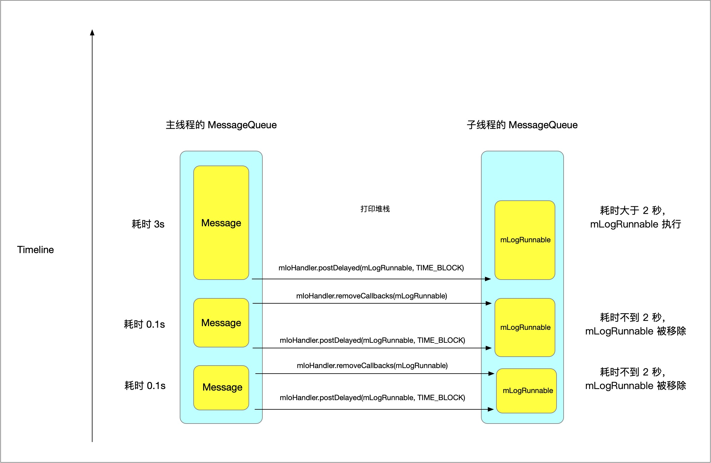
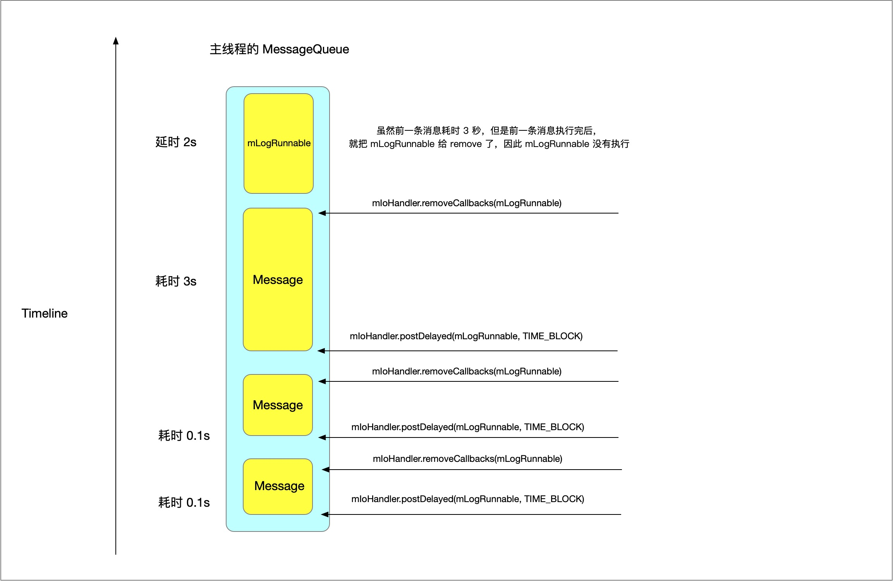

# 使用 Looper#setMessageLogging 检测卡顿

在 Looper 的 loop 方法中，有这么一段代码：

```java
public static void loop() {
    final Looper me = myLooper();
    for (;;) {
    	// 从消息队列中取出一条消息
        Message msg = queue.next(); // might block
        if (msg == null) {
            // No message indicates that the message queue is quitting.
            return;
        }

        // This must be in a local variable, in case a UI event sets the logger
        // 获取 Printer，这里的 Printer 是由开发者自己传入的
        final Printer logging = me.mLogging;
        // 1
        if (logging != null) {
            logging.println(">>>>> Dispatching to " + msg.target + " " +
                    msg.callback + ": " + msg.what);
        }

		// 调用 dispatchMessage 方法，
		// dispatchMessage 方法会回调 Handler 的 handleMessage 方法
        msg.target.dispatchMessage(msg);

		// 2
        if (logging != null) {
            logging.println("<<<<< Finished to " + msg.target + " " + msg.callback);
        }
    }
}
```

这里我们看下 dispatchMessage 方法，在 [消息机制源码解析](https://github.com/shadowwingz/AndroidLife/blob/master/article/%E6%B6%88%E6%81%AF%E6%9C%BA%E5%88%B6%E6%BA%90%E7%A0%81%E8%A7%A3%E6%9E%90.md) 中我分析过，Looper 会不停的从消息队列取出消息，然后交给 Handler 的 dispatchMessage 方法处理。

Handler 的 dispatchMessage 方法执行在哪个线程取决于 Handler 在哪个线程被初始化，我们一般是在主线程初始化 Handler 的，所以 dispatchMessage 方法一般也是在主线程被调用。

回忆一下 Handler 的工作流程：

一般我们在子线程中做完了耗时操作，会把结果通过 sendMessage 方法发送到主线程。在源码内部就是调用了 dispatchMessage 方法。

其实，不仅是我们调用 sendMessage 方法会被投递到消息队列，就连普通的点击事件，都会被 Android 系统投递到消息队列，然后被 Looper 取出，交给 Handler 去执行。

那我们如果要检测代码中是否有耗时操作，耗时操作的代码在哪里，那么可以这样：

- 向 Looper 中传入 Printer，这样在 `msg.target.dispatchMessage(msg)` 前后的代码块 1 和代码块 2 才会执行。
- 代码块 1 和代码块 2 会打印日志，会通过 println 方法回调到我们自定义的 Printer 中。
- 我们拿到打印的日志，如果日志是已 `>>>>> Dispatching` 开头，说明方法开始执行，如果日志是已 `<<<<< Finished` 开头，说明方法已经执行完毕。
- 最近一步，也是最关键的一步，当检测到方法开始执行的时候，我们投递一个 Runnable 任务到任务队列中，这个 Runnable 任务是打印主线程的调用方法堆栈。我们投递是用 `postDelayed` 方法来延时投递的，这个延时就是我们自定义的耗时时间，假设我们定义耗时 2 秒为耗时操作，那我们就延时 2 秒投递消息。当检测到方法执行完毕的时候，我们把这个 Runnable 任务移除掉。

如果 `dispatchMessage` 在 2 秒内执行完毕，那么执行到代码块 2 的时间，Runnable 任务就已经被移除掉了，就不会打印方法堆栈。

如果 `dispatchMessage` 方法的执行时间超过 2 秒，那么 Runnable 任务就会被投递到消息队列，然后被执行，打印方法堆栈。

```java
public static void loop() {
    final Looper me = myLooper();
    for (;;) {
    	// 从消息队列中取出一条消息
        Message msg = queue.next(); // might block
        if (msg == null) {
            // No message indicates that the message queue is quitting.
            return;
        }

        // This must be in a local variable, in case a UI event sets the logger
        // 获取 Printer，这里的 Printer 是由开发者自己传入的
        final Printer logging = me.mLogging;
        // 1
        // 执行到这里的时候，延时 2 秒，投递一个 Runnable
        if (logging != null) {
            logging.println(">>>>> Dispatching to " + msg.target + " " +
                    msg.callback + ": " + msg.what);
        }

		// 调用 dispatchMessage 方法，
		// dispatchMessage 方法会回调 Handler 的 handleMessage 方法
        msg.target.dispatchMessage(msg);

		// 2
		// 如果 msg.target.dispatchMessage(msg) 很快就执行完了（不到 2 秒），
		// 执行到这里，Runnable 任务就会被移除掉，就不会打印堆栈了。
		// 如果 msg.target.dispatchMessage(msg) 执行的很慢（超过 2 秒），
		// 执行到这里，Runnable 任务会被投递到消息队列，
		// 等下一个 loop 被执行，堆栈就被打印出来了。
        if (logging != null) {
            logging.println("<<<<< Finished to " + msg.target + " " + msg.callback);
        }
    }
}
```

具体实现：

新建一个 BlockDetectByPrinter 类，这个类会向 Looper 中传入自定义的 Printer，在自定义的 Printer 中，我们会检测 Printer 中回调的系统的日志，根据日志判断是方法开始还是方法结束。如果是方法开始，就延时投递一个 Runnable 任务，用于打印方法堆栈，如果是方法结束，就移除这个 Runnable 任务。

```java
public class BlockDetectByPrinter {

    public static void start() {

        Looper.getMainLooper().setMessageLogging(new Printer() {

            private static final String START = ">>>>> Dispatching";
            private static final String END = "<<<<< Finished";

            @Override
            public void println(String x) {
                if (x.startsWith(START)) {
                    LogMonitor.getInstance().startMonitor();
                }
                if (x.startsWith(END)) {
                    LogMonitor.getInstance().removeMonitor();
                }
            }
        });

    }
}
```

再新建一个类 LogMonitor，

```java
public class LogMonitor {

    private static LogMonitor sInstance = new LogMonitor();
    private HandlerThread mLogThread = new HandlerThread("log");
    private Handler mIoHandler;
    private static final long TIME_BLOCK = 2000L;

    private LogMonitor() {
        mLogThread.start();
        mIoHandler = new Handler(mLogThread.getLooper());
    }

    private static Runnable mLogRunnable = new Runnable() {
        @Override
        public void run() {
            StringBuilder sb = new StringBuilder();
            StackTraceElement[] stackTrace = Looper.getMainLooper().getThread().getStackTrace();
            for (StackTraceElement s : stackTrace) {
                sb.append(s.toString() + "\n");
            }
            Log.e("LogMonitor", sb.toString());
        }
    };

    public static LogMonitor getInstance() {
        return sInstance;
    }

    public void startMonitor() {
        mIoHandler.postDelayed(mLogRunnable, TIME_BLOCK);
    }

    public void removeMonitor() {
        mIoHandler.removeCallbacks(mLogRunnable);
    }

}
```

这里我们用 HandlerThread 来创建一个 Handler，然后让这个 Handler 来投递 Runnable 任务，也就是打印方法堆栈，Runnable 任务会在非 UI 线程执行，这样就不会阻塞 UI。

原理图：



### 使用：

在 Application 的 onCreate 方法里，调用：

```java
BlockDetectByPrinter.start();
```

### 疑问

如果在 LogMonitor 里，用主线程的 Looper 来创建 Handler，Runnable 任务会在 UI 线程执行，虽然会阻塞下 UI，但是 Runnable 任务只是打印而已，不会阻塞很久，但实际情况是 Runnable 任务根本就没有执行。

```java
mIoHandler = new Handler(Looper.getMainLooper());
```

原因：

如果我们用主线程的 Handler 来投递打印堆栈的任务，那么这个打印堆栈的任务就永远无法被执行，因为在上一条消息执行完毕后，就会把打印堆栈的消息给 remove 掉。

