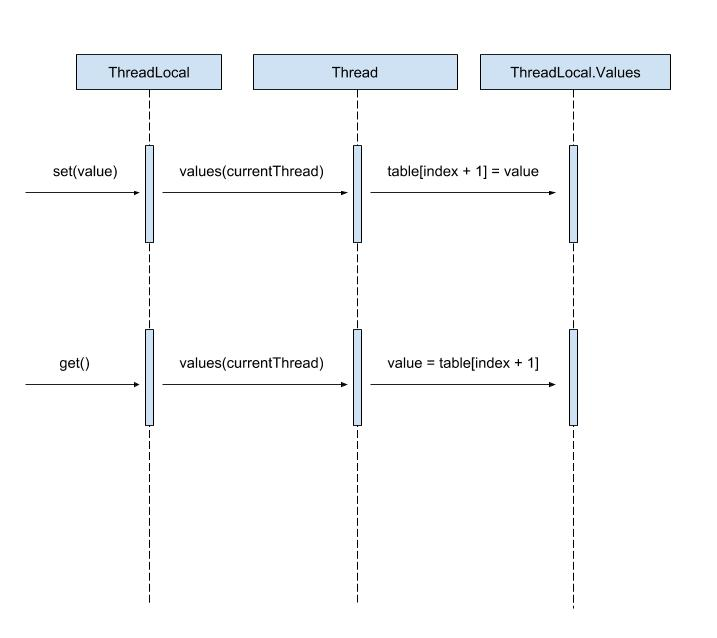

<p align="center">
  
</p>


ThreadLocal 是一个泛型类，它的定义为 `public class ThreadLocal<T>`，只要弄清楚 ThreadLocal 的 get 和 set 方法就可以明白它的工作原理。

### set 方法 ###

首先看 ThreadLocal 的 set 方法：

```java
ThreadLocal # set

public void set(T value) {
    // 获取当前线程对象
    Thread currentThread = Thread.currentThread();
    // 获取当前线程中的 ThreadLocal.Values 对象
    Values values = values(currentThread);
    // 如果 values 为空，就先初始化 values
    if (values == null) {
        values = initializeValues(currentThread);
    }
    // 将 ThreadLocal 的值存储到 table 数组中
    values.put(this, value);
}
```

ThreadLocal.Values 定义：

```java
ThreadLocal # Values

public class ThreadLocal<T> {
    ......
    static class Values {
        ......
        // ThreadLocal 的值最终会存储在 table 数组中
        private Object[] table;
    }
}
```

ThreadLocal.Values 使用：

```java
Thread # localValues

public class Thread implements Runnable {
    // ThreadLocal.Values 是 Thread 类的一个变量
    ThreadLocal.Values localValues;
}
```

可以看到，Values 的定义是在 ThreadLocal 中定义的，但是使用是在 Thread 中使用的（Values 是 Thread 类的一个变量）。

再看 values.put() 源码

```java
ThreadLocal.Values # put

void put(ThreadLocal<?> key, Object value) {
    ......

    for (int index = key.hash & mask;; index = next(index)) {
        Object k = table[index];

        if (k == key.reference) {
            // Replace existing entry.
            table[index + 1] = value;
            return;
        }

        if (k == null) {
            if (firstTombstone == -1) {
                // Fill in null slot.
                // reference 字段所标识对象的索引为 index
                table[index] = key.reference;
                // value 的索引是 index + 1，也就是 reference 的下一个位置
                table[index + 1] = value;
                size++;
                return;
            }
            ......
        }
        ......
    }
}
```

可以看到，ThreadLocal 的值，也就是 value，是存储在 table 数组中的，而且在 table 数组中的存储位置总是为 ThreadLocal 的 reference 字段所标识对象的下一个位置。

### get ###

再来看下 get 方法：

```java
ThreadLocal # get

public T get() {
    // Optimized for the fast path.
    // 获取当前线程对象
    Thread currentThread = Thread.currentThread();
    // 获取当前线程中的 ThreadLocal.Values 对象   
    Values values = values(currentThread);
    if (values != null) {
        Object[] table = values.table;
        int index = hash & values.mask;
        if (this.reference == table[index]) {
            // 从 table 数组中返回 value
            // value 在 reference 索引的下一个位置
            return (T) table[index + 1];
        }
    } else {
        values = initializeValues(currentThread);
    }

    return (T) values.getAfterMiss(this);
}
```

### 总结一下： ###
- set 时，要先去 Thread 对象中取出 Values 变量（Values 是在 ThreadLocal 中定义的），然后再从 Value 的 table 数组中取出 value。
- get 时，要先去 Thread 对象中取出 Values 变量（Values 是在 ThreadLocal 中定义的），然后再把 value 存入 Value 的 table 数组中。